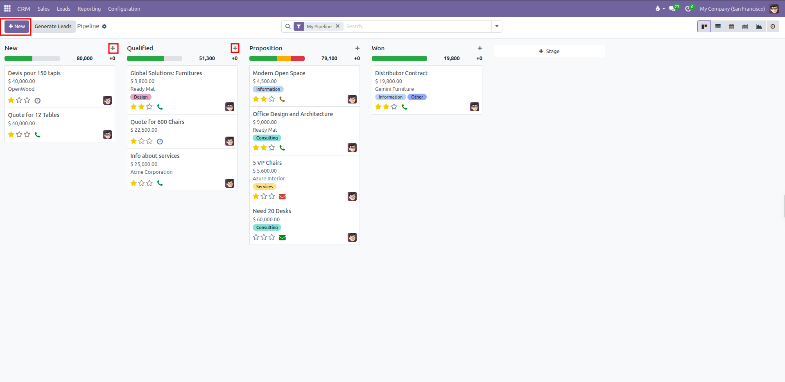
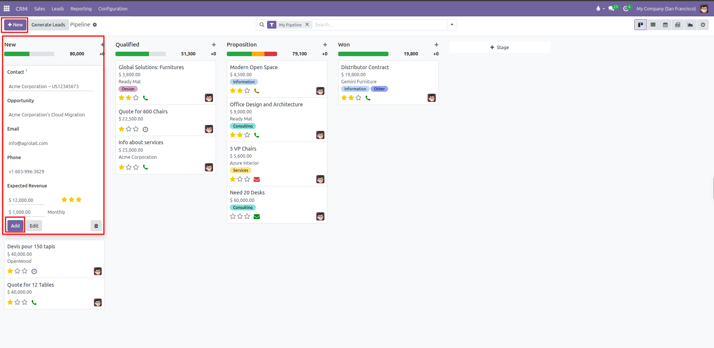
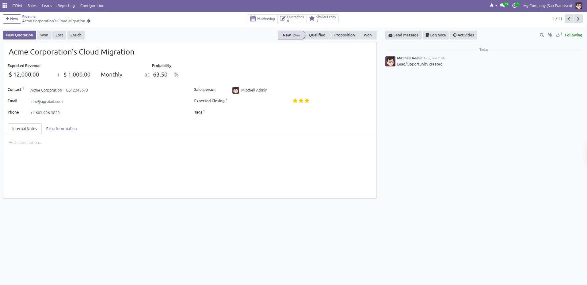
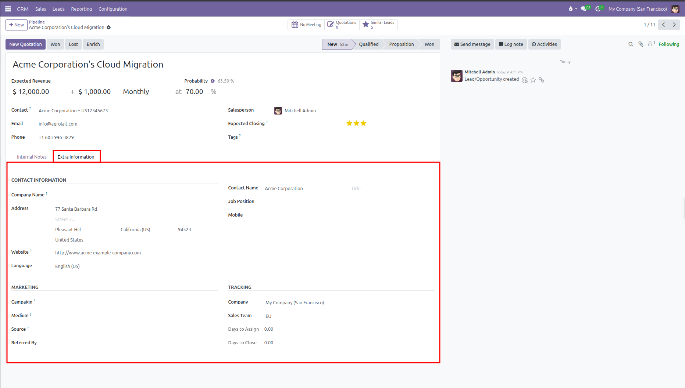
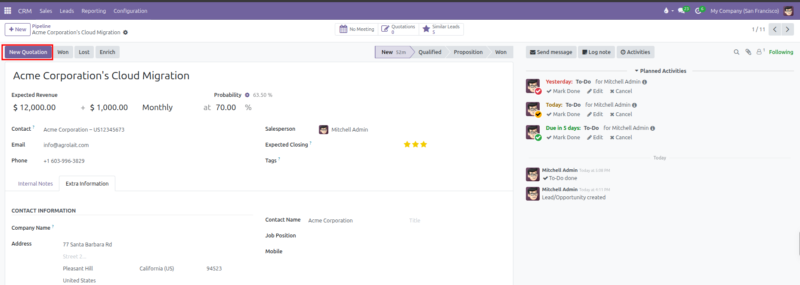

# Creating and Managing Opportunities

Create new sales opportunities, assign contacts, estimate deal values, set win probabilities, and prioritize deals in CURQ 18.

---

### 1. Overview of Opportunities in CURQ

In CURQ 18, an opportunity reflects a qualified sales prospect or potential contract. Opportunities move across visual pipeline stages until they are won or lost.

Every opportunity tracks:
* The [contact](../../Contacts/manual/01-create-contact.md) or organization.
* The expected revenue and estimated closing date.
* The automated or manually assigned win probability.
* The assigned salesperson and designated [sales team](../procedures/02-sales-teams-setup.md).
* The priority level to help sales teams focus on high-impact deals.
* Connected meetings, [quotations](../../Sales/manual/01-create-quotation.md), sales orders, and communication history.

---

### 2. Quick Creation from the Pipeline Kanban

You can create an opportunity directly from the Kanban pipeline view using either of two buttons:

1. **Top Control Panel `+ New` Button**:
   * Located in the top left control bar.
   * Clicking **+ New** opens the quick creation card inside the first column *(**New** stage)*.

2. **Column Header `+` Button**:
   * Located on the right side of each individual stage column header *(**New**, **Qualified**, **Proposition**, **Won**)*.
   * Clicking the **+** icon opens the quick creation card directly inside that specific stage. This allows you to log a deal directly into **Qualified** or **Proposition** without creating it in **New** first.

#### Fields on the Quick Creation Card:
The quick creation card displays the following fields:

* **Contact**: Select an existing [contact](../../Contacts/manual/01-create-contact.md) from the database, or type a new name to create a contact card immediately.
* **Opportunity**: Enter a clear, descriptive title *(such as `Product Pricing` or `Cloud Migration Contract`)*.
* **Email**: Contact email address, automatically populated when an existing contact is picked.
* **Phone**: Contact phone number.
* **Expected Revenue**: Enter the estimated monetary value of the deal.
* **Priority**: Click the star icons to set urgency *(1 star = Low, 2 stars = Medium, 3 stars = High)*.
* **Recurring Revenue**: If recurring revenues are enabled, specify the recurring amount and time period *(such as Monthly or Annually)*.

Click **Add** to place the opportunity card into the column immediately, or click **Edit** to open the full form view.

---

### 3. Detailed Opportunity Form View

Clicking any opportunity card opens the full form view. Here you configure comprehensive commercial details across several sections:

#### Top Header and Metrics:
* **Opportunity Title**: The primary deal title shown at the top of the sheet.
* **Expected Revenue**: The estimated monetary value of the deal, including optional recurring revenue and period *(such as Monthly)*.
* **Probability**: The percentage likelihood of winning the deal.
* **Automated Probability Reset**: When a custom percentage is typed, a small gear icon appears next to the field showing the system calculation. Clicking the gear restores the automated probability calculation.

#### Main Columns:
* **Left Column**:
  * **Contact**: The [contact](../../Contacts/manual/01-create-contact.md) company or individual linked to the deal.
  * **Email**: Direct email address.
  * **Phone**: Direct telephone number.
* **Right Column**:
  * **Salesperson**: The internal user responsible for guiding the deal to closure.
  * **Expected Closing**: Target date to close the contract.
  * **Priority**: Priority star rating placed directly alongside the expected closing date.
  * **Tags**: Color-coded categorization tags *(such as `Software`, `Services`, or `Consulting`)*.

#### Tab Sections:
* **Internal Notes**: A rich text area for internal discovery notes, technical constraints, or customer requirements.
* **Extra Information**: Holds extended contact details, marketing attribution, and operational tracking metrics.

##### Contact Information

| Field            | Description                                                     |
| ------------------| -----------------------------------------------------------------|
| **Company Name** | Legal name of the customer company or organization.             |
| **Address**      | Complete street address, city, state, postal code, and country. |
| **Website**      | Customer web address or portal link.                            |
| **Language**     | Preferred communication language for quotations and messages.   |
| **Contact Name** | Full name of the primary contact person.                        |
| **Title**        | Salutation or honorific title *(such as Mr., Ms., Dr.)*.        |
| **Job Position** | Role or professional title within the client company.           |
| **Mobile**       | Mobile telephone number for direct calls or text messages.      |

##### Marketing

| Field           | Description                                                                       |
| -----------------| -----------------------------------------------------------------------------------|
| **Campaign**    | Specific promotional campaign that generated this deal.                           |
| **Medium**      | Delivery channel used to reach the prospect *(such as Banner, Email, or Direct)*. |
| **Source**      | Origin platform or touchpoint *(such as Search Engine, Referral, or Trade Show)*. |
| **Referred By** | Name of the individual or partner who introduced the prospect.                    |

##### Tracking

| Field | Description |
| --- | --- |
| **Company** | Internal operating company managing the deal. |
| **Sales Team** | Designated [sales team](../procedures/02-sales-teams-setup.md) handling the account *(such as EU Sales or Wholesale)*. |
| **Days to Assign** | Total days elapsed between lead creation and salesperson assignment. |
| **Days to Close** | Total days elapsed between deal creation and final Won or Lost status. |

#### Smart Buttons:
* **Meeting**: Shows scheduled calendar meetings.
* **Similar Leads**: Warns if potential duplicate leads exist.
* **Quotations**: Displays connected draft [quotations](../../Sales/manual/01-create-quotation.md).
* **Orders**: Appears once an offer is confirmed, displaying the untaxed total value of confirmed sales orders.

---

### 4. Connecting an Opportunity to a Quotation

When a prospect is ready for formal pricing, create a [sales quotation](../../Sales/manual/01-create-quotation.md) directly from the opportunity record:

1. Open the opportunity form.
2. In the top button bar, click **New Quotation**.

3. CURQ automatically creates a draft quotation with the customer, salesperson, and sales team pre-filled.
4. Add products, configure quantities, apply discounts, and [send the quotation](../../Sales/manual/02-send-quotation.md) to the client.
5. Once a quotation is confirmed into a Sales Order, the revenue amount and order status link back directly to the **Orders** smart button at the top of the form.

---

To organize daily follow-ups, schedule customer calls, and manage planned meetings, see [My Activities](03-my-activities.md).
