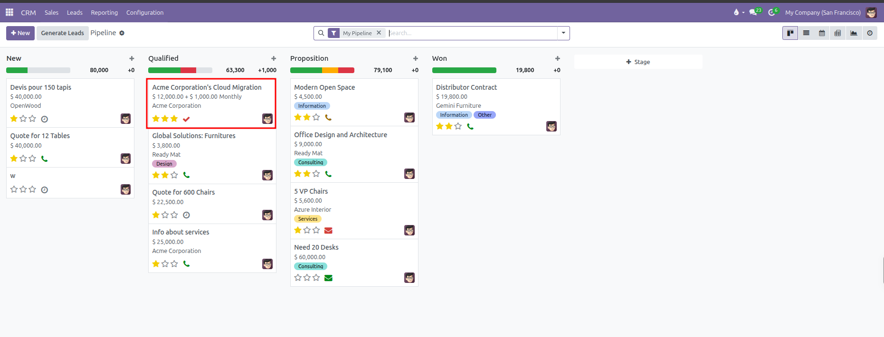
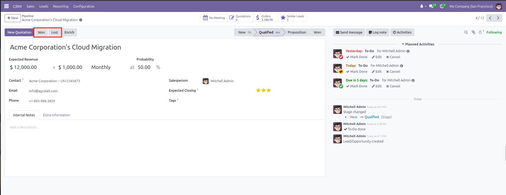
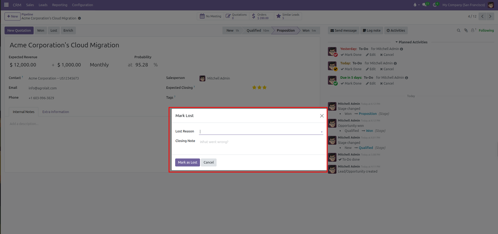
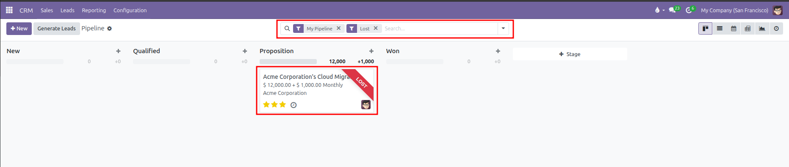

# Pipeline Stages and Won or Lost Workflow

Advance deals across stages, mark deals as Won, record lost reasons with closing feedback, and restore archived opportunities in CURQ 18.

---

### 1. Visual Kanban Pipeline Management

The CRM pipeline displays opportunities as movable cards grouped into vertical stage columns. Stages reflect each milestone in your commercial qualification cycle.

Default stages in CURQ include:
* **New**: Newly logged inquiries and prospective leads.
* **Qualified**: Deals where customer budget, project scope, and timeline are verified.
* **Proposition**: Opportunities with an active quotation or formal commercial proposal submitted.
* **Won**: Successfully closed deals with signed agreements.

#### Moving Cards Across Stages:
To advance an opportunity, click and drag the deal card from its current column to the next stage column.

When a card moves to a new stage:
* The probability percentage automatically adjusts to match historical stage success metrics.
* The column totals at the top of each stage update instantly to reflect current pipeline volume and expected revenue.
* The stage progress tracker inside the opportunity form highlights the active stage.

---

### 2. Marking an Opportunity as Won

When a customer accepts your proposal or signs a contract, finalize the deal using the header action buttons:

1. Open the opportunity card from the pipeline Kanban.
2. In the top action bar, click the **Won** button.
3. CURQ marks the opportunity won:
   * A green **Won** banner ribbon appears across the top right corner of the sheet.
   * The probability updates to 100%.
   * The deal stage automatically switches to **Won**.
   * A celebration effect displays across the screen.

Alternatively, dragging an opportunity card directly into the **Won** stage column achieves the same result.

---

### 3. Marking an Opportunity as Lost

If a prospect decides not to proceed, select a competitor, or cancels a project, mark the deal as Lost to maintain accurate pipeline metrics:

1. Open the opportunity from the pipeline.
2. In the top action bar, click **Lost**.
3. A dialog box opens requesting closing details:
   * **Lost Reason**: Select a standardized reason from the dropdown *(such as `Too expensive`, `Not enough stock`, or `We don't have people/skills`)*.
   * **Closing Note**: Enter specific customer feedback, price objections, or competitor details for future review.

4. Click **Mark as Lost**.

#### What Happens When a Deal is Lost:
* A red **Lost** banner ribbon appears across the opportunity sheet.
* Probability drops to 0%.
* The record is archived and hidden from default pipeline views so active boards remain focused on open opportunities.
* The selected lost reason and closing note are logged directly into the chatter timeline.

---

### 4. Finding and Restoring Lost Opportunities

Archived lost deals are never deleted. When a former prospect reaches out again or budget becomes available, restore the opportunity:

1. Open **CRM > Sales > My Pipeline**.
2. Click the search bar at the top of the screen.
3. Click the **Filters** menu and select **Lost** *(or **Archived**)*.
4. The pipeline displays all previously closed and archived deals with a diagonal red **LOST** ribbon on the card.

5. Click the opportunity card to open the form view.
6. In the top action bar, click **Restore**.
7. The red **Lost** ribbon disappears, the record unarchives, and the deal card returns to active pipeline stages so your team can resume negotiations.
