# My Activities

Organize daily sales follow-ups, schedule new activities, manage meetings, postpone tasks, and track pipeline activities across multiple view formats in CURQ 18.

---

### 1. Centralized Activity Workspace

Sales success relies on timely follow-ups. Instead of checking individual deal cards one by one, the **My Activities** dashboard consolidates all your planned tasks across every stage into a unified operational view.

#### Accessing My Activities:
Navigate to **CRM > Sales > My Activities**.

By default, the view displays all opportunities that have at least one planned task assigned to you, sorted in chronological order so the most urgent deadlines appear first.

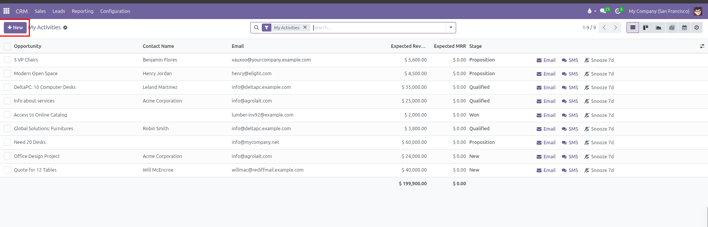

#### Understanding the Top `+ New` Button:
The purple **+ New** button in the top left control bar creates a new **Opportunity** record rather than an isolated task. Because the view is an opportunity management view filtered by planned actions, clicking **+ New** opens a blank opportunity form where you can register a new prospect and immediately schedule follow-up tasks in its chatter.

---

### 2. Scheduling a New Activity

You can schedule new activities using three primary methods:

#### Method 1: From the Opportunity Chatter Pane
1. Open the opportunity card from the pipeline or activity list.
2. In the right chatter area, click **Activities** *(clock icon)*.

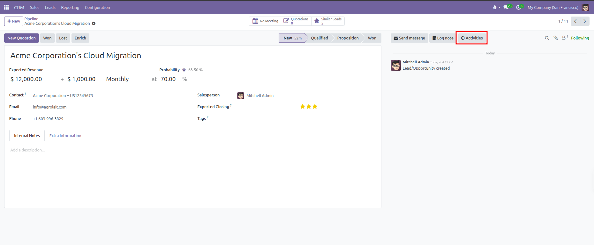

3. In the **Schedule Activity** dialog:
   * **Activity Type**: Select the task category *(such as Email, Call, Meeting, or To-Do)*.
   * **Summary**: Enter a short title describing the objective *(such as Discuss proposal terms)*.
   * **Due date**: Pick the target completion date.
   * **Assigned to**: Choose the team member responsible for executing the task.
   * **Log note**: Enter optional talking points, background context, or instructions in the text area.

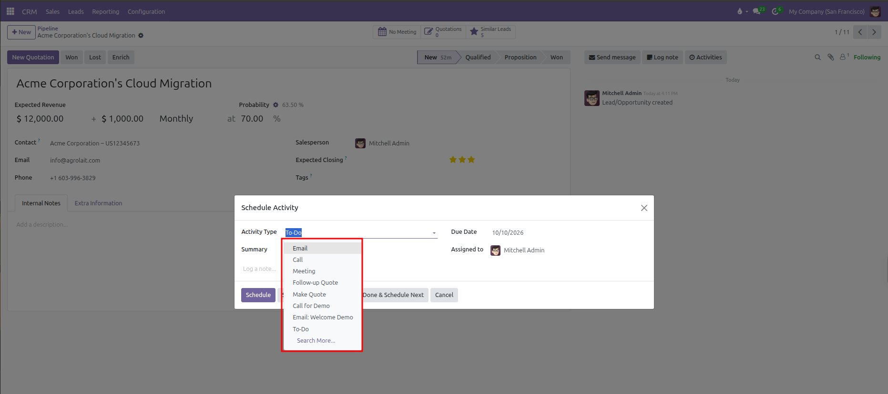

4. Click **Schedule** to save the task, or click **Schedule & Mark Done** if the action was already completed.

#### Method 2: From the Activity View (Matrix Grid)
1. In **CRM > Sales > My Activities**, click the **Activity view** icon *(clock icon in the top right control bar)*.

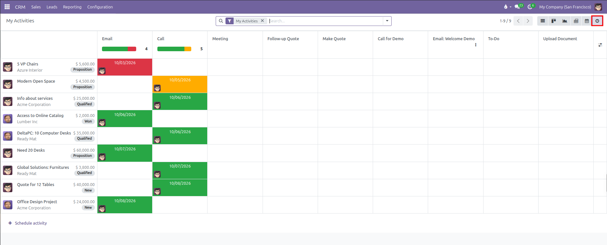

2. The matrix provides an operational grid of all open deals and their planned follow-ups:
   * **Rows**: Display individual opportunities with deal value, customer name, stage badge, and assigned salesperson.
   * **Columns**: Display each configured Activity Type *(such as Email, Call, Meeting, Follow-up Quote, or To-Do)* with column summary progress bars.
   * **Cells**: Display color-coded scheduled deadline dates *(red for overdue, orange for today, green for future)*.

3. To schedule an activity directly from the grid, click any empty cell at the intersection of your deal row and the desired activity column:
   * **Scheduling a Meeting**: Clicking inside the **Meeting** column opens a dialog with a summary field and an **Open Calendar** button to pick an exact meeting time slot.

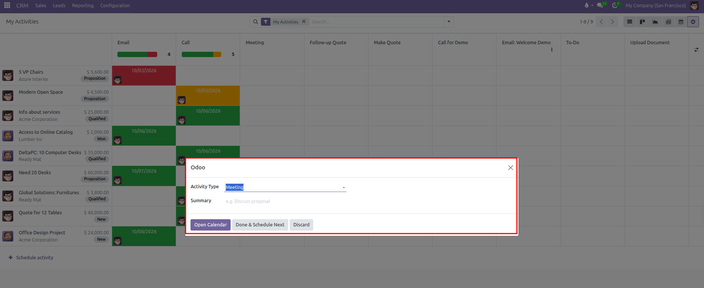

   * **Scheduling Tasks and Calls**: Clicking inside any standard task column *(such as Follow-up Quote, Call, or To-Do)* opens the schedule dialog pre-filled with the activity type, target deadline, and assigned salesperson. Enter a summary note and click **Schedule**.

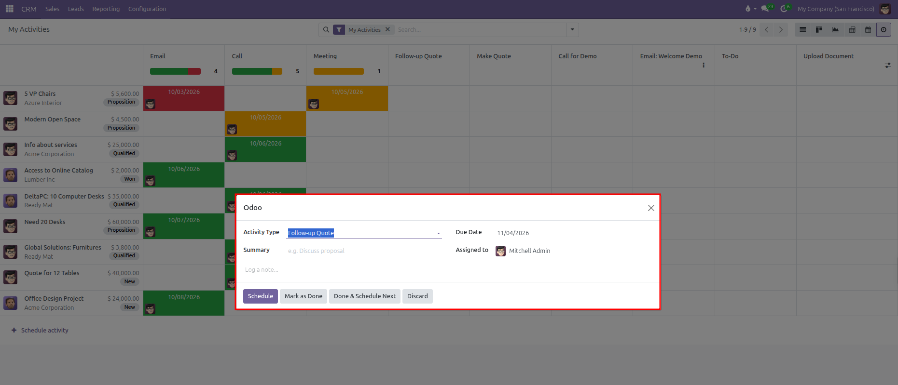

#### Method 3: Chaining Follow-ups (Done & Schedule Next)
When completing a call, email, or meeting, you can immediately log discussion outcomes and schedule the next follow-up action in a single continuous workflow:

1. In the opportunity chatter pane under **Planned Activities**, click the **Mark Done** button on your active task.

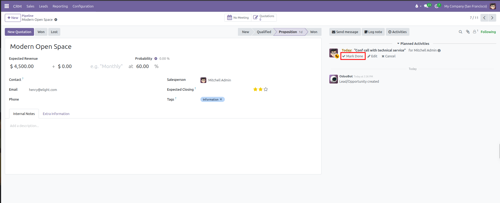

2. In the **Mark Done** feedback popup, enter customer discussion notes or meeting outcomes into the text field, then click **Done & Schedule Next**.

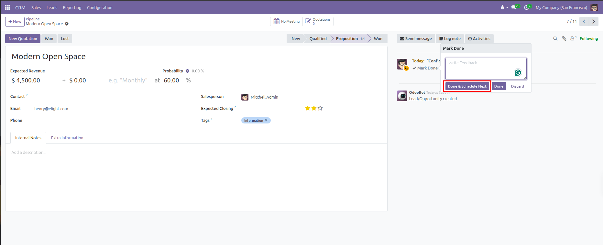

3. CURQ logs your feedback note into the chatter history and immediately opens the **Schedule an Activity** dialog.
4. The dialog selects the next logical action *(such as a To-Do follow-up)*. Adjust the **Activity Type**, set the next **Due Date**, confirm the **Assigned to** team member, and click **Schedule**.

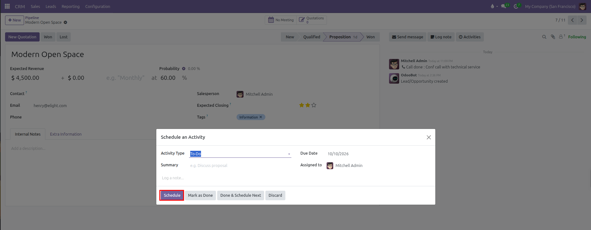

---

> [!NOTE]
> Direct creation is disabled on the Calendar view grid. The calendar view is dedicated to visualizing, inspecting, and editing existing deadlines rather than creating new tasks from blank slots. To schedule new meetings or calls, use the Activity matrix grid or the opportunity chatter pane.

---

### 3. Activity Search Filters

The search bar includes dedicated activity filters to help you organize your daily work schedule:

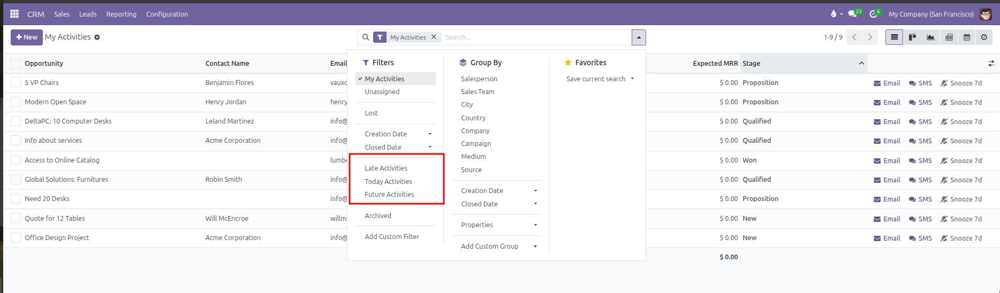

* **My Activities**: Filters opportunities to display tasks assigned to your user account *(active by default)*.
* **Late Activities**: Displays deals with overdue deadlines requiring immediate outreach.
* **Today Activities**: Focuses on tasks scheduled for completion during the current business day.
* **Future Activities**: Shows upcoming tasks scheduled for subsequent dates.

Combine these activity filters with stage groupings or sales team filters to focus on high-priority pipeline segments.

---

### 4. List View and Quick Row Actions

The default view for **My Activities** is the List view. This layout acts as an actionable daily to-do list where you can execute tasks without opening each record individually.

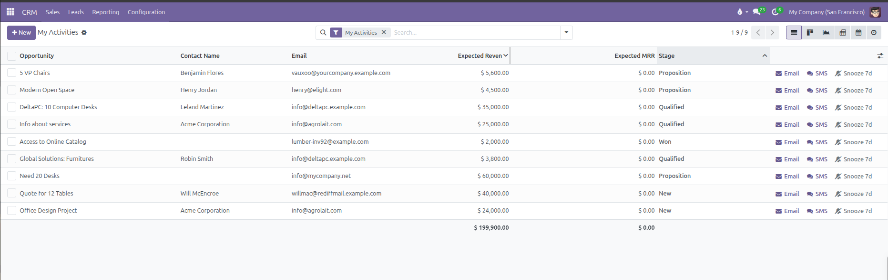

#### Key Columns Displayed:
* **Opportunity**: The name of the deal.
* **Contact Name**: Primary customer or prospect contact.
* **Email**: Direct email address for the prospect.
* **Expected Revenue**: Financial value of the deal.
* **Expected MRR**: Monthly recurring revenue for subscription deals.
* **Stage**: Current pipeline qualification milestone.

#### Inline Action Buttons on Each Row:
Each record row provides fast inline action buttons:
* **Email** *(envelope icon)*: Opens the email composer popup to draft and send a message directly to the customer.
* **SMS** *(speech bubble icon)*: Sends a direct text message to the customer phone number.
* **Snooze 7d** *(bell slash icon)*: Available on non-meeting tasks. Postpones the activity deadline by seven days with a single click when a prospect needs extra time.
* **Reschedule** *(calendar icon)*: Appears on scheduled meetings. Opens the calendar interface so you can select a new meeting time slot.

---

### 5. Multiple View Formats for Daily Execution

Switch between different view modes using the icons in the top right control bar:

#### A. List View
The primary task execution list sorted by deadline. Ideal for working through calls, emails, and daily follow-up lists.

#### B. Kanban View
Displays deals as cards grouped across vertical pipeline stages. Each card displays color-coded activity icons *(green envelope for future email, orange phone for call due today, red envelope for overdue email)*.

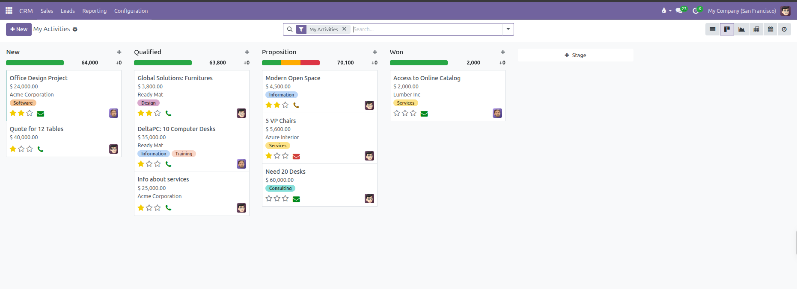

#### C. Calendar View
Provides an interactive calendar timeline displayed by Day, Week, or Month with sidebar filters for customers and salespersons. Direct task creation is disabled on the calendar grid. Use this view to review existing deadlines, inspect scheduled customer appointments, and adjust dates by clicking an entry to edit or dragging bars across dates.

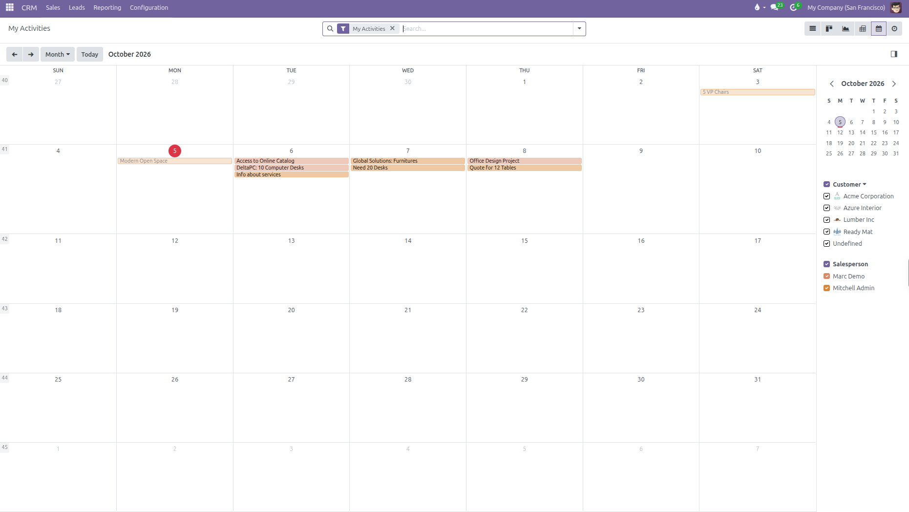

#### D. Pivot View
Provides an analytical pivot matrix summarizing expected revenues across pipeline stages and calendar months.

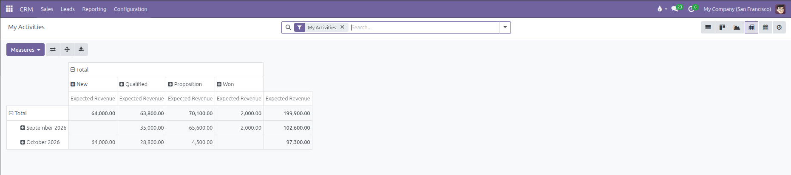

#### E. Activity View (Matrix Grid)
Displays a structured table where rows display opportunities and columns display activity types. Cells display count badges indicating task status, allowing quick scheduling with inline plus buttons.

---

### 6. Color Indicators and Managing Planned Activities

Scheduled activities appear both in the document chatter and on opportunity cards across views with clear color status indicators:
* **Green**: Future activity scheduled on time *(such as `Due in 5 days`)*.
* **Orange**: Activity due today *(such as `Today`)*.
* **Red**: Overdue activity requiring immediate attention *(such as `Yesterday` or `2 days overdue`)*.

#### Inline Chatter Actions:
Each planned activity listed in the opportunity chatter provides quick inline action buttons:
* **Mark Done**: Completes the activity and opens the outcome dialog.
* **Edit**: Modifies the due date, assigned user, or task summary.
* **Cancel**: Discards the planned activity without logging it as completed.

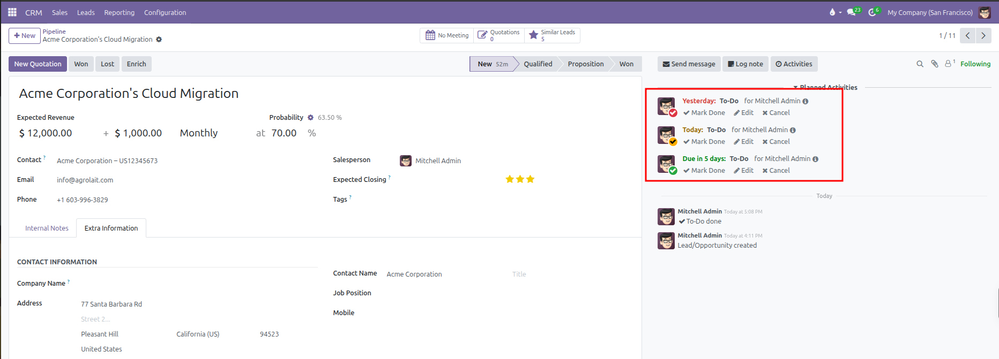

#### Completing an Activity:
1. Open the opportunity form view.
2. In the right chatter area under **Planned Activities**, locate the overdue or active task.
3. Click the **Mark Done** button.

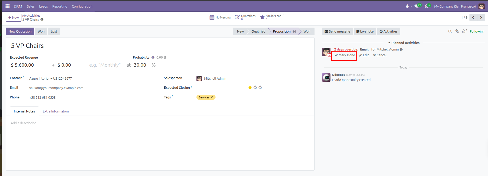

4. In the completion dialog, enter meeting outcomes or customer feedback in the notes field.
5. Choose **Done & Schedule Next** to immediately chain the next follow-up action, or click **Done** to close the task.
