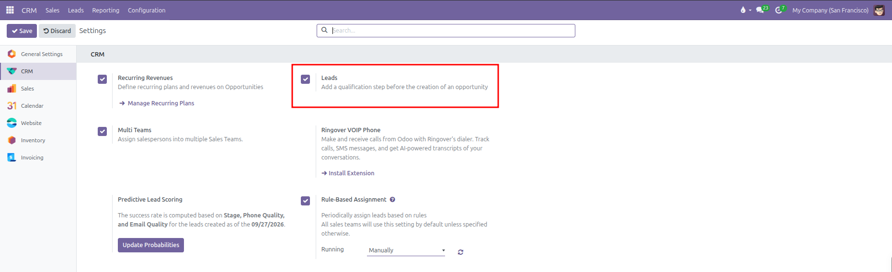
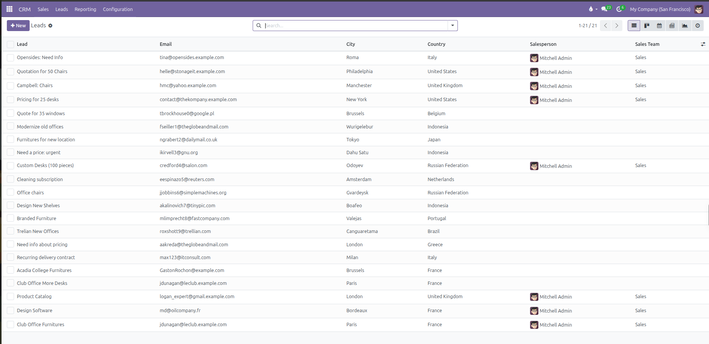
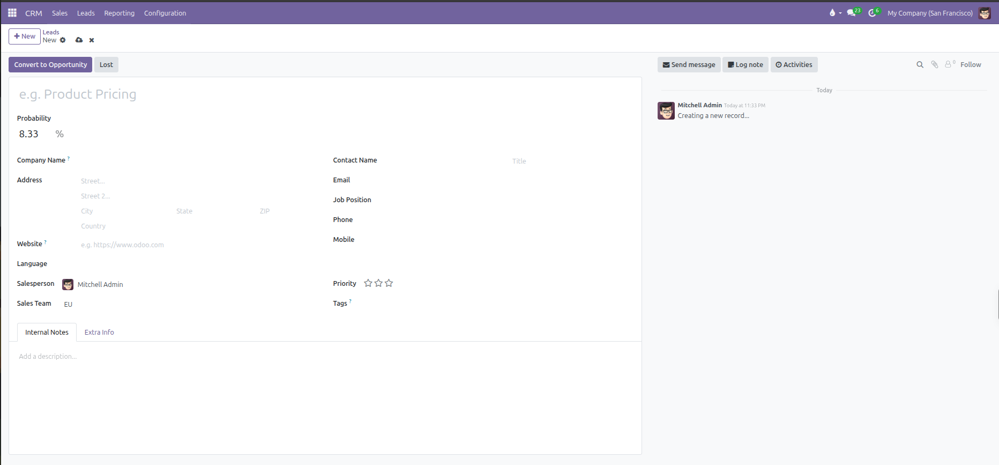
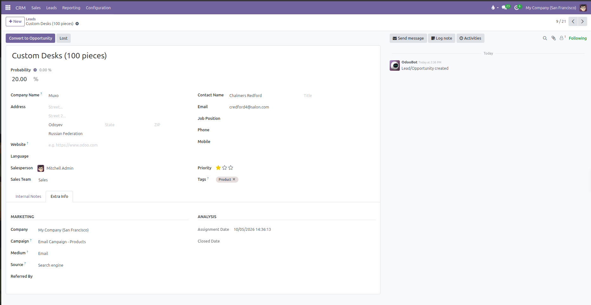
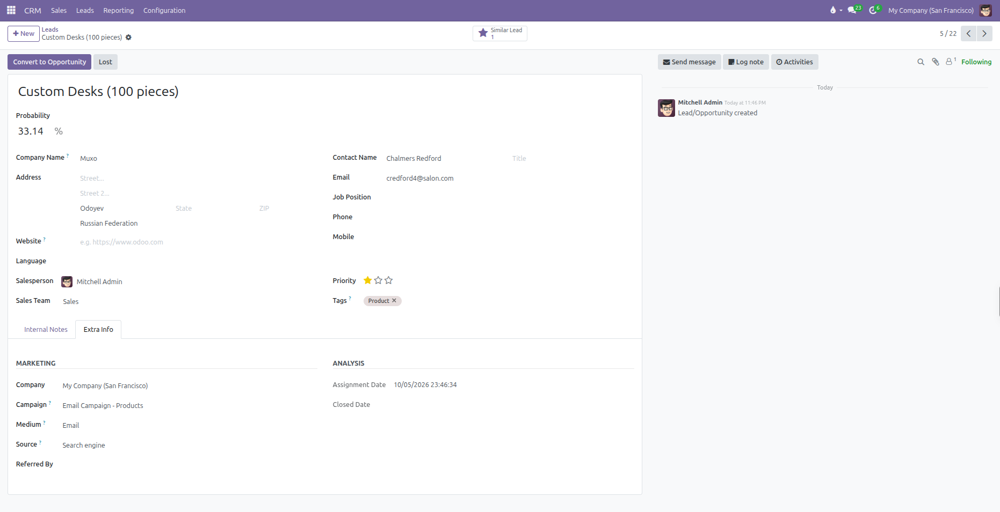
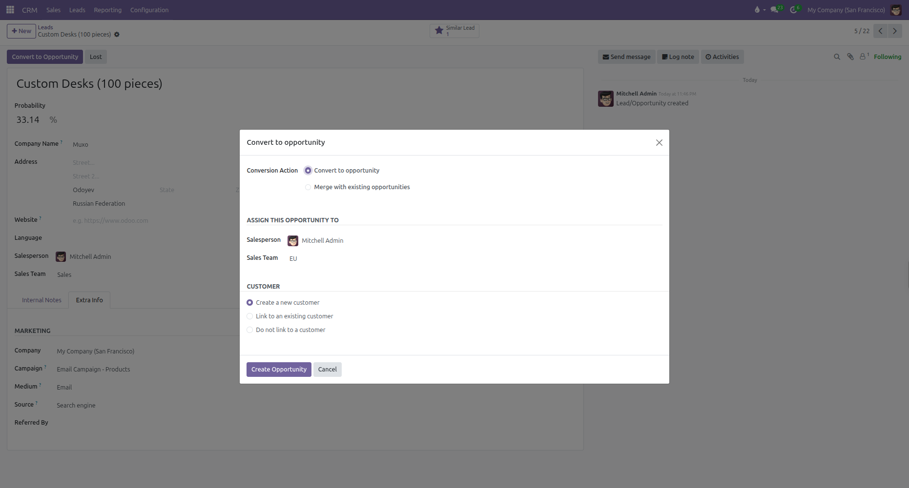
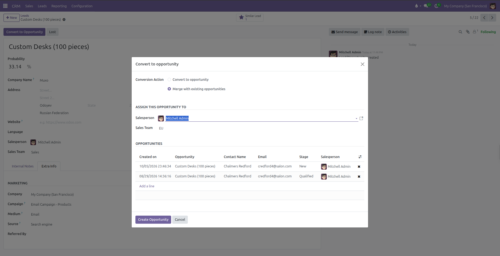
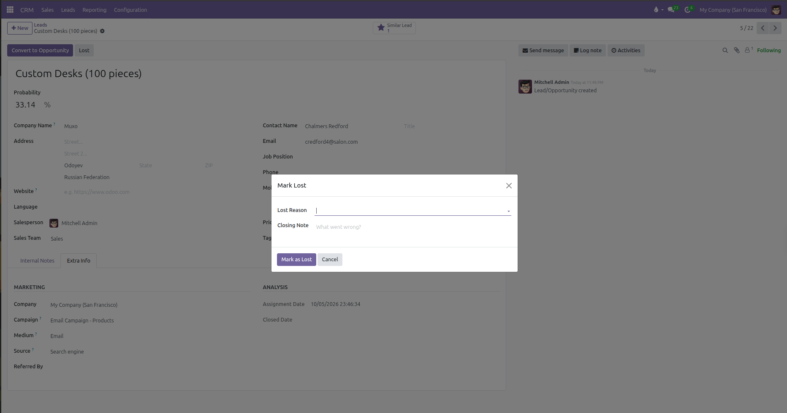

# Qualifying and Converting Leads

Capture unqualified inquiries, evaluate prospect suitability, identify duplicate records, and convert qualified leads into pipeline opportunities in CURQ 18.

---

### 1. Distinction Between Leads and Opportunities

CURQ 18 supports a two-tier intake process for commercial prospects:

* **Leads**: Unscrubbed, unverified inquiries such as incoming contact form submissions, business cards gathered at exhibitions, raw email messages, or cold prospect directories. A lead does not have pipeline stages, win probability calculations, or quotation links.
* **Opportunities**: Qualified commercial prospects with an assigned contact, estimated monetary value, closing date, and active pipeline stage *(such as New, Qualified, Proposition, or Won)*.

Using leads prevents raw, low-intent inquiries from cluttering active sales pipeline Kanban views. Once an inquiry is validated as a legitimate sales prospect, you convert it into an opportunity.

---

### 2. Enabling Leads in System Configuration

The Leads intake stage is optional. When disabled, CURQ directs all incoming inquiries immediately into the pipeline as opportunities.

To activate the Leads workflow:

1. Open the **CRM** app.
2. In the top navigation bar, click **Configuration** > **Settings**.
3. Under the **CRM** section, locate **Leads**.
4. Check the box labeled **Add a qualification step before the creation of an opportunity**.
5. Click **Save** in the top control panel.

Once saved, a dedicated **Leads** menu item appears in the top navigation bar next to **Sales**.

---

### 3. Creating and Managing Inbound Leads

To log a new inquiry manually:

1. Navigate to **CRM** > **Leads**.
2. Click **+ New** in the top left control bar.

3. CURQ opens the lead creation form with the following fields:

#### Primary Header and Subject:
* **Lead Title**: Enter a descriptive summary of the inquiry *(such as `Custom Desks (100 pieces)` or `Web contact form submission`)*.
* **Probability**: The calculated win probability percentage. Clicking the gear icon resets custom entries back to the automated calculation.

#### Left Column (Company and Sales Assignment):
* **Company Name**: Legal or operating name of the customer business.
* **Address**: Complete street address, city, state, postal code, and country.
* **Website**: Client website URL.
* **Language**: Preferred language for outgoing messages and documentation.
* **Salesperson**: The internal user assigned to qualify the inquiry.
* **Sales Team**: The designated commercial team handling the division. Configure teams in [Sales Teams Setup](../procedures/02-sales-teams-setup.md).

#### Right Column (Contact Person and Prioritization):
* **Contact Name**: First and last name of the individual prospect.
* **Title**: Salutation or honorific *(such as Mr., Ms., Dr.)*.
* **Email**: Direct email address for commercial correspondence.
* **Job Position**: Professional role within their organization.
* **Phone**: Landline telephone number.
* **Mobile**: Mobile telephone number.
* **Priority**: Priority stars indicating urgency *(1 star = Low, 2 stars = Medium, 3 stars = High)*.
* **Tags**: Categorization tags *(such as `Product`, `Software`, `Enterprise`, or `Trade Show`)*.

#### Tab Sections:
* **Internal Notes**: Discovery notes, technical specifications, or qualification discussion details.
* **Extra Info**: Contains marketing origin data and assignment tracking metrics.

##### Marketing

| Field | Description |
| --- | --- |
| **Company** | Internal operating company managing the inquiry. |
| **Campaign** | Promotional campaign that generated the lead *(such as `Email Campaign: Products`)*. |
| **Medium** | Delivery channel used to reach the prospect *(such as `Email`, `Banner`, or `Direct`)*. |
| **Source** | Origin platform or touchpoint *(such as `Search engine`, `Referral`, or `Trade Show`)*. |
| **Referred By** | Individual, partner, or colleague who introduced the prospect. |

##### Analysis

| Field | Description |
| --- | --- |
| **Assignment Date** | Timestamp recording when a salesperson was assigned to the lead. |
| **Closed Date** | Timestamp recording when the lead reached closure. |

---

### 4. Detecting Duplicate Records and Similar Leads

Before reaching out to a prospect, verify whether the individual or organization already exists in your records:

* The **Similar Leads** smart button appears at the top right of the lead sheet whenever CURQ detects matching contact details *(such as identical email addresses, phone numbers, or company names)*.
* Clicking the smart button displays a list of potential duplicate leads or opportunities.
* Reviewing matches prevents multiple sales team members from contacting the same prospect independently.

---

### 5. Converting a Lead to an Opportunity

Once an inquiry is qualified and confirmed as a genuine commercial prospect, convert the record into an opportunity:

1. Open the lead form.
2. In the top action bar, click **Convert to Opportunity**.
3. A modal dialog opens with conversion configuration choices:

#### Conversion Action:
* **Convert to opportunity**: Creates a new opportunity card inside the pipeline. This option displays customer linking choices *(Link to an existing customer, Create a new customer, or Do not link to a customer)*.
* **Merge with existing opportunities**: Combines the inquiry with matching active deals into a single record, displaying a list of matching opportunities to consolidate.

#### Assign This Opportunity To:
* **Salesperson**: Confirm or reassign the team member responsible for advancing the deal.
* **Sales Team**: Confirm or select the designated commercial team.

#### Customer Handling (when Converting):
* **Create a new customer**: Automatically generates a brand new contact card in your database using the address and contact details from the lead form.
* **Link to an existing customer**: Select this option when the prospect belongs to an established customer in your system. Use the search field to connect to the existing record in [Contacts](../../Contacts/manual/01-create-contact.md).
* **Do not link to a customer**: Converts the inquiry into an opportunity without generating or linking an address book contact.

When duplicate deals are detected, selecting **Merge with existing opportunities** displays the matching records to consolidate:

4. Click **Create Opportunity** to execute the transition.

Following conversion:
* The record moves out of the Leads view into **CRM** > **Sales** > **My Pipeline**.
* The pipeline stage statusbar appears at the top of the form, placed by default into the first stage *(**New**)*.
* Commercial revenue estimation, automated win probability, calendar meeting scheduling, and quotation drafting become accessible. See [Creating and Managing Opportunities](01-create-and-manage-leads-opportunities.md) and [Pipeline Stages and Won/Lost Workflow](02-pipeline-stages-and-won-lost-workflow.md).

---

### 6. Marking Unqualified Inquiries as Lost

Not every inbound inquiry reflects a viable commercial engagement. If a lead contains spam, requests unsupported services, or lacks genuine commercial intent:

1. Open the lead form.
2. In the top action bar, click **Lost**.
3. In the **Mark Lost** popup dialog, pick a standardized **Lost Reason** *(such as `Not qualified`, `Spam`, or `Services not offered`)*. Configure lost reasons in [Lost Reasons and Tags Setup](../procedures/03-lost-reasons-and-tags-setup.md).
4. Enter optional closing remarks in the **Closing Note** field.

5. Click **Mark as Lost**.

The record receives a red **Lost** ribbon and archives automatically from the default Leads list view while preserving the inquiry for historical analysis.
