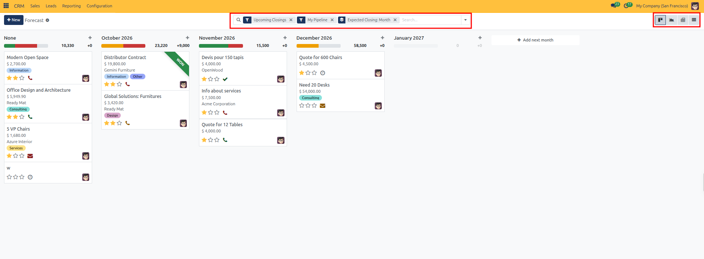
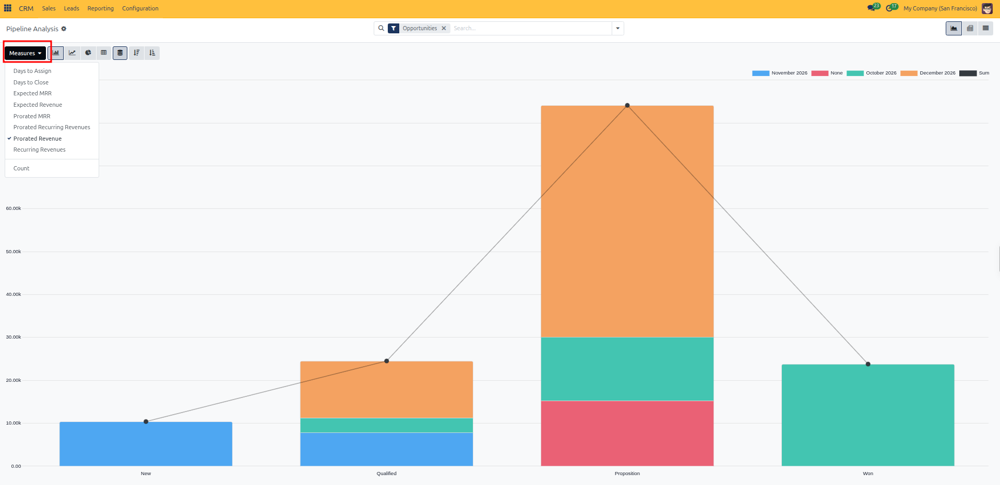
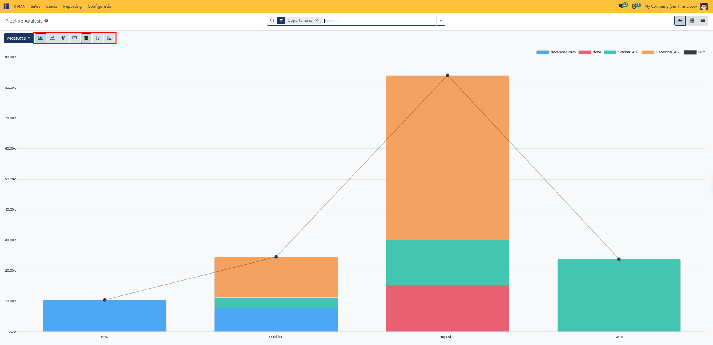
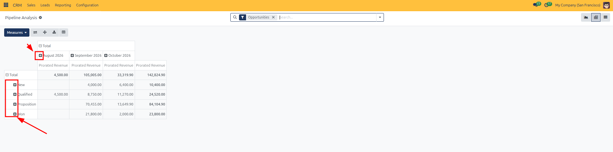
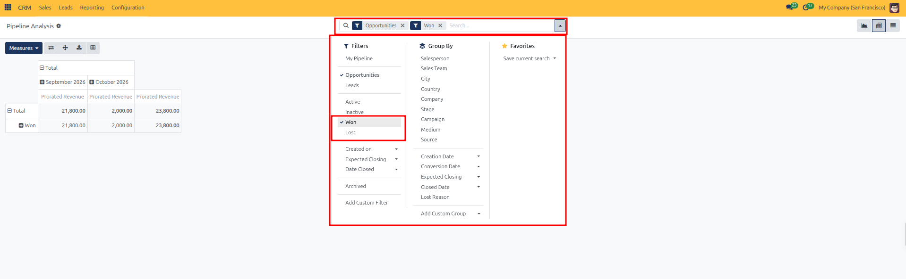
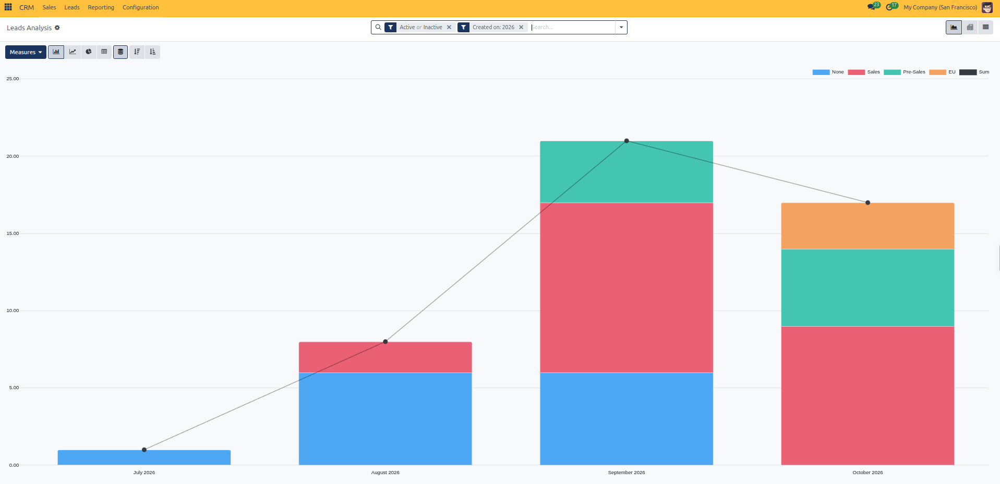
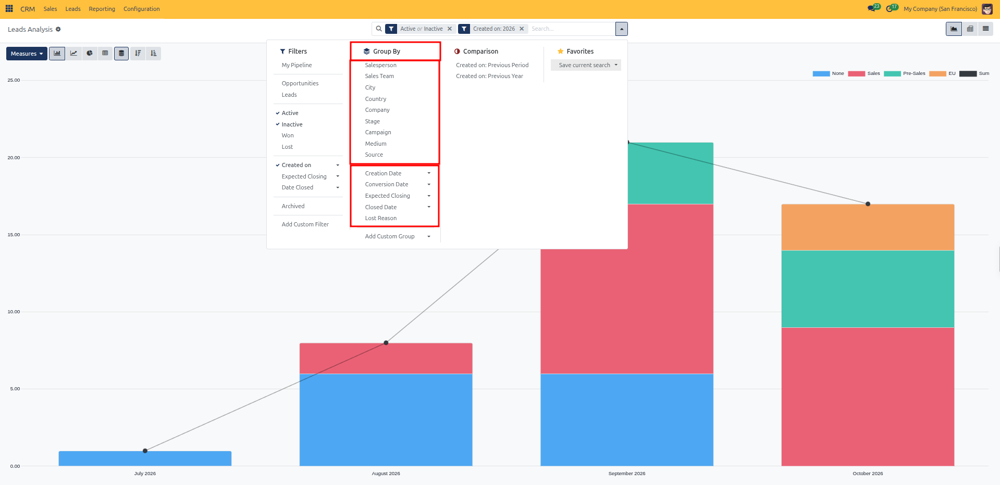
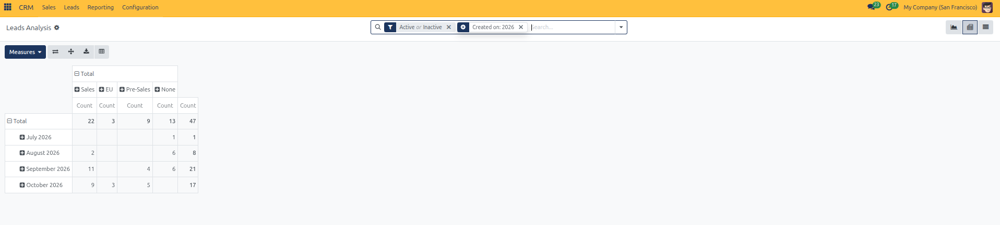
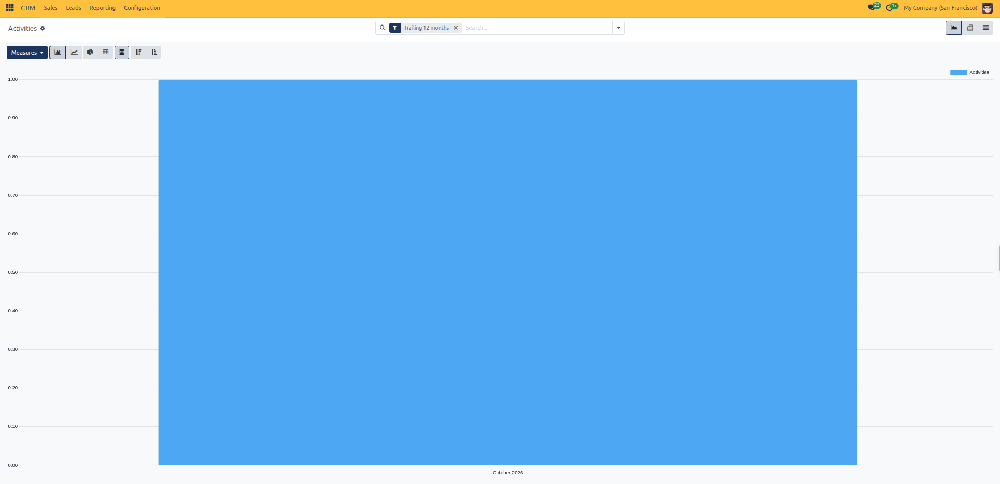

# Analyze CRM Pipeline, Leads, and Forecasts

Follow these practical steps to analyze sales pipeline performance, monitor revenue forecasts, evaluate incoming lead acquisition, and track sales team activities across the four dedicated reporting views in CURQ 18.

---

### 1. Access the Four CRM Reporting Views

In the top navigation bar of the CRM application, click **Reporting** to reveal the four dedicated analysis views:

* **Forecast**: Monthly revenue forecasts organized by expected deal closing deadlines.
* **Pipeline**: Overall pipeline analysis, stage velocity, deal value distributions, and win/loss rates.
* **Leads**: Incoming lead volume trends, acquisition channels, and qualification timelines.
* **Activities**: Sales rep activity logs tracking completed and planned calls, meetings, emails, and follow-ups.

---

### 2. Track Revenue Forecasts by Closing Month (Reporting > Forecast)

To project incoming sales revenue based on anticipated closing dates:

1. In the top navigation bar, click **Reporting** > **Forecast**.
2. By default, CURQ opens the **Forecast** view in a dedicated **Kanban** layout where deal columns represent future closing months *(such as `October 2026`, `November 2026`, or `December 2026`)*.
3. Each month column displays:
   * **Prorated Revenue**: The expected deal value multiplied by its win probability, providing a realistic weighted forecast.
   * **Monthly Recurring Revenue (MRR)**: If recurring revenues are enabled, the normalized monthly contract value (total recurring amount divided by the plan duration in months) is summarized separately as Expected MRR.
   * **Column Summary Progress Bar**: Visual progress indicator showing weighted revenue contributions per month.
4. **Reschedule Deals**: Drag and drop any deal card between month columns to immediately adjust its expected closing date.
5. **Switch Visualization Modes**: Use the view switcher in the top right corner to review forecast figures in alternative layouts *(Graph, Pivot, and List)*.

---

### 3. Evaluate Deal Values and Stage Progression (Reporting > Pipeline)

To examine total deal volume, identify bottleneck stages, and calculate conversion rates:

1. In the top navigation bar, click **Reporting** > **Pipeline**.
2. By default, CURQ opens the **Pipeline Analysis** in a **Bar Chart** graph view pre-filtered by **Opportunities** and active pipeline records:
   * **X-Axis**: Represents pipeline stages *(New, Qualified, Proposition, Won)*.
   * **Y-Axis**: Measures weighted revenue or deal value.

3. **Change Performance Measures**:
   * Click the **Measures** button at the top left of the view.
   * Select **Prorated Revenue** to evaluate weighted pipeline value.
   * Select **Expected Revenue** to view total unweighted deal sizes.
   * Select **Expected MRR** or **Prorated MRR** to inspect recurring monthly figures.
   * Select **Count** to analyze the sheer number of open deals per stage.
   * Select **Probability** to evaluate average stage confidence levels.

4. **Switch Chart Formats**:
   * **Bar Chart**: Compare revenue across stages side-by-side.
   * **Line Chart**: Observe how pipeline value transitions over time.
   * **Pie Chart**: Review the proportional distribution of revenue across stages or teams.
   * **Stack & Sort**: Toggle stacked bar visualizations or order columns ascending/descending.

5. **Cross-Tabulate in Pivot View**:
   * Click the **Pivot** view icon at the top right.
   * Click the **+** (plus) icon on rows to expand by **Stage**, **Salesperson**, or **Sales Team**.
   * Click the **+** (plus) icon on columns to group by **Expected Closing Month** or **Creation Date**.
   * Click **Insert in Spreadsheet** or **Download** to export pipeline figures for executive review.

6. **Analyze Historical Wins and Losses**:
   * Open the search bar filter dropdown.
   * Select the **Won** filter to analyze characteristics of successfully closed opportunities.
   * Select the **Lost** filter and group by **Lost Reason** to pinpoint primary causes for deal cancellations.

---

### 4. Analyze Incoming Lead Inflow and Sources (Reporting > Leads)

To evaluate lead acquisition campaigns, marketing channel performance, and team intake:

1. In the top navigation bar, click **Reporting** > **Leads**.
2. By default, CURQ displays the **Leads Analysis** report in a **Graph** view pre-filtered by active and closed leads created over the past year.

3. **Analyze Acquisition Channels**:
   * Click the search bar dropdown and navigate to the **Group By** section.
   * Select **Medium** to compare channels *(such as Banner, Direct, or Email)*.
   * Select **Source** to identify lead origins *(such as Search Engine, Referral, or Newsletter)*.
   * Select **Campaign** to evaluate specific marketing initiative returns.
4. **Evaluate Lead Volume Over Time**:
   * Group by **Creation Date** > **Month** to observe seasonal lead intake trends.
   * Group by **Sales Team** to verify whether incoming inquiries are distributed evenly.

5. **Examine Conversion Efficiency in Pivot View**:
   * Switch to the **Pivot** view to compare total leads created against leads converted into active opportunities across sales teams.
   * Inspect lead assignment lag to ensure sales representatives respond promptly to new inquiries.

---

### 5. Monitor Sales Activities and Team Follow-ups (Reporting > Activities)

To ensure consistent sales engagement, monitor task completions, and prevent neglected leads:

1. In the top navigation bar, click **Reporting** > **Activities**.
2. By default, CURQ opens the **Activities Analysis** report pre-filtered to the **Trailing 12 months**:
   * Displays an interactive **Bar Chart** breaking down completed and planned sales activities.

3. **Review Activities by Type**:
   * Columns are categorized by activity type *(Call, Meeting, Email, To-Do)*.
   * Identify whether the sales team relies predominantly on email follow-ups or telephone outreach.
4. **Evaluate Salesperson Engagement**:
   * In the **Group By** menu, select **Salesperson** or **Assigned To**.
   * Compare individual team member activity counts to ensure balanced workload and proactive deal follow-up.
5. **Cross-Reference with Won Deals**:
   * Filter by **Won** to determine the average volume of calls, meetings, and emails required to successfully close a deal.
