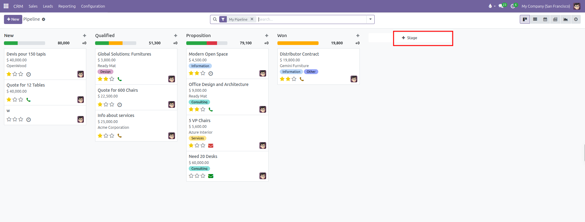
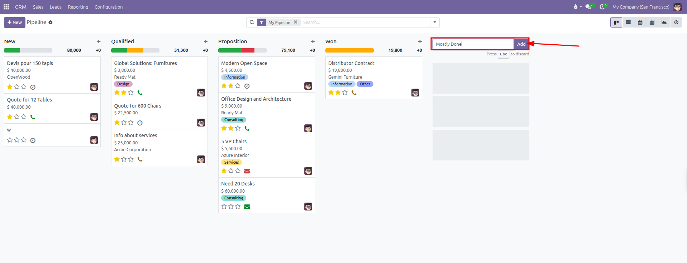
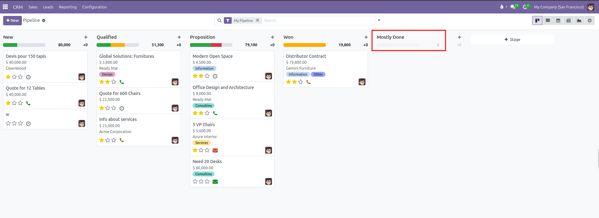
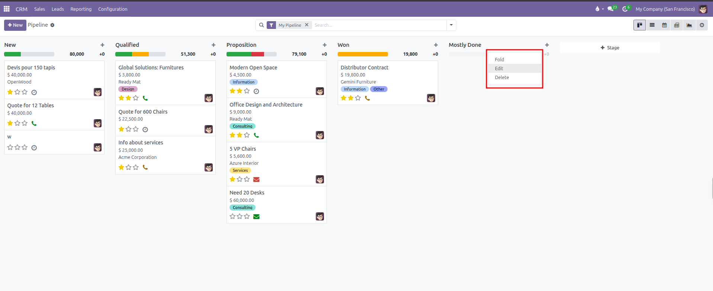
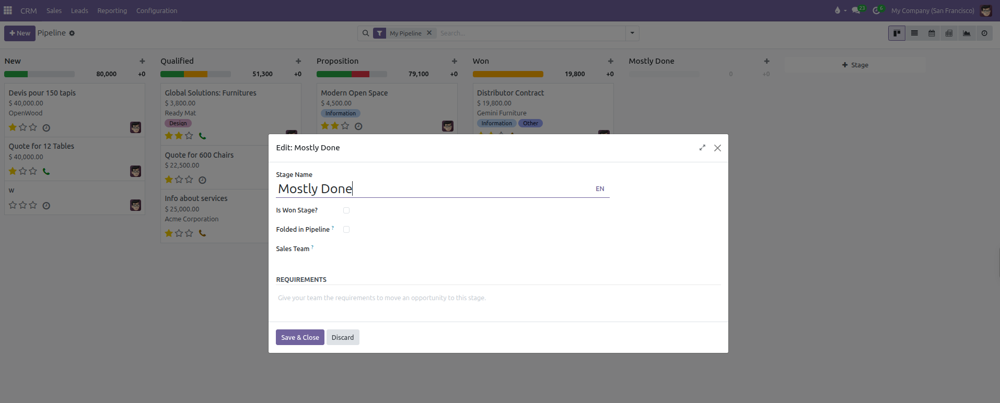
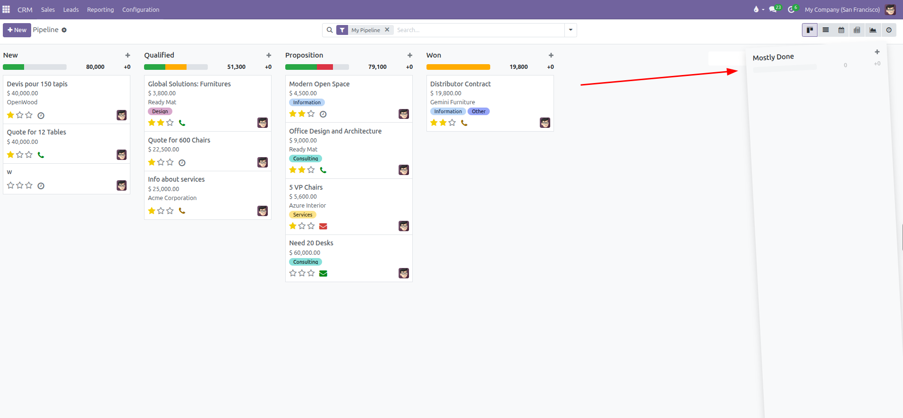

# Pipeline Stages Configuration

Create custom pipeline stages, define display sequences, configure stage folding, set win markers, and establish stage requirements in CURQ 18.

---

### 1. Overview of Pipeline Stages

Pipeline stages reflect the structured steps of your organization's sales qualification process. Setting up clear stages ensures every team member follows standardized milestones when guiding prospective clients from first contact to closing.

CURQ allows businesses to tailor stages to their commercial model, whether selling short-cycle retail goods or complex enterprise contracts.

---

### 2. Managing Stages Directly on the Kanban Board

In standard daily operations, stages are configured directly on the opportunity Kanban board without navigating through backend configuration menus.

#### Navigating to the Pipeline Board:
1. Open the **CRM** application.
2. In the top navigation bar, click **Sales**.
3. Select **My Pipeline**.

#### Adding a New Stage:
1. Scroll to the far right of the Kanban columns.
2. Click **+ Stage** in the final column header.

3. Enter the new stage name *(such as `Discovery`, `Solution Design`, or `Contract Review`)*.
4. Click **Add** to create the column.

5. The new stage column appears on the Kanban board.

---

### 3. Configuring Stage Properties

To adjust stage settings, exit criteria, or win designations:

1. Hover your cursor over the title header of any stage column in **My Pipeline**.
2. Click the gear actions icon that appears at the top right of the column header.
3. Select **Edit** from the dropdown menu to open the configuration dialog.

#### Stage Configuration Fields:
* **Stage Name**: The label displayed at the top of the Kanban column and in the deal status bar.
* **Is Won Stage?**: Check this box to designate this stage as the successful closing milestone. When an opportunity moves into this stage, CURQ marks the opportunity as Won and sets probability to 100%.
* **Folded in Pipeline ?**: Check this box to collapse the stage column horizontally by default in the Kanban board. This saves screen space for stages that do not require daily attention.
* **Sales Team ?**: Assign a specific sales team if this stage only applies to that group *(such as an Enterprise Sales team with distinct qualification steps)*. Leave this field empty to make the stage available across all sales teams.
* **REQUIREMENTS**: Enter internal guidelines, exit criteria, or mandatory documentation needed before a deal advances to this stage *(such as `Technical feasibility approved and budget authority confirmed`)*. This text displays as informative guidance to team members when viewing or hovering over the stage.

4. Click **Save & Close** to apply the configuration.

#### Additional Column Actions:
* **Fold**: Collapses the column horizontally. Clicking the vertical folded bar expands it again.
* **Delete**: Removes the stage column from the board. Ensure all deals are moved out of the stage before deletion.

---

### 4. Reordering Stages in the Pipeline

The left-to-right order of columns determines the progression flow on the Kanban board and the chronological sequence in deal forms.

To reorder stages:
1. Navigate to **CRM > Sales > My Pipeline**.
2. Click and hold the title header of any stage column.
3. Drag the column horizontally to the desired position.
4. Release the mouse button to drop the column in place.

---
