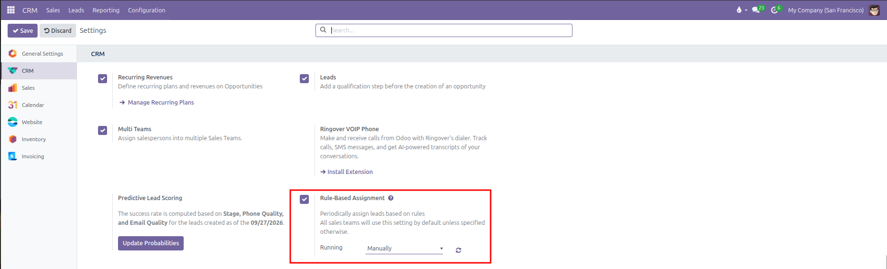
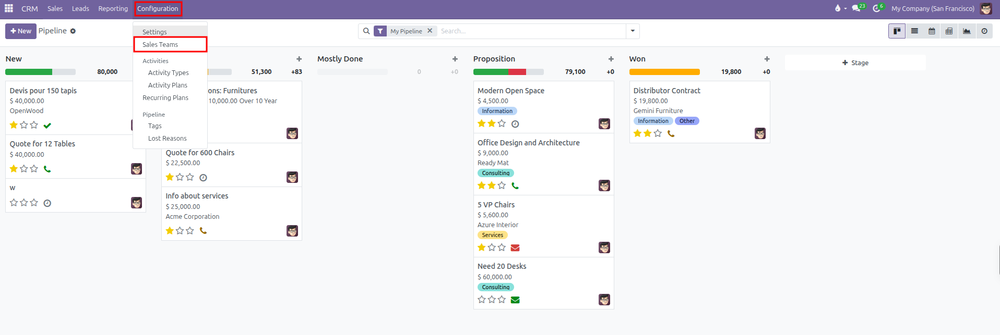
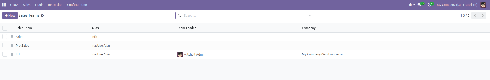
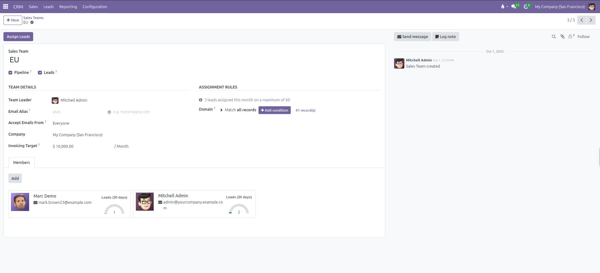
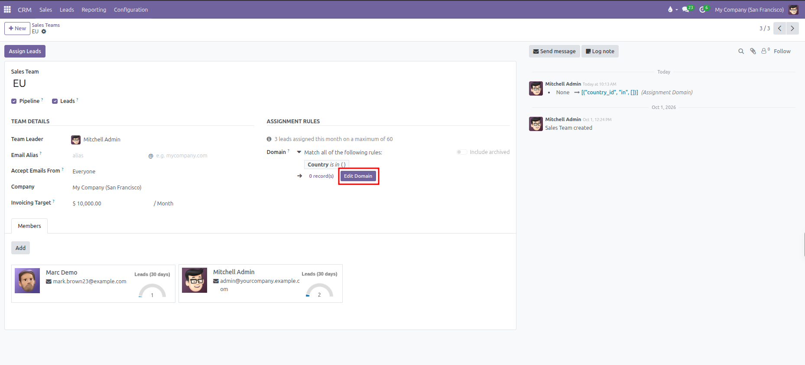
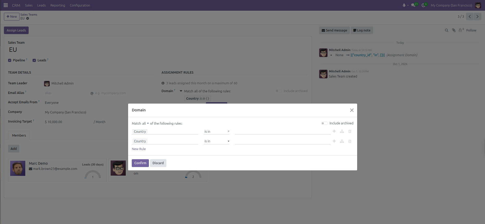
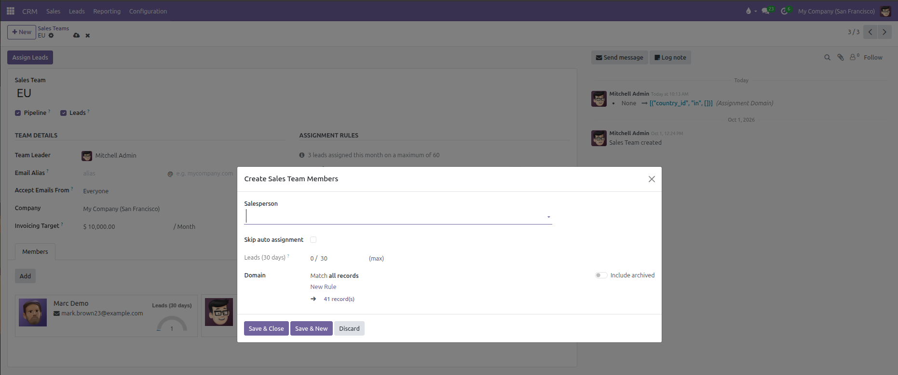
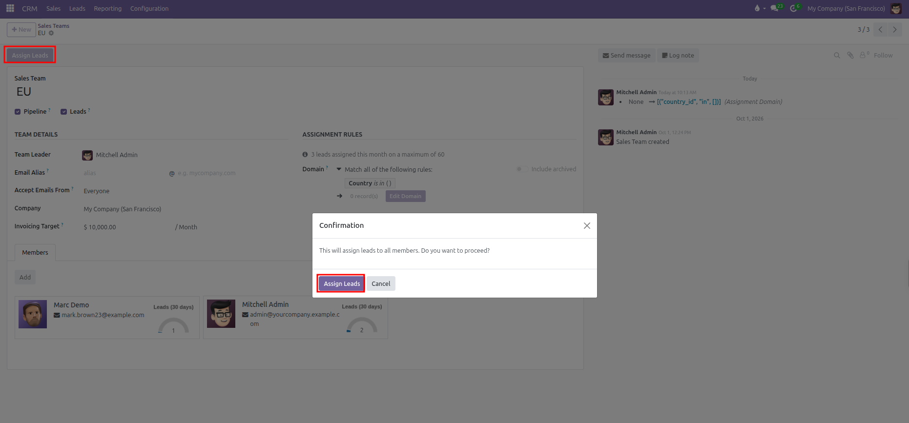

# Sales Teams Configuration

Configure commercial sales teams, assign team leaders, manage members, establish monthly invoicing targets, and configure automated lead assignment rules in CURQ 18.

---

### 1. The Role of Sales Teams in CRM

Sales teams allow organizations to structure commercial activities by geography, industry, product vertical, or deal size (such as Domestic Accounts, International Enterprise, or Inbound Qualification).

Organizing staff into dedicated teams enables commercial leadership to:
* Route incoming inquiries to qualified salespeople based on domain rules.
* Establish and track monthly invoicing targets for each commercial group.
* Maintain segmented visibility across pipelines and team member workloads.
* Balance lead distribution evenly across team members according to 30-day volume limits.

---

### 2. Enabling Rule-Based Assignment in Settings

Before configuring team-specific assignment domains or executing on-demand allocation, an administrator must activate lead assignment in the global system settings:

1. Open the **CRM** application.
2. In the top navigation bar, click **Configuration**.
3. Select **Settings**.
4. In the **CRM** section, locate the **Rule-Based Assignment** option.
5. Check the box for **Rule-Based Assignment**.

#### Rule-Based Assignment Settings:
* **Function Description**: Periodically assign leads based on rules. All sales teams will use this setting by default unless specified otherwise.
* **Running**: Governs the execution schedule for lead distribution:
  * `Manually`: Automatic background distribution is paused. Lead allocation happens strictly on demand when an authorized manager clicks **Assign Leads** on individual sales team forms.
  * `Repeatedly`: Activates the background scheduled cron job to automate lead distribution across all teams. Selecting this option displays additional configuration fields:
    * **Repeat every**: The execution frequency number and interval unit (`Minutes`, `Hours`, `Days`, or `Weeks`).
    * **Next Run**: Displays and schedules the exact timestamp for the next automated allocation execution.
* **Sync Button**: The refresh icon situated next to the Running selection triggers immediate lead assignment across all active sales teams directly from the settings page.

Activating this setting exposes the **Assignment Rules** section and the **Assign Leads** action button on all sales team records.

---

### 3. Navigating to Sales Teams Configuration

To access and configure sales teams:

1. Open the **CRM** application.
2. In the top navigation bar, click **Configuration**.
3. Select **Sales Teams**.

4. The **Sales Teams** list displays all configured teams, their email aliases, assigned team leaders, and legal company affiliations.
5. You can adjust team display sequence by clicking and dragging the handle at the left edge of any row.

---

### 4. Creating and Configuring a Sales Team

Click **New** to establish a team, or click an existing team row (such as `EU`) to adjust its settings:

#### Primary Team Information:
* **Sales Team**: The unique name identifying the commercial unit (such as `EU`, `Sales`, or `Pre-Sales`).
* **Assign Leads**: Action button situated in the top action bar. Clicking this button opens a confirmation prompt and immediately distributes unassigned leads matching team criteria among eligible members. This button remains hidden when both Pipeline and Leads are disabled or when automated lead assignment is inactive in system settings.
* **Pipeline**: Checkbox enabling the opportunity pipeline Kanban view for this team.
* **Leads**: Checkbox enabling unscrubbed lead qualification before converting inquiries into pipeline opportunities.

#### Team Details:
* **Team Leader**: The manager or lead salesperson guiding operations for this team.
* **Email Alias**: The incoming email prefix assigned to the team (such as `alias` followed by `@yourcompany.example.com`). Inbound messages delivered to this address automatically generate new leads or opportunities assigned to the team. This field remains hidden when both Pipeline and Leads are disabled.
* **Accept Emails From**: Security filter governing who can generate records via the team email alias:
  * `Everyone`: Any inbound sender can generate a record.
  * `Authenticated Partners`: Only contacts already saved in the database can generate records via email.
  * `Followers only`: Restricts submission to existing followers of the team.
  
* **Company**: The legal entity associated with the team in multi-company environments.
* **Invoicing Target**: The monthly revenue benchmark for the team (such as `$ 10,000.00 / Month`). This figure powers progress meters on commercial dashboards against posted and paid customer invoices.

#### Assignment Rules:
When automated lead assignment is enabled in system settings, this section manages inbound distribution criteria:
* **Assignment Tracker**: Displays real-time allocation metrics for the active month (such as `3 leads assigned this month on a maximum of 60`). The maximum reflects the combined 30-day capacity of all active team members.
* **Domain**: Filtering conditions that incoming leads must satisfy to match this team.
  * When rules are active, the form displays the condition summary, the number of matching records (such as `0 record(s)`), and the **Edit Domain** button.

  * Clicking **Edit Domain** opens the dedicated domain builder modal to construct detailed routing filters.

  * **Match Logic**: Select `Match all of the following rules` or `Match any of the following rules`.
  * **Rule Rows**: Select the lead field (such as `Country`), comparison operator (such as `is in`), and filter values. Use the plus icon to append conditions, the branch icon to create nested criteria, or the trash icon to remove a line.
  * **New Rule**: Appends an additional condition row.
  * **Include archived**: Toggle switch to evaluate or ignore archived records in domain queries.
  * Click **Confirm** to apply the domain or **Discard** to cancel changes.

#### Members Tab:
The **Members** tab manages internal salespeople assigned to this commercial group:
1. Click **Add** to open the member configuration modal.

2. Configure individual member settings:
   * **Salesperson**: Select the internal user account.
   * **Skip auto assignment**: Check this box if this salesperson should not receive automated lead assignments.
   * **Leads (30 days)**: Displays current assigned lead count alongside the monthly maximum capacity (such as `0 / 30 (max)`). This ceiling sets the 30-day workload limit for this specific user.
   * **Domain**: Specific filtering rules applied only to this salesperson, narrowing which team leads get allocated to them.
3. Click **Save & Close** to add the member, or **Save & New** to add multiple colleagues in sequence.
4. Each member appears as an individual card displaying their name, email address, and visual **Leads (30 days)** gauge meter tracking volume against their capacity limit.

---

### 5. Executing Lead Assignment Manually and Automatically

CURQ manages lead distribution across sales teams using two complementary methods:

#### Manual Assignment Trigger:
1. Open the target team form in **CRM > Configuration > Sales Teams**.
2. Click the **Assign Leads** button in the top action bar.
3. A confirmation dialog appears asking: `This will assign leads to all members. Do you want to proceed?`

4. Click **Assign Leads** in the confirmation modal.
5. CURQ immediately processes all available unassigned leads matching the team domain, resolves duplicate inquiries, and allocates deals to eligible team members who have available monthly capacity.

#### Automated Scheduled Allocation:
When **Rule-Based Assignment** has **Running** set to `Repeatedly` in system settings, the background cron task runs periodically at the configured frequency (**Repeat every**), matching newly created inquiries against team assignment domains and balancing assignments across salespeople while respecting individual 30-day capacity ceilings.
