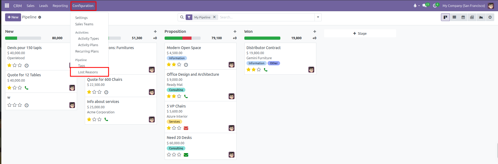
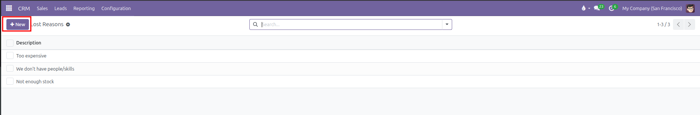
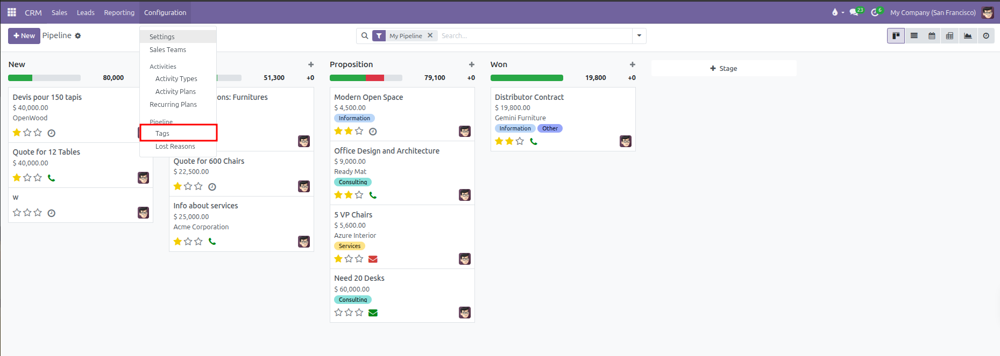
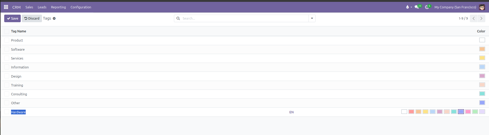

# Lost Reasons and Deal Tags Configuration

Standardize customer rejection reasons, organize opportunities with color tags, and maintain clean commercial categorization in CURQ 18.

---

### 1. Purpose of Standardized Lost Reasons and Tags

Maintaining consistent categorization across your sales pipeline enables meaningful business analysis. When deals fail to close, capturing structured reasons reveals product, pricing, or capacity gaps. Similarly, color-coded tags allow salespeople and managers to filter opportunities by market segment, project type, or urgency at a glance.

---

### 2. Configuring Lost Reasons

When salespeople click **Lost** on an opportunity, CURQ requires them to pick a reason. Setting up standard reasons prevents vague feedback and establishes actionable trends.

#### Navigating to Lost Reasons:
1. Open the **CRM** application.
2. In the top navigation bar, click **Configuration**.
3. Under the **Pipeline** section, click **Lost Reasons**.

#### Creating and Managing Reasons:
* **Add a Reason**: Click **New**, type the reason name *(such as `Competitor Selected`, `Budget Cancelled`, `Timeline Postponed`, or `Technical Incompatibility`)*, and save.
* **Archive an Outdated Reason**: If a reason is no longer applicable, open the record, click the gear actions icon, and select **Archive**. Archiving preserves historical data on past deals while removing the option from the active dropdown list.

---

### 3. Configuring Lead and Opportunity Tags

Tags provide lightweight labels visible directly on Kanban deal cards and inside form views.

#### Navigating to Tags:
1. Open the **CRM** application.
2. In the top navigation bar, click **Configuration**.
3. Under the **Pipeline** section, click **Tags**.

#### Creating a New Tag:
1. Click **New** at the top of the list to open an inline row.
2. In the **Tag Name** field, enter a concise label *(such as `Hardware`, `Enterprise`, `Urgent`, or `Consulting`)*.
3. Select a **Color** from the color palette boxes. Each color corresponds to a distinctive visual badge on the Kanban board.
4. Click **Save**.

#### Applying Tags in the Pipeline:
* Open any opportunity form and click into the **Tags** field.
* Select one or multiple tags from the dropdown list.
* In the pipeline Kanban board, tags display as vibrant colored chips at the bottom of each deal card, allowing team members to group or filter deals instantly.
