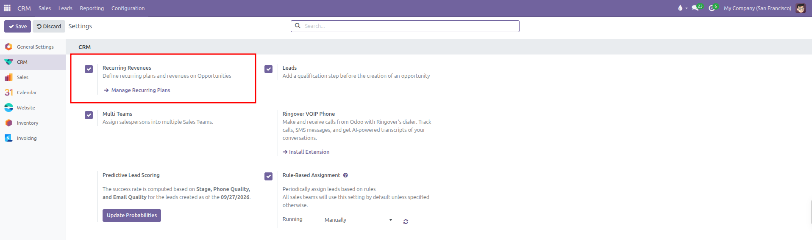
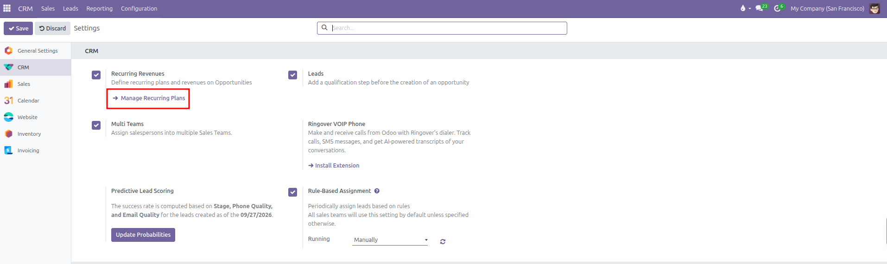
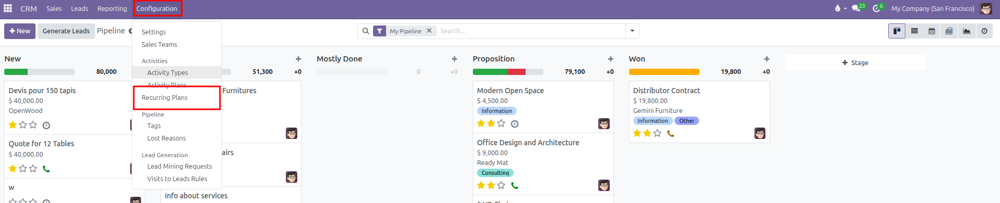
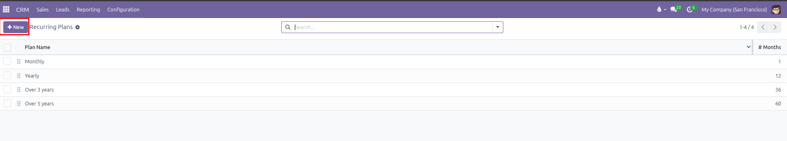
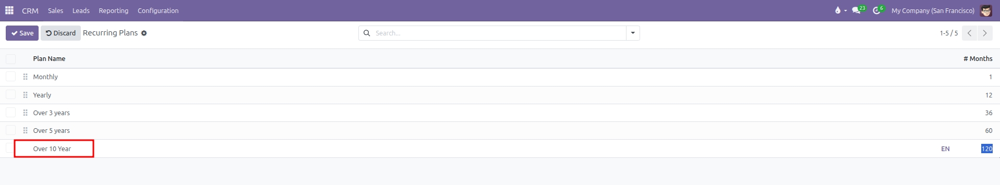
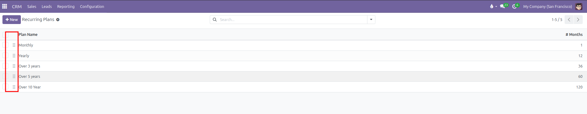
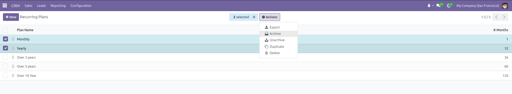
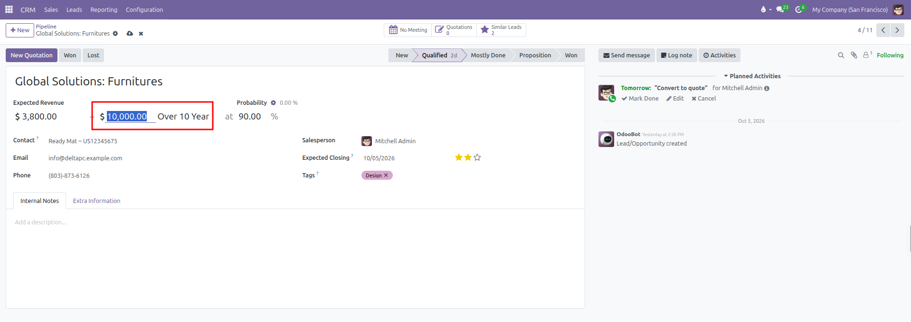
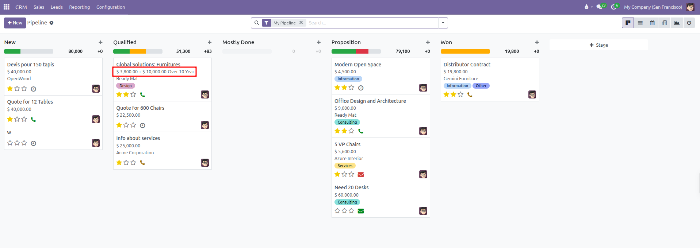

# Recurring Plans and Revenue Configuration

Enable subscription tracking, establish contract renewal intervals, configure monthly revenue calculations, and apply recurring plans to sales opportunities in CURQ 18.

---

### 1. Understanding Recurring Revenues in CRM

Recurring revenues allow organizations to track subscription agreements, software licenses, maintenance retainers, and multi-year service contracts alongside one-off product sales.

While standard expected revenue measures immediate transaction totals, recurring revenue reflects ongoing income generated over time. CURQ automatically converts recurring contract figures into a normalized monthly metric based on the duration in months, enabling clear pipeline comparisons across different agreement lengths.

---

### 2. Enabling Recurring Revenues in System Settings

Before configuring specific renewal intervals, an administrator must activate the recurring revenue capability:

1. Open the **CRM** application.
2. In the top navigation bar, click **Configuration**.
3. Select **Settings**.
4. In the **CRM** section, locate the **Recurring Revenues** option.
5. Check the box for **Recurring Revenues**.

6. Click **Save** in the top left corner of the settings page.

Once saved, a direct link button labeled **Manage Recurring Plans** appears under the setting, and a dedicated **Recurring Plans** menu item becomes available under the **Configuration** menu.

---

### 3. Creating and Managing Recurring Plans

To view existing renewal periods or establish custom billing cycles:

1. Open the **CRM** application.
2. In the top navigation bar, click **Configuration**.
3. Select **Recurring Plans**.

The list view displays all currently active renewal options:
* **Monthly**: Calculated across 1 month.
* **Yearly**: Calculated across 12 months.
* **Over 3 years**: Calculated across 36 months.
* **Over 5 years**: Calculated across 60 months.

#### Creating a Custom Plan:
1. Click **New** at the top of the list view. An editable row appears at the bottom of the table.
2. Enter the **Plan Name** *(such as `Quarterly`, `Semi-Annual`, or `Over 10 Year`)*.
3. Enter the total duration in the **# Months** column *(for example: `3` for quarterly billing, `6` for semi-annual agreements, or `120` for a decade contract)*. The system requires zero or positive values.

4. Click away or click the cloud save icon to save the row.

#### Organizing and Archiving Plans:
* **Reorder**: Click and drag the handle icon *(six dots)* on the left edge of any row up or down to change its position in user dropdown menus.

* **Archive**: If an organization discontinues a renewal option, select the checkbox on the left of the plan rows, click the **Actions** dropdown menu at the top, and select **Archive**. Past opportunities retain historical references without showing outdated choices on new deals.

---

### 4. Applying Recurring Plans to Opportunities

Once recurring revenues are enabled, deal cards and forms incorporate renewal metrics into daily sales workflows:

#### Opportunity Form Entry:
1. Navigate to **CRM > Sales > My Pipeline**.
2. Open an opportunity form.
3. Next to the standard **Expected Revenue** field, a second row displays dedicated recurring inputs.
4. In the amount field, enter the expected recurring sum *(for example: `$ 10,000.00`)*.
5. Select the appropriate cycle from the **Recurring Plan** dropdown *(such as `Monthly`, `Yearly`, or `Over 10 Year`)*. If a recurring amount is entered, selecting a plan is mandatory.

6. Click the cloud save icon or navigate away to save changes.

#### Pipeline Board Display:
* **Deal Cards**: On the Kanban board, opportunities with recurring terms display both the one-off expected revenue and the recurring contract figure *(such as `$ 3,800.00 + $ 10,000.00 Over 10 Year`)*.
* **Column Metrics**: At the top of each Kanban stage column, CURQ calculates and sums the monthly recurring revenue across all deals in that stage. The system divides total contract values by the plan month count to provide accurate monthly pipeline projections *(for example: displaying `+83` next to column revenue when a $10,000 contract spans 120 months)*.

