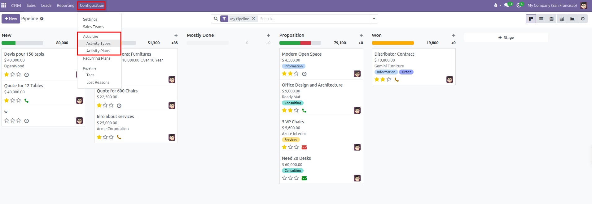
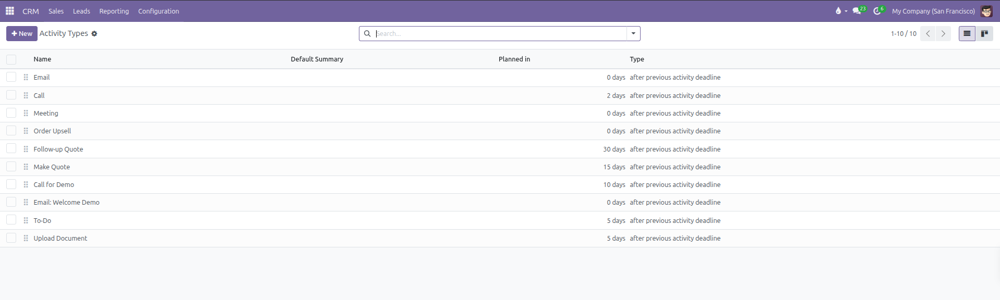
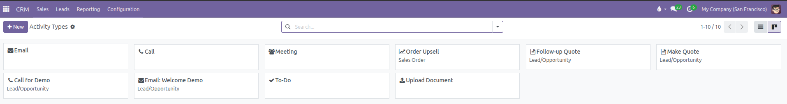
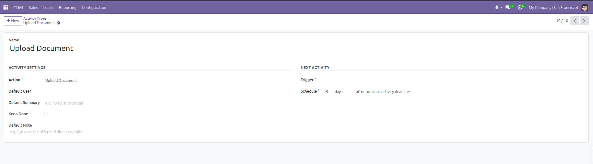
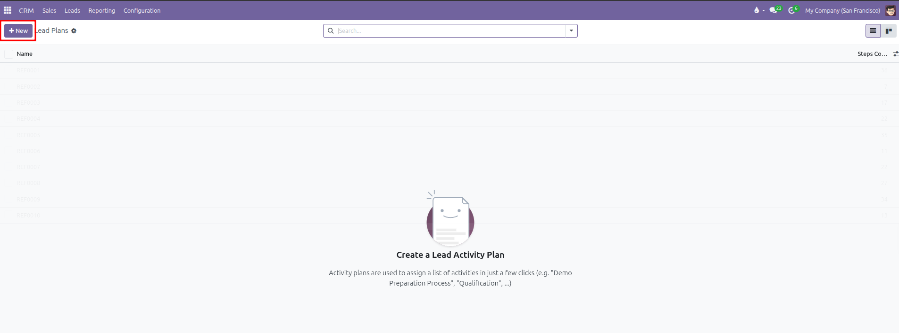
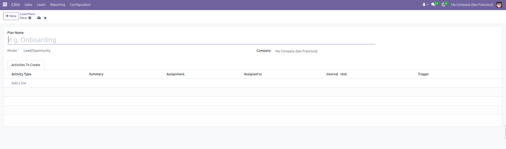
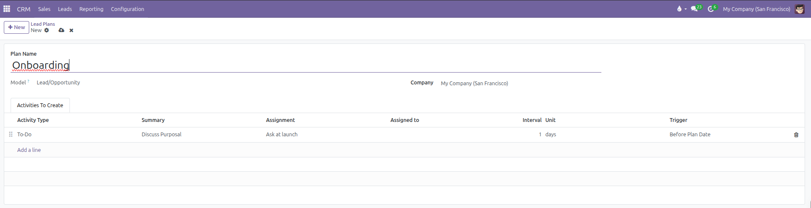
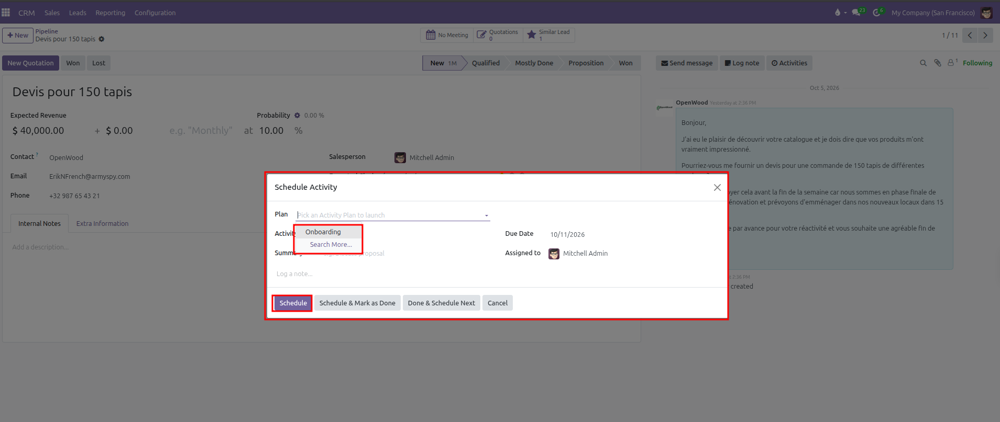

# Activity Types and Activity Plans Configuration

Standardize customer engagement actions, automate follow-up task sequences, configure default due date delays, and streamline commercial workflow execution in CURQ 18.

---

### 1. Understanding Activity Types and Activity Plans in CRM

Managing commercial engagements requires structured execution. When salespeople qualify leads and negotiate opportunities, completing timely tasks ensures deals advance smoothly. CURQ provides two complementary tools:

* **Activity Types**: Discrete single action items that team members schedule on records *(such as `Email`, `Call`, `Meeting`, `To Do`, or `Upload Document`)*. They define the interaction category, automated follow-up suggestions, and default instructions.
* **Activity Plans**: Structured multi-step milestone workflows launched with a single click *(such as `New Lead Qualification Sequence` or `Onboarding`)*. Rather than scheduling multiple tasks manually, a plan instantly generates a series of scheduled actions with defined deadlines and designated colleagues.

---

### 2. Navigating to Activities Configuration

To access activity settings:

1. Open the **CRM** application.
2. In the top navigation bar, click **Configuration**.
3. Under the **Activities** section, select:
   * **Activity Types**: To customize individual task options.
   * **Activity Plans**: To build multi-step task sequences for deals.

---

### 3. Configuring Activity Types

Navigate to **CRM > Configuration > Activities > Activity Types** to view all configured task categories:

You can view activity types as a tabular list or switch to the Kanban card layout using the view switcher in the top right:

Click **New** to create an activity type, or click an existing row *(such as `Upload Document`)* to adjust settings:

#### Activity Settings:
* **Name**: The title identifying the task *(such as `Discovery Call`, `Product Demo`, or `Upload Document`)*.
* **Action**: The system behavior triggered by the activity:
  * `None`: General task without specialized software behavior.
  * `Upload Document`: Prompts the user to attach a document file when marking the activity done.
  * `Phonecall`: Connects with calling features and records call logs.
  * `Meeting`: Opens the calendar to schedule a formal calendar event.
  * `Request Signature`: Initiates an electronic signature request.
* **Default User**: The team member automatically assigned when scheduling this activity type. Leave empty to assign the deal owner.
* **Default Summary**: Default subject line automatically inserted into the activity *(such as `Discuss proposal`)*.
* **Keep Done**: Check this box to keep completed tasks of this type visible in the document history.
* **Default Note**: Standard text guidance or checklist points automatically inserted into new activities.

#### Next Activity Automation:
* **Chaining Type**:
  * `Suggest Next Activity`: Displays recommended follow-up types in the completion dialog *(for example: completing a Call suggests an Email or Meeting)*.
  * `Trigger Next Activity`: Automatically schedules a mandatory subsequent action immediately upon completion *(for example: completing a Demo triggers Send Offer)*.
* **Due Date Delay**: Specify the numerical delay count and unit *(such as `5 days`)* and choose whether the delay starts after the previous deadline or after the completion date.

Click the cloud save icon to save changes.

---

### 4. Configuring Activity Plans

Activity plans group multiple activity types into an automated timeline:

#### Creating a New Plan:
1. Navigate to **CRM > Configuration > Activities > Activity Plans**.
2. Click **New** at the top of the list view.

3. A blank plan creation form opens:

4. In the **Plan Name** field, enter a clear workflow title *(such as `Onboarding`)*.
5. **Model**: Automatically set to `Lead/Opportunity` within CRM.
6. **Company**: Select an operating company in multi-company databases, or leave blank to make the plan available across all companies.

#### Adding Steps to the Plan:
Under the **Activities To Create** tab, click **Add a line** for each scheduled milestone:
* **Activity Type**: Select the action to execute *(such as `To-Do`, `Call`, or `Email`)*.
* **Summary**: Specify the milestone objective *(such as `Discuss Purposal`)*.
* **Assignment**: Choose whether the task routes automatically or prompts the user *(such as `Ask at launch`)*.
* **Interval** and **Unit**: Define the schedule offset count and unit *(such as `1 days`)*.
* **Trigger**: Select whether the delay triggers before or after the plan launch date.

Drag rows using the left handle icon *(six dots)* to organize the chronological sequence. Click the cloud save icon to save the plan.

---

### 5. Executing Activity Plans on Opportunities

Once configured, salespeople can launch an activity plan directly from any deal:

1. Navigate to **CRM > Sales > My Pipeline**.
2. Open an opportunity form.
3. In the Chatter panel on the right side, click **Activities**.
4. In the scheduling modal, click the **Plan** dropdown and select the desired plan *(such as `Onboarding`)*.
5. Click **Schedule**. CURQ automatically generates all configured tasks on the opportunity and tracks them across user activity dashboards.

