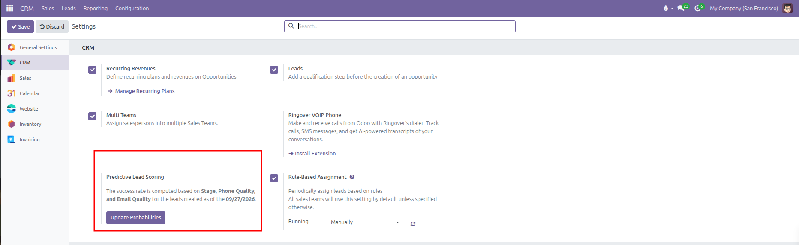
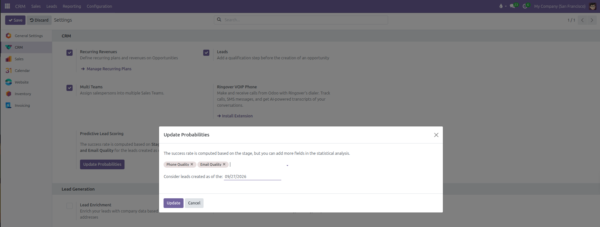

# Predictive Lead Scoring Configuration

Configure automated probability calculations, adjust statistical quality variables, set historical lead start dates, and update win odds in CURQ 18.

---

### 1. Understanding Predictive Lead Scoring in CRM

Predictive Lead Scoring calculates the likelihood of closing incoming deals using statistical analysis. Rather than relying on individual guesswork, CURQ evaluates historical outcomes across won and lost deals to compute a statistical win probability percentage on each active opportunity.

Key factors evaluated by the scoring algorithm include:
* **Stage**: The current pipeline stage of the deal.
* **Communication Quality**: Contact data completeness, including Phone Quality and Email Quality.
* **Historical Cutoff Date**: A defined starting date ensuring older, obsolete deals do not distort current probability models.

---

### 2. Navigating to Predictive Lead Scoring in Settings

To view and manage lead scoring parameters:

1. Open the **CRM** application.
2. In the top navigation bar, click **Configuration**.
3. Select **Settings**.
4. In the **CRM** section, locate the **Predictive Lead Scoring** block situated next to **Rule-Based Assignment**.

---

### 3. Customizing Statistical Attributes and Historical Start Dates

Click **Update Probabilities** to adjust the variables and date range used for probability calculations:

* **Statistical Attributes**: While deal stages are automatically evaluated, you can include extra variables to refine calculation precision:
  * **Phone Quality**: Evaluates the validity and structure of the contact phone number.
  * **Email Quality**: Evaluates the validity and presence of the contact email address.
  * Click into the field box to add further attributes, or click the cross icon on any tag to remove it.
* **Consider leads created as of the**: Sets the earliest lead creation date included in the statistical calculation (such as `09/27/2026`). Deals created before this date are excluded from the dataset.
* Click **Update** to save changes and calculate automated probabilities across active opportunities in the pipeline, or **Cancel** to discard edits.

---

### 4. Automated Probabilities Across the Opportunity Pipeline

Once probabilities are recalculated:
* Each active opportunity displays an automated probability percentage reflecting its statistical win likelihood.
* When an opportunity moves between pipeline stages or updates its contact details, CURQ updates the calculated probability automatically.
* If a salesperson manually enters a custom probability percentage on a specific deal, CURQ respects that manual input and preserves the user figure without overwriting it during automated recalculation cycles.
