# General Settings

Configure core system preferences, manage users and companies, set up access permissions, and manage integrations in CURQ 18.

## Centralized System Administration
The **General Settings** module is the central control panel for your CURQ 18 environment. From here, administrators configure company details, manage user accounts and access levels, enable global business features, connect email servers, and manage developer settings.

## Users, Multi-Company, and System Integrations
General Settings coordinates cross-module capabilities across the entire platform:
* **Users & Companies**: Add and invite employees, define security groups and access rights, configure multi-company structures, and manage company currencies.
* **Communication & Email**: Configure outgoing (SMTP) and incoming (IMAP) mail servers, email templates, and corporate domain aliases.
* **System Integrations & Security**: Manage two-factor authentication, password policies, external cloud integrations, and developer mode tools.

---

### 1. Accessing the Settings Interface

To open system settings:

1. Open the CURQ 18 main dashboard and click the **Settings** app icon.
2. The Settings workspace displays:
   * **Left Sidebar**: Lists **General Settings** at the top, followed by installed application sections *(such as CRM, Sales, Website, Inventory, and Invoicing)*.
   * **Top Search Bar**: Allows administrators to filter settings instantly across all modules.
   * **Main Content Area**: Displays configuration sections, checkboxes, and setup links for the currently selected category.

---

### 2. Finding Settings Using the Search Bar

Instead of scrolling through multiple panels, locate settings instantly using the search tool:

1. Click into the **Search...** bar at the top of the Settings window.
2. Type any feature keyword *(such as `Email`, `reCAPTCHA`, `Language`, or `Developer`)*.
3. The interface dynamically filters and highlights all matching settings across both General Settings and installed modules.
4. Clear the search input to return to the full settings list.

---

### 3. Managing Users and Invitations

The **Users** section provides immediate controls for onboarding team members:

1. Locate the **Users** section at the top of General Settings.
2. **Invite New Users**:
   * In the **Enter an email** field, type the corporate email address of the new employee.
   * Click **Invite** to dispatch an automated onboarding email containing an account activation link.
3. **Pending Invitations**: Review any pending user invitations that have not yet been accepted. Click any pending badge to open and review the draft user profile.

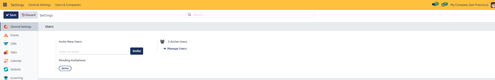

4. **Manage Active Accounts**: Click the **Active Users** link *(such as `3 Active Users`)* or **Manage Users** to open the complete user list.
5. In the users list, inspect account names, login usernames, language preferences, latest authentication timestamps, and status badges *(such as `Confirmed` or `Never Connected`)*.

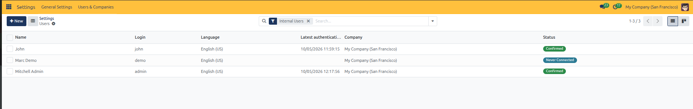

6. Click on any user row *(such as `John`)* to open their complete user form view:
   * **Access Rights Tab**: Define access levels across business domains *(Sales, Accounting, Inventory, Human Resources, and Administration)*.

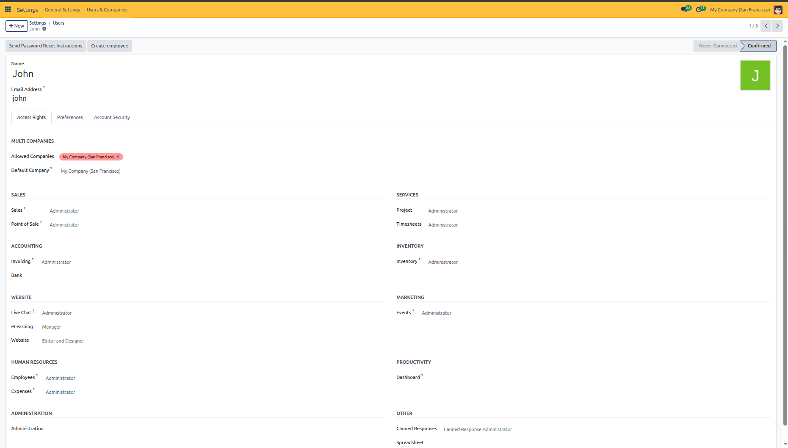

   * **Preferences Tab**: Set individual localization settings *(Language, Timezone)*, notification delivery method *(Handle by Emails vs. Handle in CURQ)*, and email signature.

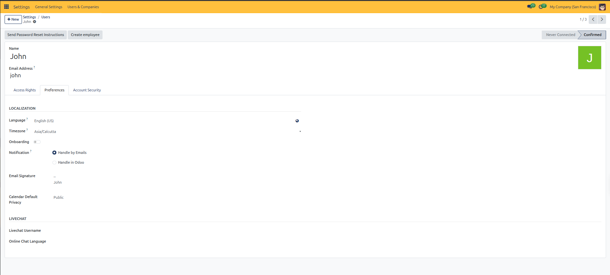

   * **Account Security Tab**: Configure Two-Factor Authentication (2FA) or click **Invite to use 2FA** to require mobile authenticator codes for login.

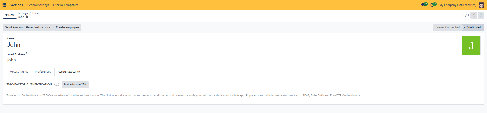

---

### 4. Setting System Languages

1. Scroll to the **Languages** section in General Settings.
2. View the number of currently active system languages.

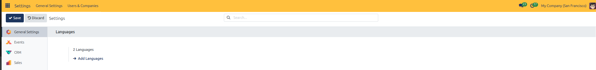

3. Click **Add Languages** to open the language installation dialog:
   * **Languages**: Select your desired language and dialect from the dropdown list.

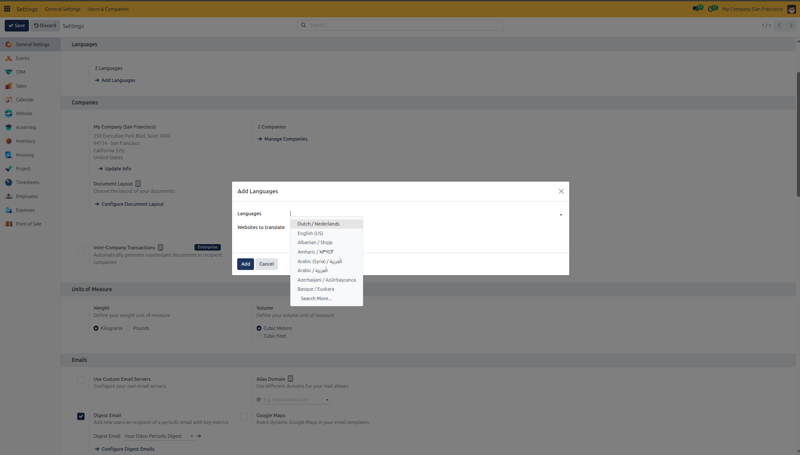

   * **Websites to translate**: If multi-website features are active, check the specific public websites to enable front-end translations.

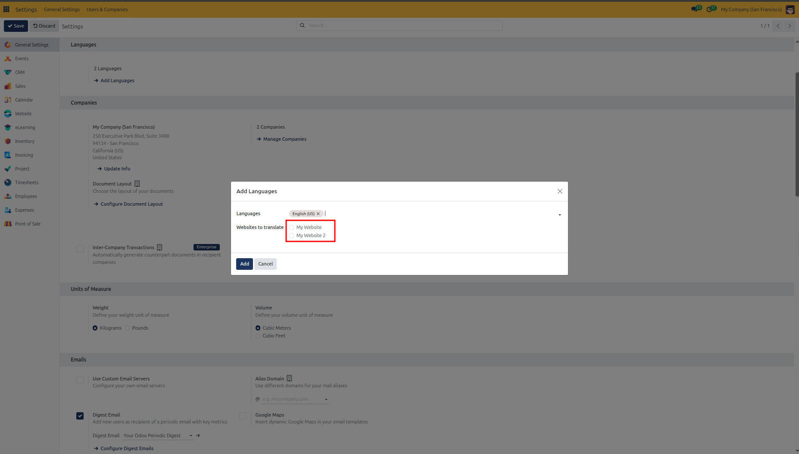

4. Click **Add** to install the translation pack and make it available across user preferences and customer documents.

---

### 5. Configuring Company Information and Branding

The **Companies** section defines corporate identity, addresses, and document styling:

1. Review the primary company address card and available setup actions.

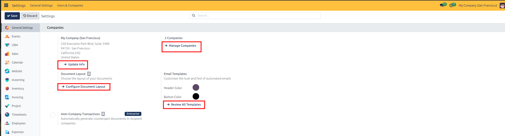

2. Click **Update Info** on the company card to open the company details form:
   * **General Information Tab**: Update official company name, logo, street address, Tax ID, default currency, phone numbers, email, website, and company color tag.

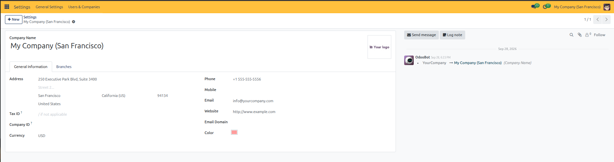

   * **Branches Tab**: Manage operational branch offices linked directly under this parent entity.

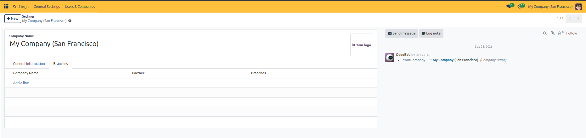

3. **Multi-Company Management**: Click **Manage Companies** to open the complete companies list view, where administrators can add new parent or child organizations.

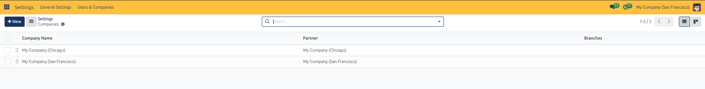

4. **Document Layout**:
   * Click **Configure Document Layout** to customize the appearance of printed quotations, invoices, and purchase orders.
   * Choose a layout style *(Light, Boxed, Bold, Striped, Bubble, Wave, or Folder)*, upload the company logo, set header colors, footer text, paper format, and optional payment QR code.
   * Review the live preview invoice displayed on the right side.

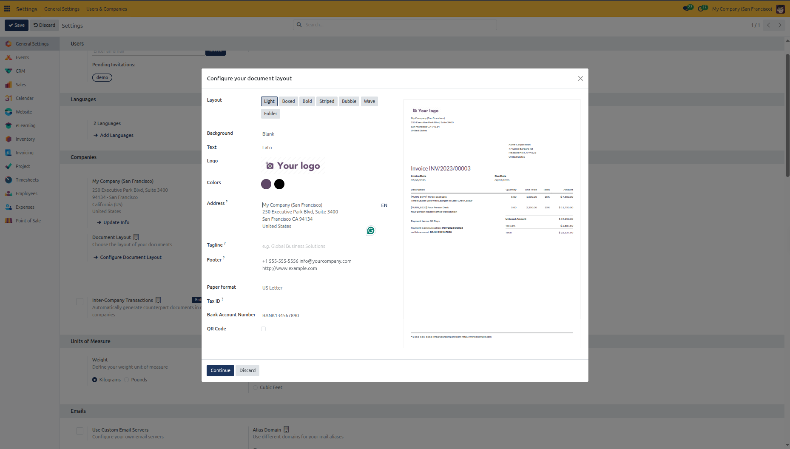

5. Click **Continue** to save the document branding settings.

---

### 6. Managing Automated Email Templates

To inspect and customize the automated emails sent to customers and team members:

1. In the **Companies** section under **Email Templates**, click **Review All Templates** to open the templates directory.
2. The **Email Templates** list view displays all predefined templates across calendar events, invoices, sales orders, and customer portal invites.

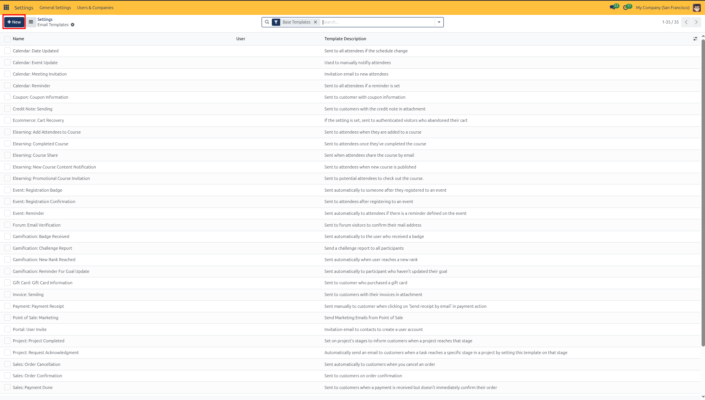

3. Click on any template *(such as `Calendar: Date Updated`)* to open the template editor:
   * **Content Tab**: Edit the email subject line, body text, buttons, and dynamic placeholders using the rich text editor.

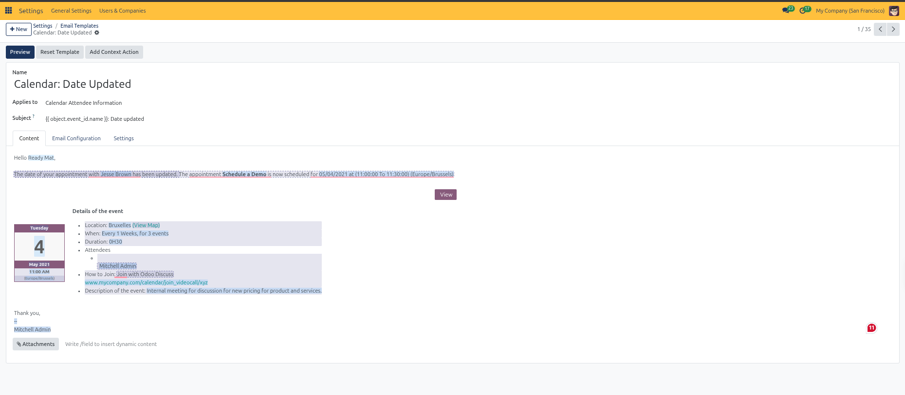

   * **Email Configuration Tab**: Define sender addresses (**From**), automated recipient routing (**To**), carbon copy (**Cc**), and reply-to mailboxes.

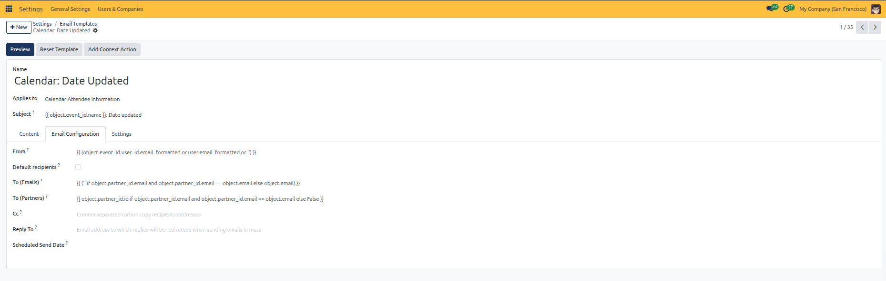

   * **Settings Tab**: Specify the template language, linked outgoing mail server, auto-delete policy, and dynamic report attachments.

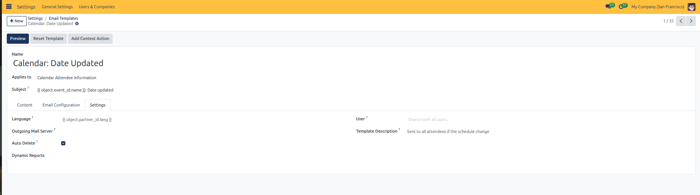

4. **Previewing Templates**: Click the **Preview** button in the top action bar to inspect how the template renders with live sample data from a test record.

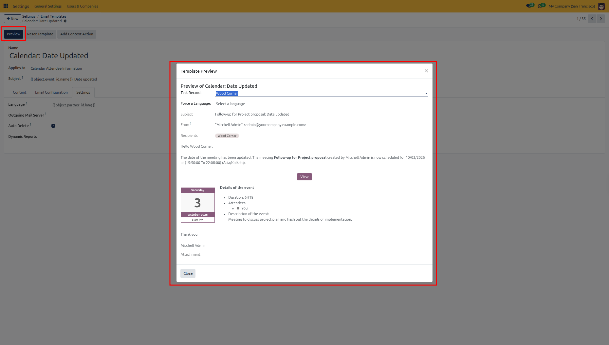

---

### 7. Defining Global Units of Measure

Ensure consistency across inventory, shipping, and sales by setting company-wide measurement standards:

1. Scroll to the **Units of Measure** section.
2. **Weight**: Select **Kilograms** or **Pounds** as the default system weight unit.
3. **Volume**: Select **Cubic Meters** or **Cubic Feet** as the default volume packaging unit.

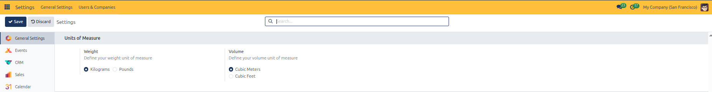

---

### 8. Setting Up Communication and Email Options

Manage how CURQ handles outgoing emails, notifications, and incoming message routing:

1. Navigate to the **Emails** section in General Settings:
   * **Use Custom Email Servers**: Connect corporate outgoing SMTP and incoming IMAP gateways.
   * **Alias Domain**: Define your mail alias domain *(such as `@mycompany.com`)* to route incoming emails into CRM leads or support tickets.
   * **Digest Email**: Enable periodic executive digest summaries.
   * **Google Maps**: Enable dynamic Google Maps previews in email messages.
   * **Restrict Template Rendering**: Lock mail template editing and placeholders to authorized administrators.

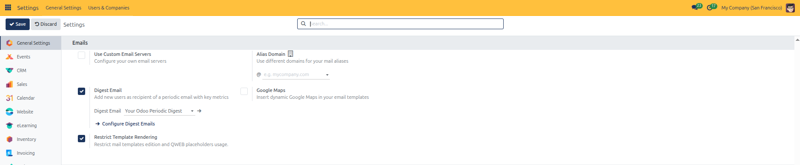

2. **Configuring Digest Emails**:
   * Click **Configure Digest Emails** to view the active periodic digest list.

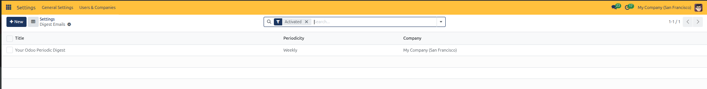

   * Open the digest record *(such as `Your CURQ Periodic Digest`)* to set mailing frequency *(Daily, Weekly, Monthly, or Quarterly)* and select the exact KPI metrics to include across Sales, CRM, Invoicing, and Project teams.

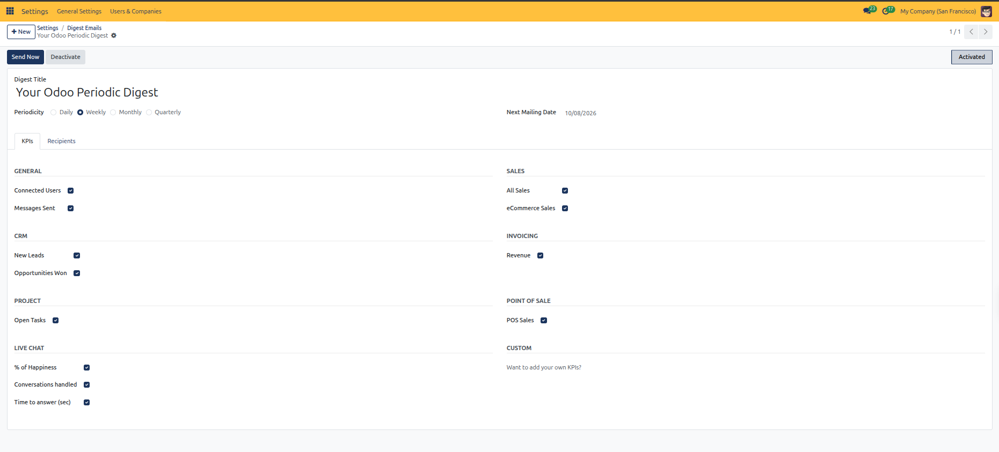

---

### 9. Setting Up Discuss and Communication Infrastructure

Configure team collaboration tools, video calling servers, and chat integrations:

1. Scroll to the **Discuss** section in General Settings:
   * **Activities**: Click **Activity Types** to configure scheduling types *(Call, Meeting, Email, To-Do)*.
   * **SFU and Twilio ICE servers**: Enter credentials for WebRTC voice and video calls.
   * **Klipy GIF Integration**: Enter your Klipy API key, content filter level, and fetch limits to support GIFs in chat.
   * **Message Translation**: Connect Google Translate API to enable real-time message translation in international channels.

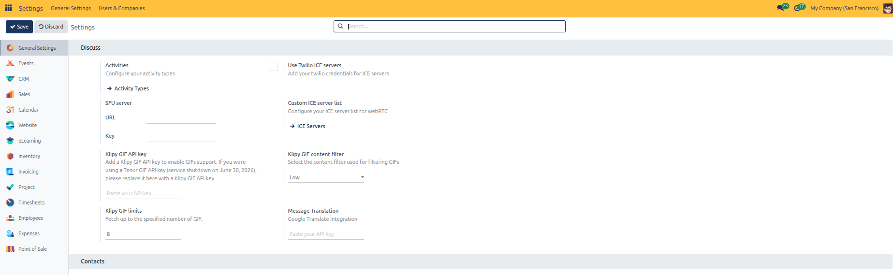

2. Click **ICE Servers** under Custom ICE server list to manage WebRTC STUN and TURN server endpoints.

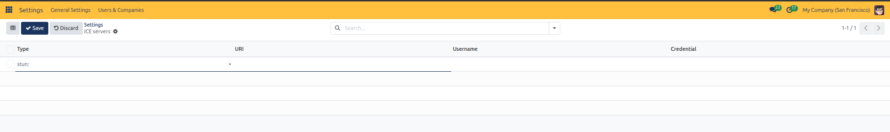

---

### 10. Configuring Permissions and Security

Define baseline access rules and password policies:

1. Navigate to the **Permissions** section:
   * **Password Reset**: Check to allow users to reset their passwords directly from the login page.
   * **Default Access Rights**: Automatically apply standardized access roles to new users.
   * **API Keys**: Enable secure external API authentication for integrations when 2FA is active.

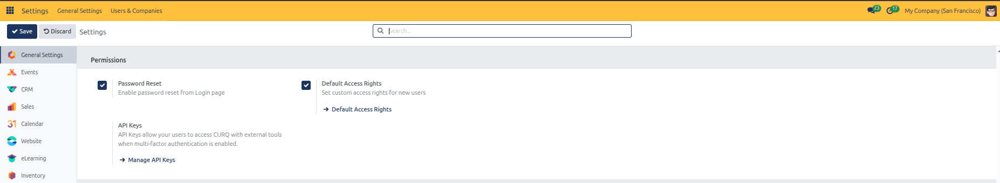

2. Click **Default Access Rights** to customize the default permission template applied to newly invited accounts.

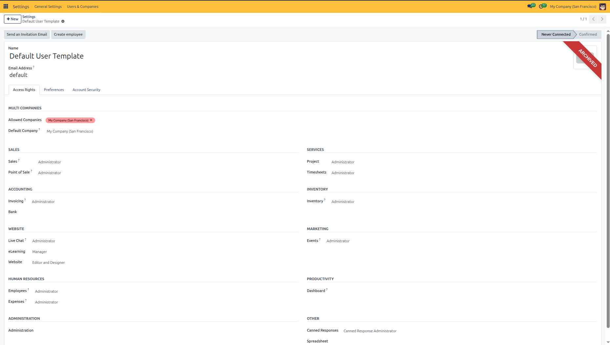

---

### 11. Managing Integrations and Form Security

Connect third-party platforms and protect online forms against spam:

1. Scroll to the **Integrations** section:
   * **Mail Plugin**: Integrate with desktop email clients *(Outlook / Gmail)*.
   * **Google Images**: Retrieve product imagery via barcode lookups.
   * **OAuth & LDAP Authentication**: Enable single sign-on using Google, Microsoft, or LDAP directories.
   * **Unsplash Image Library**: Enable royalty-free photo search for websites and marketing.
   * **Geolocation**: Geolocate customer and partner addresses on maps.
   * **reCAPTCHA & Cloudflare Turnstile**: Protect public forms from automated bots with site keys and score thresholds.

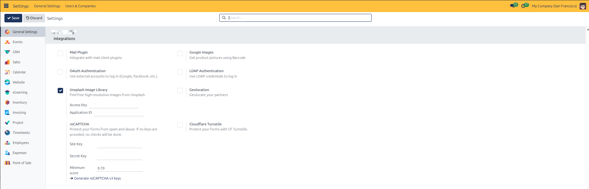

---

### 12. Developer Tools and Diagnostics

For technical administrators and system developers:

1. Scroll to the **Developer Tools** section at the bottom of General Settings.
2. Select your desired mode:
   * **Activate the developer mode**: Enables technical debug menus, external ID inspections, and model metadata.
   * **Activate the developer mode (with assets)**: Unminifies JavaScript and CSS for frontend debugging.
   * **Activate the developer mode (with tests assets)**: Loads frontend testing fixtures.

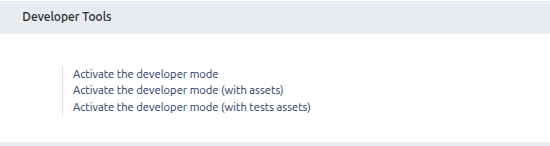

---

### 13. Saving or Discarding Configuration Changes

After modifying checkboxes, text inputs, or color pickers:

1. Click the **Save** button at the top left of the Settings form to apply all changes across the database.
2. If you do not wish to keep your edits, click **Discard** to revert all inputs back to their saved state.
