# Navigating and Filtering Standard Dashboards

Follow these quick steps to open standard dashboards, apply filters, and analyze live KPIs in CURQ 18:

---

### 1. Open a Standard Dashboard

1. Open the **Dashboards** app from the main menu.
2. In the left sidebar or top menu, click on the dashboard you want to view *(such as **Sales**, **Invoicing**, or **Warehouse Metrics**)*.

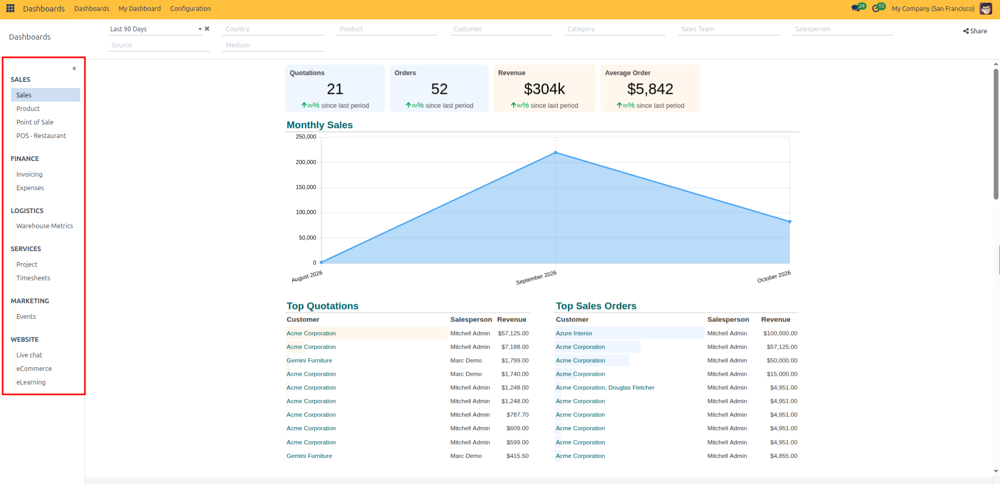

3. **Collapse the sidebar**: Click the collapse double arrow (`«`) icon next to the sidebar heading to maximize your dashboard workspace.

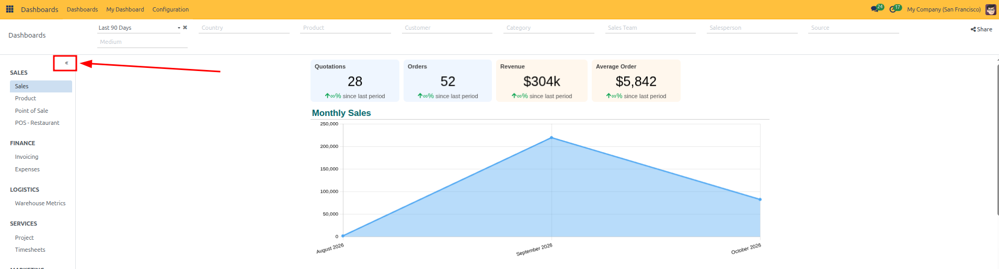

4. **Expand the sidebar**: Click the collapsed sidebar tab (`»`) on the far left to reopen the dashboard navigation list.

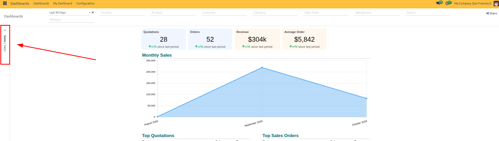

---

### 2. Read KPI Cards and Charts

Each dashboard organizes data through distinct KPI cards and chart types designed for specific analytical purposes:

#### KPI Card Types

* **Summary & Benchmark KPIs**: Prominent cards *(such as Quotations, Orders, Revenue, and Average Order)* provide an instant 3-second operational health check with percentage growth indicators against the previous period. Clicking any card drills down into that metric's source records.

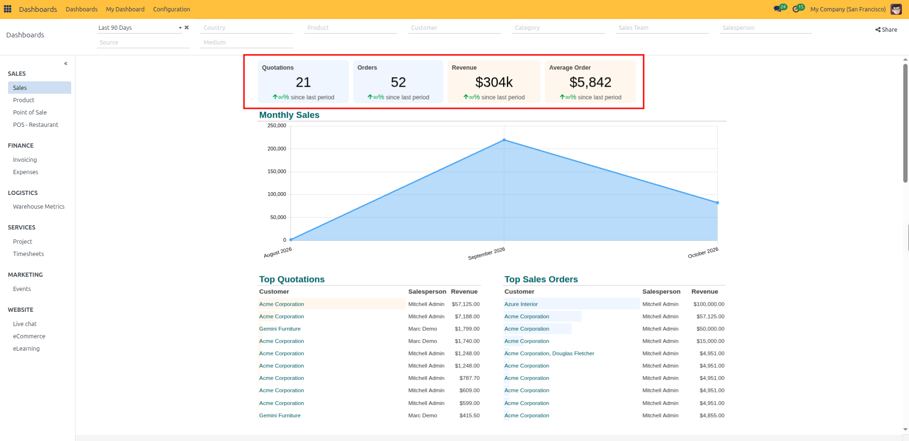

* **Top Performer KPIs**: Highlight leading items or business segments *(such as Best Seller product and Best Category)* along with their total units sold.

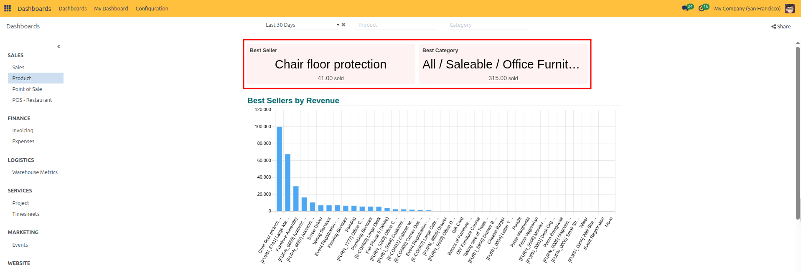

* **Gauge & Rating KPIs**: A visual speedometer gauge displaying satisfaction scores or qualitative performance benchmarks *(such as Average Rating out of 5 stars)*.

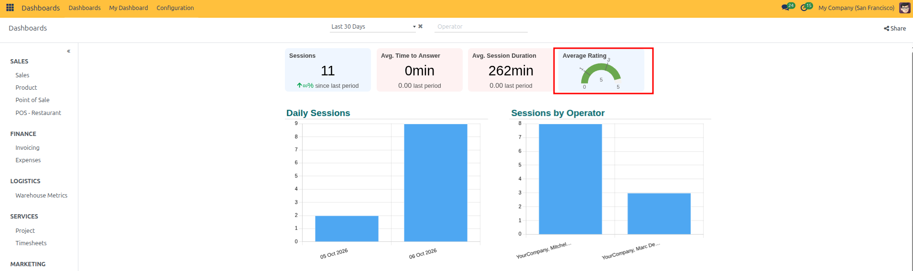

#### Chart and Graph Types

* **Line and Area Charts (Trends Over Time)**: Plotted timelines track growth trajectories, peaks, and seasonal slowdowns across months or weeks *(such as Invoiced by Month or Orders by Month)*.

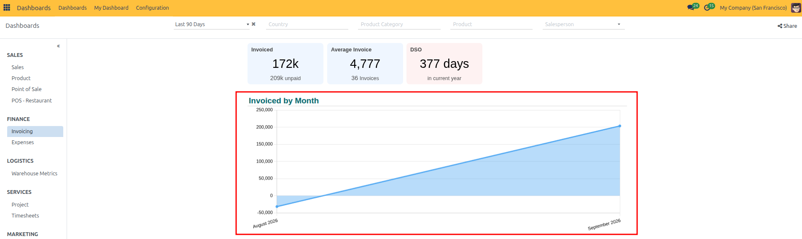

* **Bar Charts (Category Ranking)**: Compare figures across items, products, or salespeople side by side to rank top performers *(such as Best Sellers by Revenue)*.

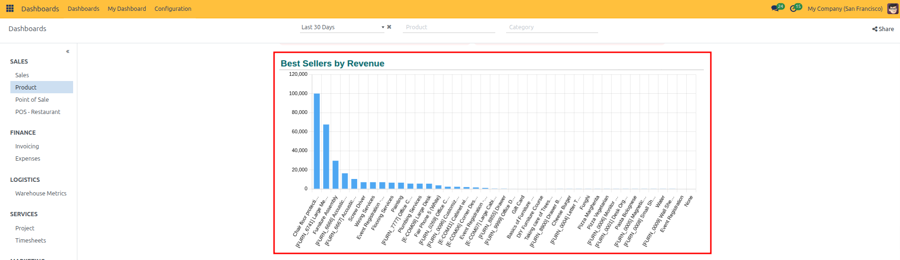

* **Stacked Bar Charts (Multi-Segment Breakdown)**: Break down monthly totals into individual cost or activity components *(such as Expenses Analysis broken down into General Expenses, Mileage, and Meals)*.

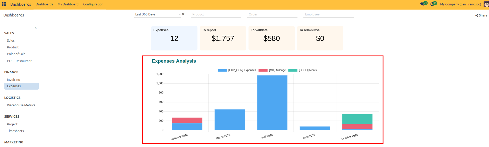

* **Combo Charts (Dual Metrics)**: Plot two complementary measures on the same chart using bars and lines *(such as Hourly Total Revenue comparing total revenue bars with average revenue per order line across hours of the day)*.

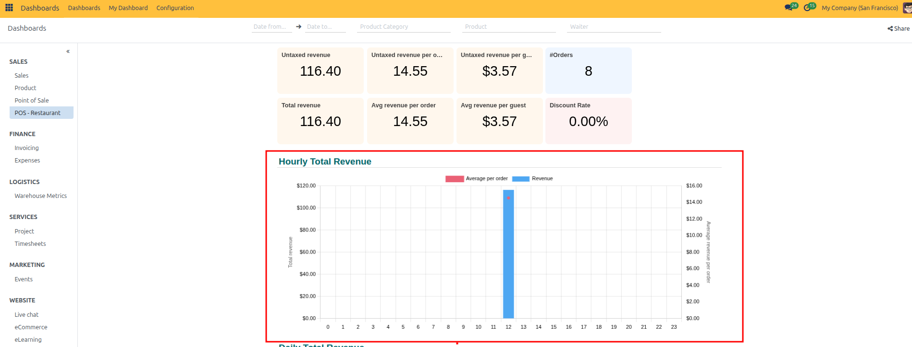

* **Pie Charts (Proportional Share)**: Display how a 100% total splits across different operational categories or states *(such as Tasks by State divided into In Progress, Changes Requested, Approved, and Done)*.

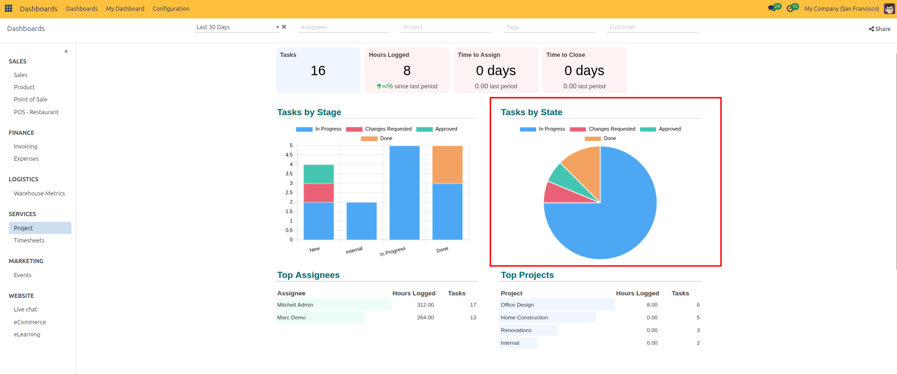

---

### 3. Filter Dashboard Data

Use the filter bar across the top of the dashboard to narrow down your data:

1. **Date Range**: Click the timeframe dropdown *(such as **Last 90 Days**)* to choose a period, or click the `x` icon to clear it.
2. **Dimensions**: Filter by **Country**, **Product**, **Customer**, **Category**, **Sales Team**, or **Salesperson**.
3. **Marketing Source**: (Optional) Filter by campaign **Source** and **Medium**.
4. **Share**: Click the **Share** button at the top right to share the filtered dashboard link with team members.

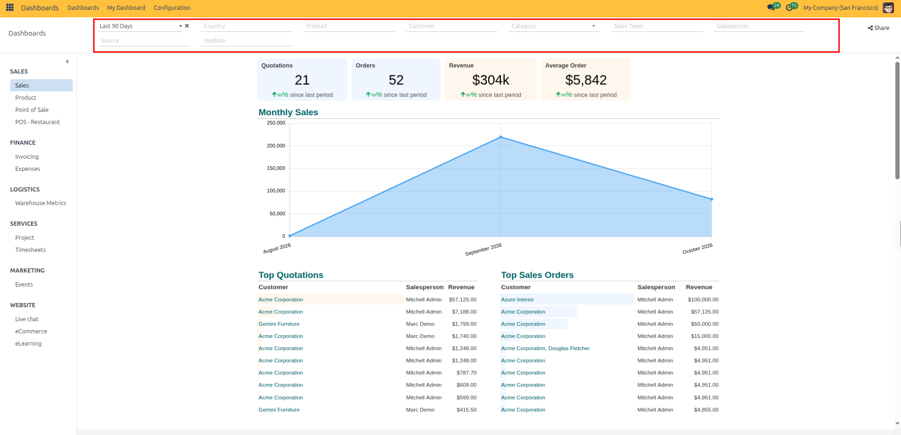

---

### 4. Drill Down into Records

Click on any metric card or chart section to view the underlying records:

1. Click directly on a KPI card *(for example, **Quotations**)*.

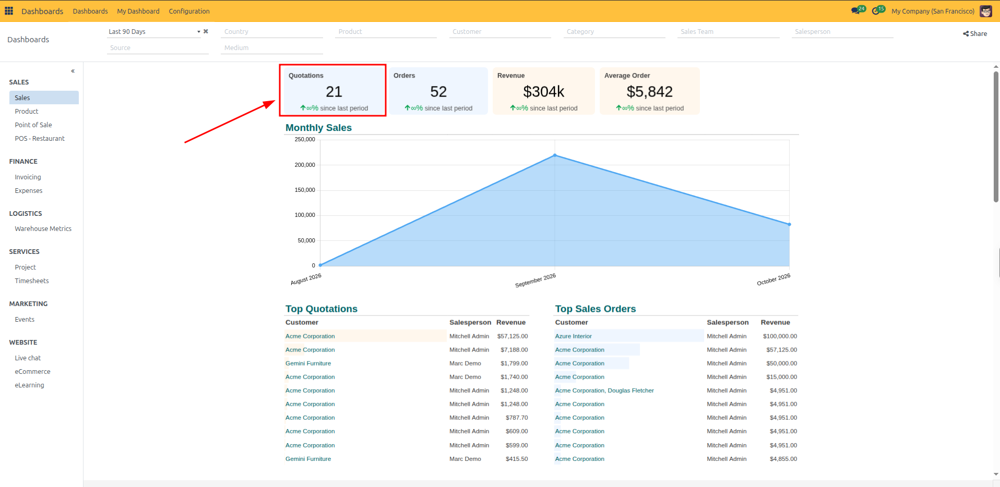

2. CURQ opens the list of matching records with the dashboard filters pre-applied.
3. Click the breadcrumbs *(such as **Dashboards**)* at the top left to return to your dashboard.

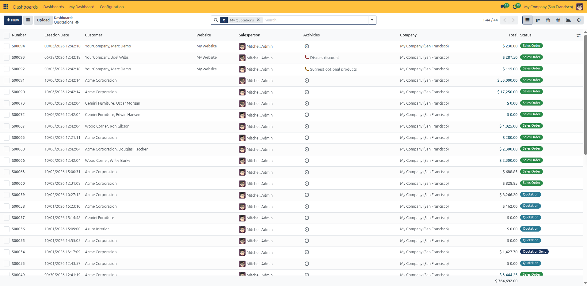
