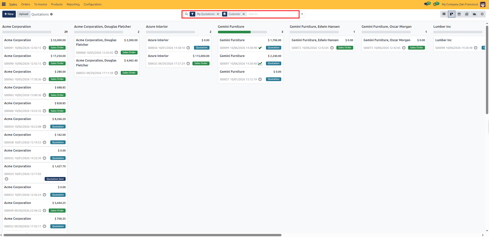
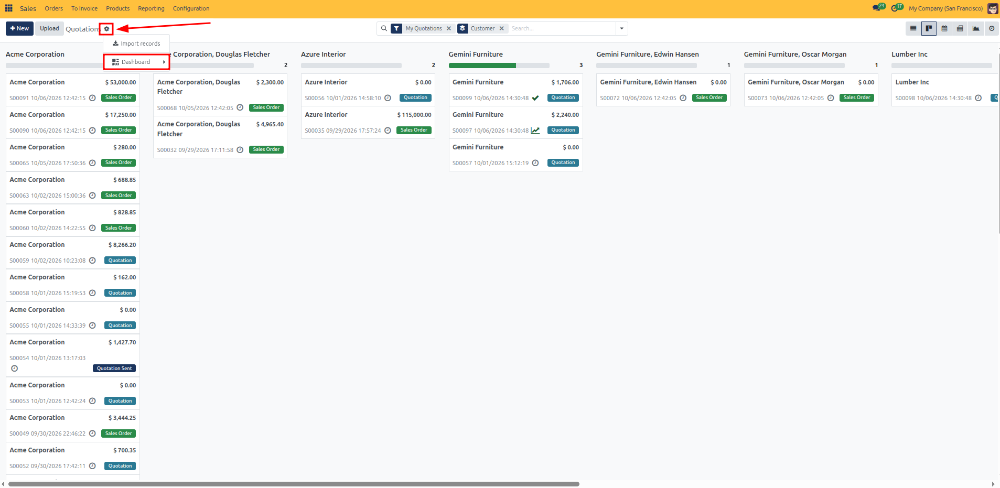
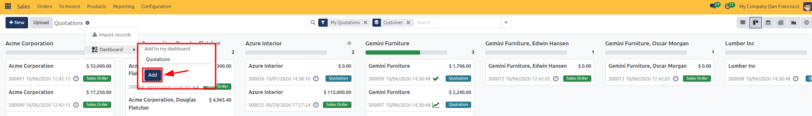
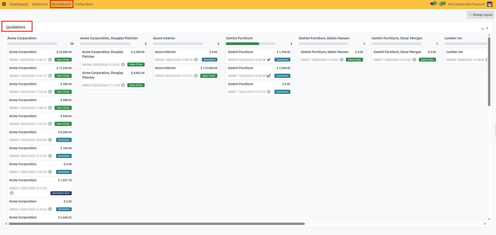
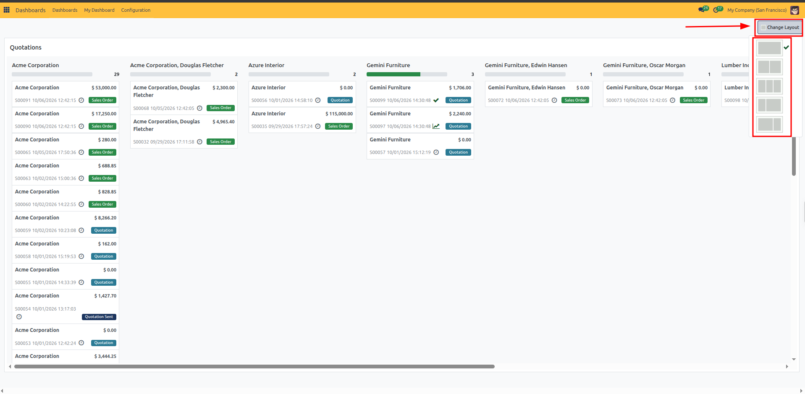
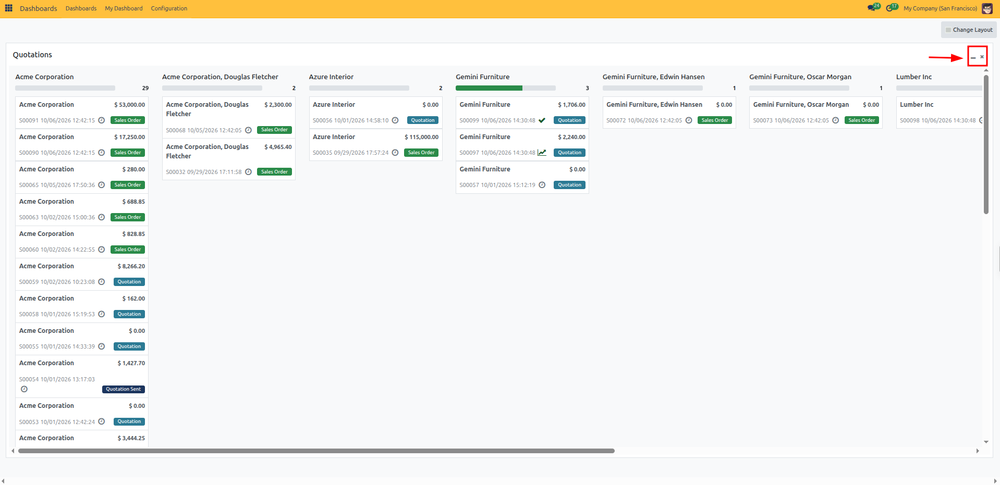
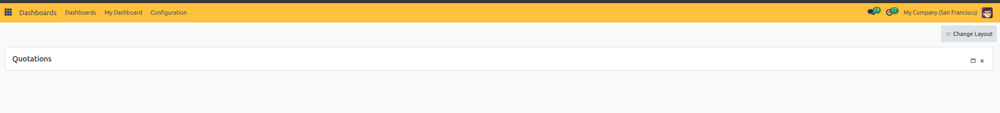

# Creating and Managing "My Dashboard"

Follow these quick steps to pin views from across CURQ 18 and organize your personal dashboard:

---

### 1. Pin a View to My Dashboard

You can pin any List, Kanban, Graph, or Pivot view to your personal dashboard:

1. Open the app and view you want to pin *(such as **Sales > Orders** or **CRM > My Pipeline**)*.
2. Apply your desired filters and grouping.

3. Click the **Actions / Settings gear icon** (`⚙`) next to the view title *(e.g., **Quotations ⚙**)*.
4. Select **Dashboard** from the dropdown menu.

5. In the **Add to my dashboard** prompt, enter a title for the widget and click **Add**.

---

### 2. View and Arrange Widgets

1. Open the **Dashboards** app from the main menu and click **My Dashboard**.
2. Your pinned widgets appear in your personal dashboard workspace.

3. **Change layout**: Click the **Change Layout** button at the top right to choose your preferred column structure *(such as 1, 2, or 3 columns)*.

4. **Move widgets**: Click and drag a widget header to move it to another position or column.
5. **Collapse widgets**: Click the minus (`-`) icon in the top right of the widget header to minimize a card and save screen space. Click the maximize icon to expand it again.

6. **Open records**: Click any item inside a widget to open its full record.

---

### 3. Remove a Widget

1. Open **My Dashboard**.
2. Click the close (`x`) icon at the top right of the widget header.
3. Confirm the prompt to remove the card from your dashboard.

