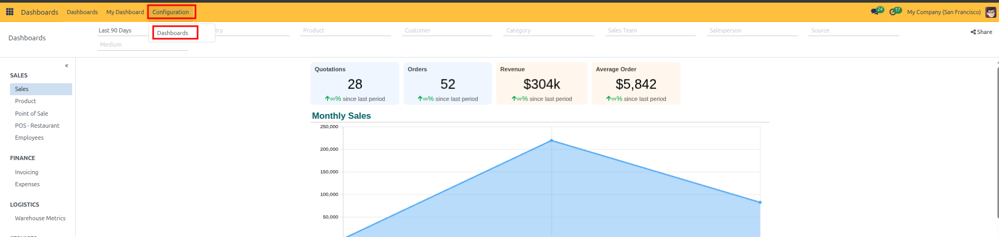
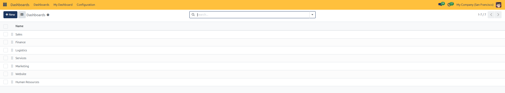
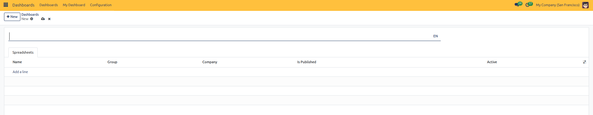
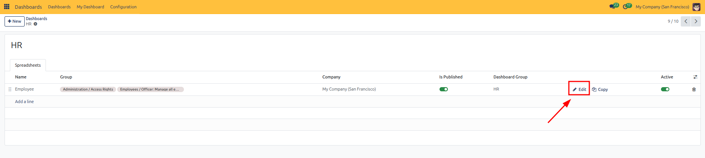
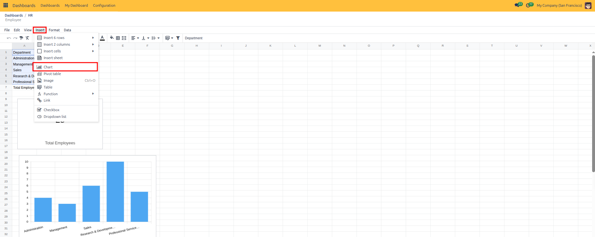
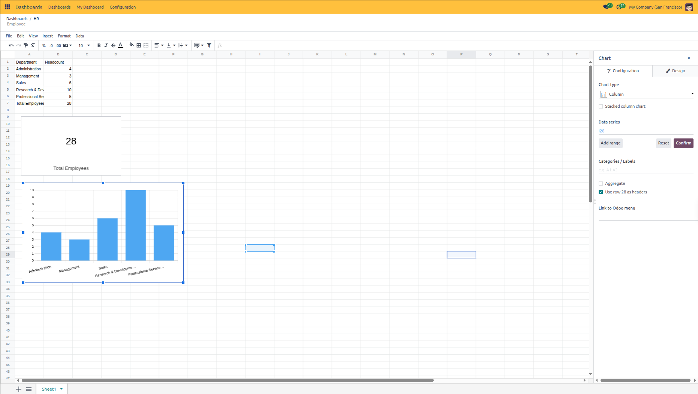
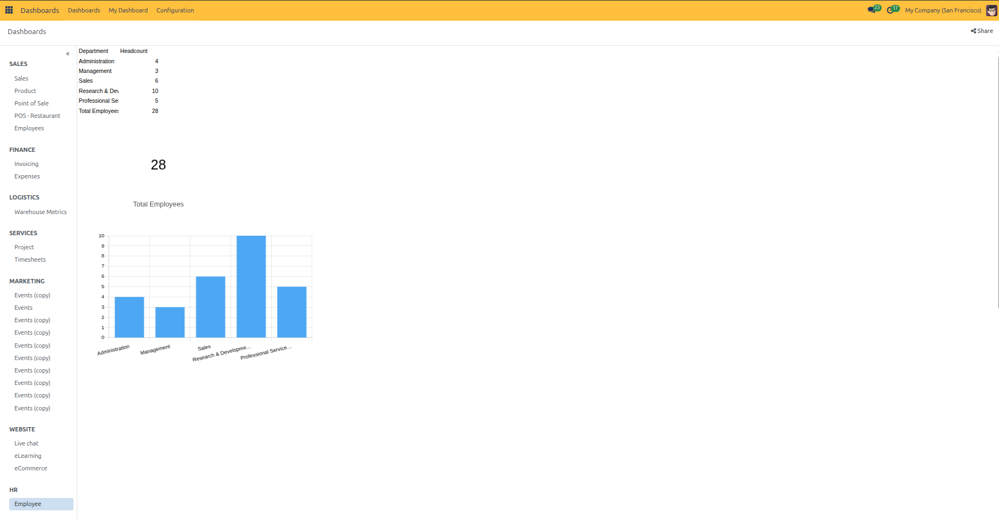

# Dashboard Groups Configuration

Create and organize dashboard groups, define sidebar category hierarchy, adjust display sequences, and manage group spreadsheets and permissions in CURQ 18.

---

### 1. Overview of Dashboard Groups

Dashboard groups serve as top-level category containers in the left navigation sidebar of the **Dashboards** app *(such as **Sales**, **Finance**, **Logistics**, and **Services**)*.

Organizing dashboards into structured groups allows administrators to:
* Keep business metrics neatly categorized by department or functional domain.
* Control the vertical display sequence of categories in the sidebar using drag-and-drop handles.
* Directly attach and manage spreadsheets, security access groups, and publishing status within each group.

> [!NOTE]
> **Required Modules:**
> To use all dashboard features in CURQ 18, you need 3 types of modules installed:
> 1. **`spreadsheet_dashboard`**: The core module for Standard Dashboards and the **Configuration > Dashboards** menu.
> 2. **`board`**: Adds the **My Dashboard** tab so each user can build their own custom dashboard.
> 3. **App Dashboard Modules** *(such as `spreadsheet_dashboard_sale` or `spreadsheet_dashboard_account`)*: Provide ready-made dashboards for Sales, Invoicing, and Inventory.

---

### 2. Navigating to Dashboards Configuration

To view and manage dashboard groups:

1. Open the **Dashboards** app from the main menu.
2. In the top navigation bar, click **Configuration**.
3. Select **Dashboards**.

4. The **Dashboards** list displays all active category groups *(such as Sales, Finance, Logistics, Services, Marketing, Website, and Human Resources)*.

---

### 3. Reordering Groups in the Navigation Sidebar

The top-to-bottom sequence in the list view directly governs the vertical order of categories in the Standard Dashboards navigation sidebar:

1. Navigate to **Dashboards > Configuration > Dashboards**.
2. Click and hold the drag handle (`⠿`) at the far left edge of any row.
3. Drag the group row up or down to your desired position and release to save the new order automatically.

---

### 4. Creating a New Dashboard Group and Registering Spreadsheets

To create a new departmental category and attach dashboards to it:

1. In the **Dashboards** list view, click the **+ New** button at the top left.
2. In the form view, enter the group title in the top name field *(such as `Human Resources`)*.
3. In the **Spreadsheets** tab, click **Add a line** to register dashboards within this category:
   * **Name**: Enter the title of the individual dashboard *(such as `Employees` or `Recruitment`)*.
   * **Group**: Select a security access group to restrict viewing rights to authorized roles *(such as `Human Resources / Officer`)*. Leave empty to allow general access.
   * **Company**: Select a specific company if this dashboard should only appear in multi-company environments.
   * **Is Published**: Check this box to make the dashboard live and visible to end users.
   * **Active**: Ensure the record is active.

4. Click the cloud save icon or navigate back to apply the new category and its spreadsheet dashboards.

---

### 5. Editing the Spreadsheet to Add Metrics and Charts

By default, newly registered dashboards initialize with an empty spreadsheet template. To populate the dashboard with metrics, KPI scorecards, and visual charts:

1. In the **Spreadsheets** tab of the dashboard group form, locate the dashboard row.
2. Click the **Edit** button *(pencil icon)* on the right side of the row.

3. The CURQ Spreadsheet interface opens. Build your dashboard data:
   * **Enter or Import Data**: Add metric rows and columns *(such as Department categories and Headcount values)* directly into the spreadsheet cells. Use standard formulas such as `=SUM(...)` to compute totals dynamically.

4. To turn spreadsheet metrics into visual dashboard widgets:
   * Click **Insert** in the spreadsheet menu bar.
   * Select **Chart** from the dropdown menu.

5. Configure your chart or KPI widgets using the right-hand **Chart** panel:
   * **Insert KPI Scorecards**: Click on a calculated metric cell *(such as the total headcount cell)*. Under **Chart type**, select **Scorecard**, set the headline label *(such as `Total Employees`)*, and reposition the scorecard on your sheet.
   * **Insert Visual Charts**: Highlight your data range *(such as department names and headcount figures)*. Under **Chart type**, select your preferred format *(such as Column, Bar, or Pie)*. Fine-tune your series, category labels, and styling.

6. Changes save automatically in the spreadsheet. Click **Dashboards** in the top navigation bar to exit the editor.

---

### 6. Verifying the Live Dashboard and Sidebar Hierarchy

Once published and populated with data, verify how the category and widgets render in Standard Dashboards:

1. In the top navigation bar, click **Dashboards**.
2. In the left navigation sidebar, locate your new group category *(such as **HR**)* and click your dashboard *(such as **Employee**)*.
3. The dashboard workspace renders your live data table, KPI scorecard, and graphical charts directly on the screen.

4. **Verify Access Restrictions**: Log in with an account that lacks the assigned security group privileges. Confirm that restricted dashboards (and empty parent categories) do not appear in the navigation sidebar for unauthorized users.
