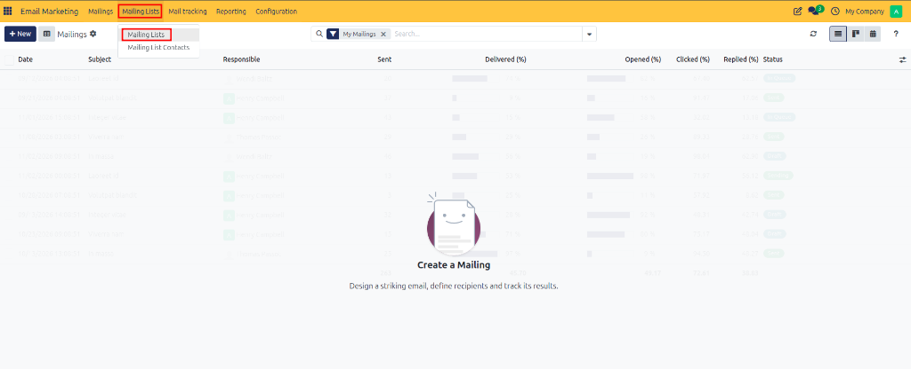
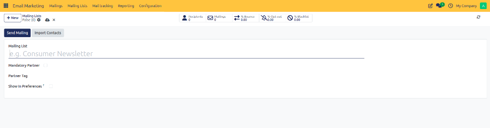
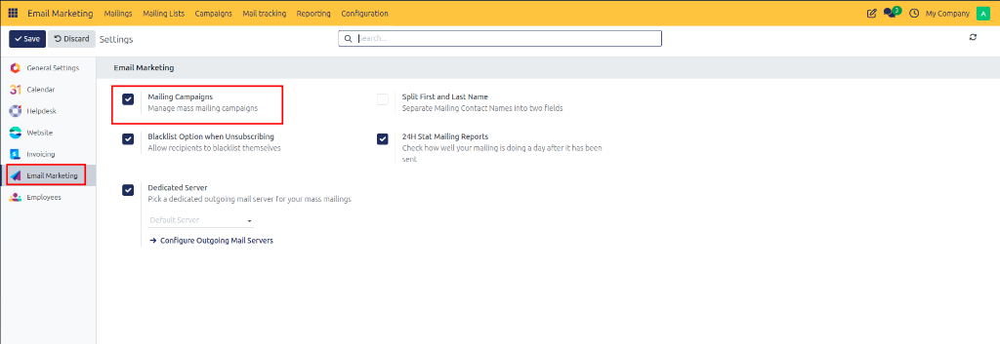
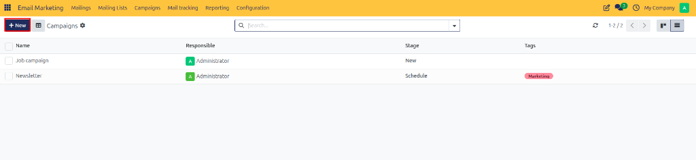
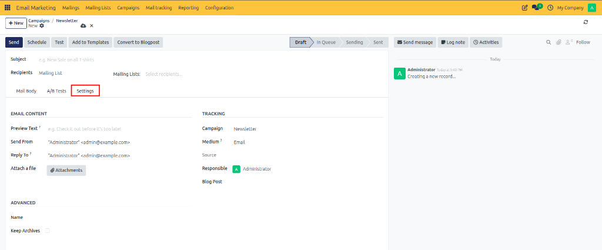
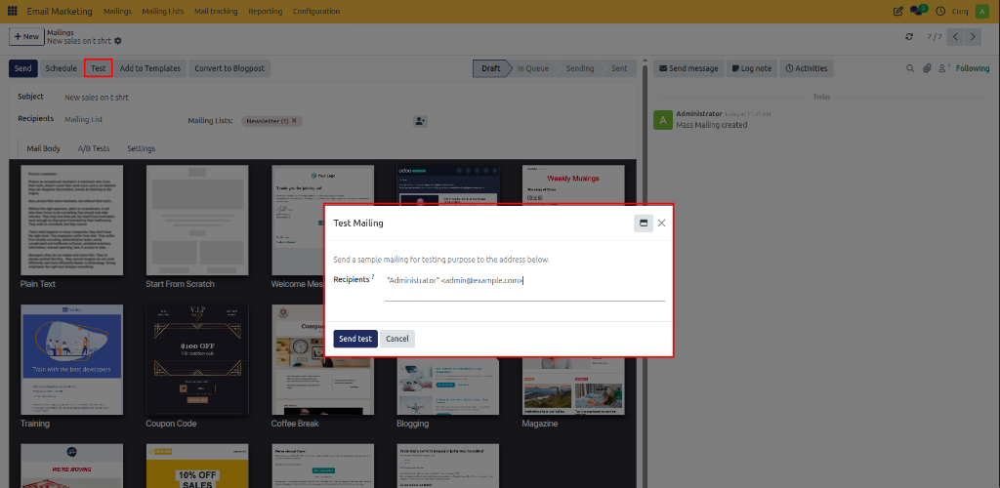
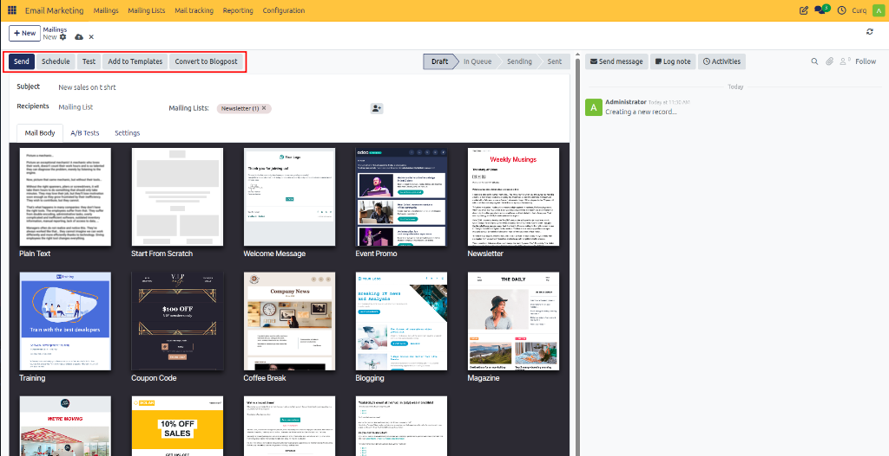
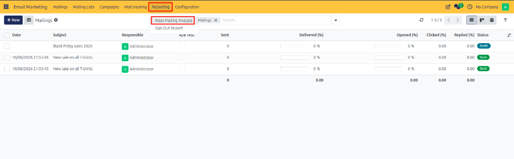
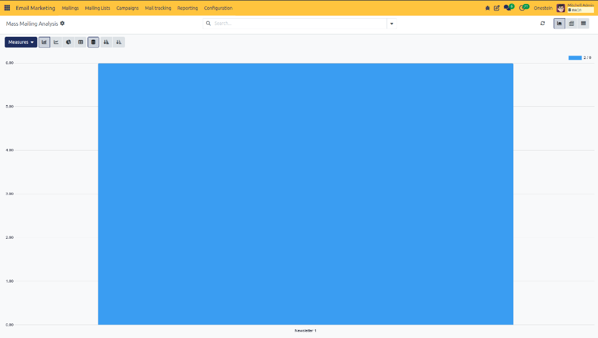

# Running a Promotional Email Campaign

An end-to-end operational walkthrough demonstrating how a retail business uses CURQ 18 Email Marketing to organize promotional campaigns, curate subscriber lists, create promotional mailings, schedule delivery, and analyze engagement performance.

---

## Overview

A promotional email campaign helps a business inform customers about special offers, seasonal discounts, new products, and limited-time promotions.

CURQ 18 Email Marketing allows marketing teams to organize campaigns, select target audiences, create promotional mailings, schedule delivery, and analyze campaign performance.

This article demonstrates how a retail business can use CURQ to promote a seasonal sale to its customers.

---

## Business Scenario

A retail company is launching a seasonal sale offering discounts on selected products. The marketing team wants to inform existing customers about the promotion, encourage them to visit the online store, and measure customer engagement.

The team uses CURQ Email Marketing to organize the promotion and distribute the announcement to a targeted mailing list.

### Business Objectives

- Inform existing customers about the seasonal sale.
- Target relevant customers using a mailing list.
- Schedule promotional emails for the campaign launch.
- Track email engagement and link clicks.
- Use campaign results to improve future promotions.

---

## Step 1: Prepare the Customer Mailing List

Before creating the campaign, the marketing team identifies the customers who should receive the promotion. For detailed procedures on building lists and adding recipients, refer to [creating mailing lists](../manual/01-create-mailing-lists.md) and [creating mailing list contacts](../manual/02-create-mailing-list-contacts.md).

1. Open the **Email Marketing** app.
2. Navigate to **Mailing Lists**.

3. Create a mailing list named **Seasonal Sale Customers**.

4. Open **Mailing List Contacts**.
5. Add the eligible customers to the mailing list.

Ensure that the selected contacts have appropriate permission to receive marketing communications.

The mailing list provides a reusable audience for the promotional campaign.

---

## Step 2: Create the Marketing Campaign

To organize multiple mailings under a unified campaign and track stages or classifications, refer to [configuring campaign stages](../procedures/03-configure-campaign-stages.md) and [configuring campaign tags](../procedures/04-configure-campaign-tags.md).

1. Navigate to **Configuration → Settings**.
2. Enable the **Marketing Campaigns** option if it is not already enabled.

3. Open the **Campaigns** menu.
4. Click **New**.

5. Enter the campaign name: **Seasonal Sale Promotion**.
6. Assign a responsible user.
7. Add a suitable campaign tag, such as **Promotion**.
8. Save the campaign.

The campaign provides a central place to organize the promotional mailings and review their performance. For step-by-step guidance on managing campaigns, see [creating and managing campaigns](../manual/03-create-and-manage-campaigns.md).

---

## Step 3: Create the Promotional Mailing

With the campaign and audience ready, create the promotional broadcast email. Learn more about configuring custom tracking links in [link tracker configuration](../procedures/05-configure-link-tracker.md).

1. Open **Email Marketing → Mailings**.
2. Click **New**.
3. Enter the subject: **Our Seasonal Sale Is Here!**.
4. Select the appropriate recipient model and mailing list.
5. Open the email content editor.
6. Choose a suitable email template or design the email from scratch.

Create promotional content that includes:

- A brief introduction to the seasonal sale.
- Details of the eligible products or offers.
- The promotion's start and end dates.
- A link to the online store.
- A clear call to action, such as **Shop the Sale**.

Under the **Settings** tab, select **Seasonal Sale Promotion** in the Campaign field if it is not already populated.

Review the sender details, reply-to address, and preview text before proceeding. For complete mailing setup options, see [creating and managing mailings](../manual/04-create-and-manage-mailings.md).

---

## Step 4: Test the Email

Before sending the promotion to customers:

1. Click **Test**.
2. Enter a test recipient's email address.
3. Send the test email.

4. Review the email layout, links, images, and text.
5. Correct any issues before launching the campaign.

Testing helps ensure that customers receive a properly formatted and functional email.

---

## Step 5: Schedule the Promotional Mailing

Choose a suitable launch date and time for the promotion. Ensure that your mail servers are properly configured by reviewing [dedicated mail server configuration](../procedures/01-configure-dedicated-server.md) and [outgoing SMTP mail server setup](../procedures/02-configure-outgoing-mail-server.md).

1. Open the completed mailing.
2. Click **Schedule**.

3. Select the intended sending date and time.
4. Confirm the schedule.

CURQ places the mailing in the queue for processing at the scheduled time.

If the promotion must be changed before delivery, review the mailing's current status and available actions before making changes.

---

## Step 6: Monitor Campaign Performance

After the mailing has been sent, open the campaign and review its associated mailings.

Navigate to **Email Marketing → Reporting** to analyze the available performance metrics. For detailed reporting analysis, see [analyzing email marketing reports](../manual/05-analyze-email-marketing-reports.md).

Review indicators such as:

- **Delivered**: Emails successfully delivered to recipients.
- **Opened**: Recorded email opens.
- **Clicked**: Recorded clicks on links within the email.
- **Bounced**: Emails that could not be delivered.
- **Revenue**: Revenue attributed to the campaign, where supported and configured.

Compare the results with previous promotions to identify which messages and offers generate stronger engagement. To manage unsubscribes and maintain list health, review [blacklisted email addresses](../procedures/06-manage-blacklisted-email-addresses.md) and [opt-out reasons](../procedures/07-manage-opt-out-reasons.md).

---

## Business Outcome

By following this workflow, the retail company can organize its promotional activity, communicate with a targeted audience, and evaluate the results using CURQ's campaign and reporting features.

The insights can help the marketing team refine its mailing lists, improve email content, and plan future promotional campaigns.

---

## Best Practices

- Maintain accurate and up-to-date mailing lists.
- Send marketing emails only to eligible recipients.
- Test email content and links before sending.
- Use clear subject lines and relevant promotional information.
- Monitor delivery failures and unsubscribe requests.
- Evaluate campaign performance before planning the next promotion.
