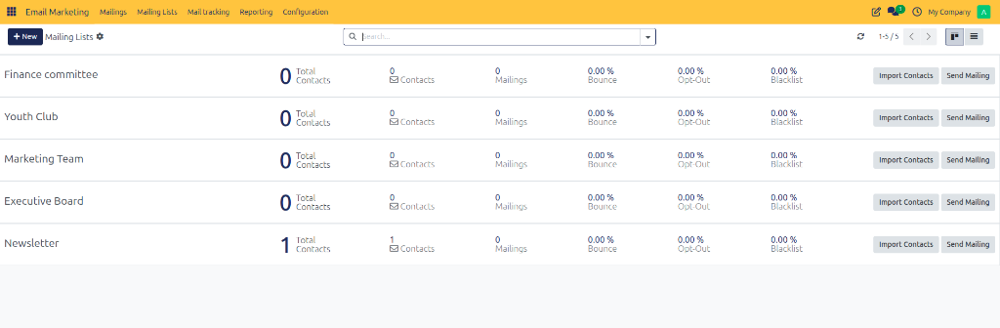
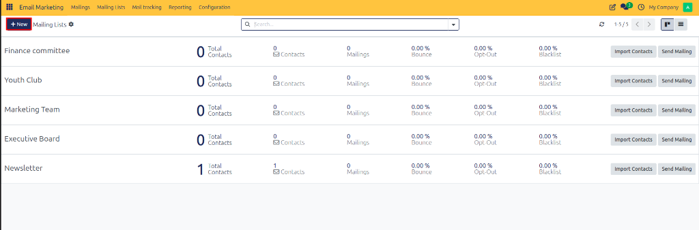
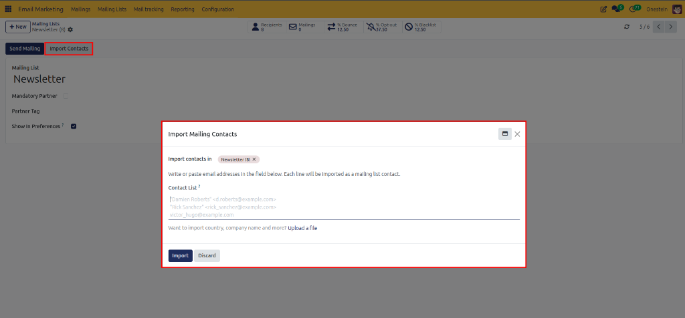
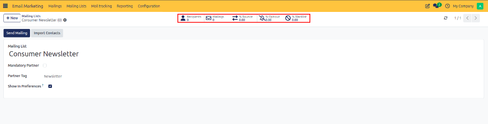

# Creating Mailing Lists

Create, organize, and manage subscriber mailing lists in CURQ 18 for targeted email marketing campaigns.

---

## 1. Opening Mailing Lists

To access and manage your subscriber lists:

1. Open the **Email Marketing** application.
2. In the top navigation bar, click **Mailing Lists**.
3. Select **Mailing Lists** from the dropdown menu.

The page opens the **Mailing Lists** overview, displaying all existing subscriber lists configured in the system.

---

## 2. Reviewing Existing Mailing Lists

The Mailing Lists overview provides key metrics to monitor list health and campaign performance:

| Metric / Stat | Description | Usage |
| :--- | :--- | :--- |
| **Total Contacts** | Total count of contact records assigned to the list. | Displays total subscriber volume *(e.g., `1 Total Contacts`)*. |
| **Contacts** | Active reachable contact subscribers. | Indicates active audience size for email broadcasts. |
| **Mailings** | Count of email marketing campaigns sent to this list. | Tracks campaign history sent to list subscribers. |
| **Bounce (%)** | Percentage of undeliverable email broadcasts. | Monitors email deliverability and list cleanliness. |
| **Opt-Out (%)** | Percentage of contacts who unsubscribed. | Tracks list retention and opt-out rates. |
| **Blacklist (%)** | Percentage of blacklisted email addresses. | Identifies blocked addresses. |

---

## 3. Creating a New Mailing List

To set up a new mailing list:

1. Navigate to **Email Marketing > Mailing Lists > Mailing Lists**.
2. Click **New** at the top left of the screen.

3. A blank mailing list form view opens.

4. Configure the mailing list fields:
   * **Mailing List**: Enter a descriptive list name *(such as `Consumer Newsletter` or `Event Participants`)* in the main title field.
   * **Mandatory Partner**: Check this box if subscribers on this list must be linked to an official Contact/Partner record in CURQ.
   * **Partner Tag**: Specify tags *(such as `Newsletter`)* to automatically filter or group associated partner records.
   * **Show In Preferences**: Check this box to display this mailing list option in subscription management preference forms for contacts.

---

## 4. Mailing List Action Buttons & Importing Contacts

From the top left of the Mailing List form view, you can trigger key actions directly for the list:

* **Send Mailing**: Click to create and draft a new email campaign pre-configured with this mailing list as the recipient target.
* **Import Contacts**: Click to open the **Import Mailing Contacts** dialog box to add subscriber records in bulk directly into this list.

### Using the Import Mailing Contacts Dialog

When you click **Import Contacts**, the **Import Mailing Contacts** dialog box opens with the following options:

1. **Import contacts in**: Displays the tag for the target mailing list *(such as `Newsletter`)* receiving the contacts.
2. **Contact List**: Write or paste email addresses directly into the text field. Each line will be imported as an individual mailing list contact record *(e.g., `"Damien Roberts" <d.roberts@example.com>`)*.
3. **Upload a file**: Click **Upload a file** if you need to import additional field details *(such as country, company name, or contact tags)* from a spreadsheet file (CSV/XLSX).
4. **Import**: Click **Import** to confirm and process the contact list import.
5. **Discard**: Click **Discard** to cancel the import wizard.

---

## 5. Monitoring List Performance via Smart Buttons

Once a mailing list record is configured, the form header displays interactive stat buttons for list analytics and recipient management:

* **Recipients**: Displays total subscribed contacts. Click to view and manage assigned contacts directly.
* **Mailings**: Displays total email campaigns sent to this list. Click to review campaign logs.
* **% Bounce**: Tracks the percentage of undelivered or bounced emails.
* **% Opt-out**: Tracks the percentage of subscribers who unsubscribed from this list.
* **% Blacklist**: Tracks the percentage of blacklisted email addresses.

---

## 6. Saving and Next Steps

Once the mailing list configuration is complete:

1. Verify the list details and settings.
2. Click **Save** (or the cloud icon) at the top left of the form.

The newly created list is saved and ready for adding contacts via [Mailing List Contacts](./02-create-mailing-list-contacts.md) and choosing target audiences when dispatching email campaigns.
