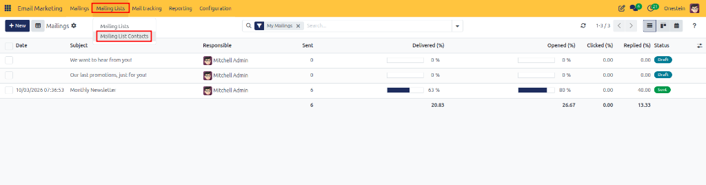
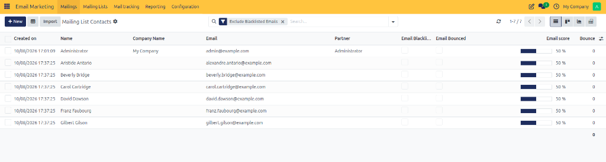
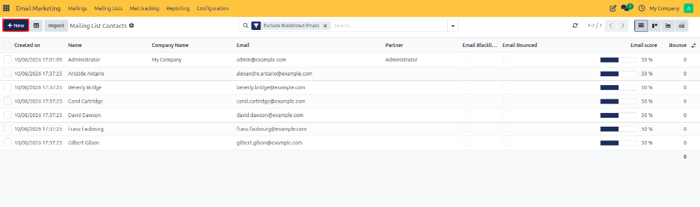
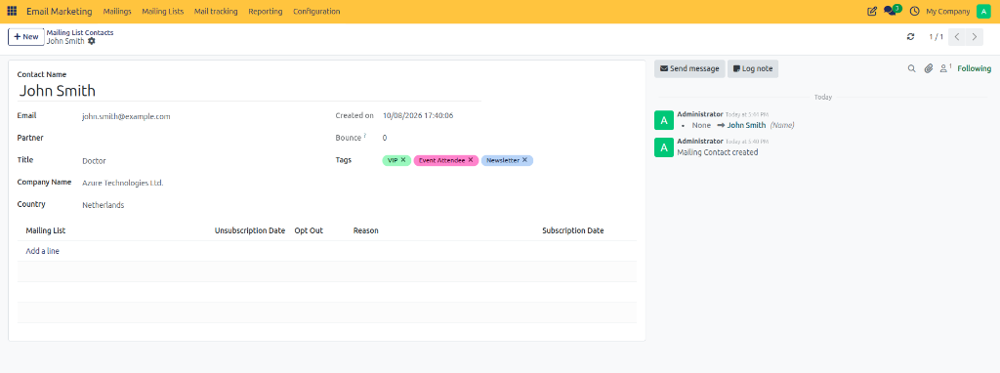
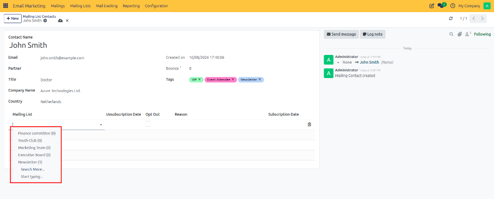
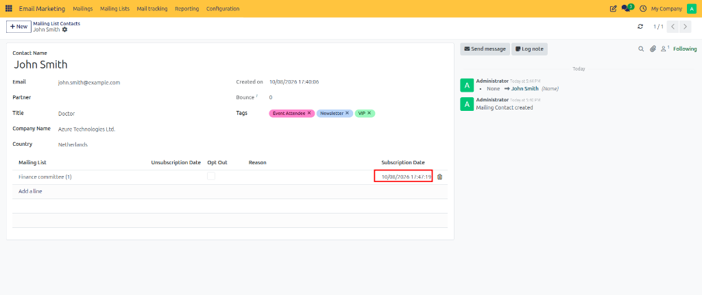
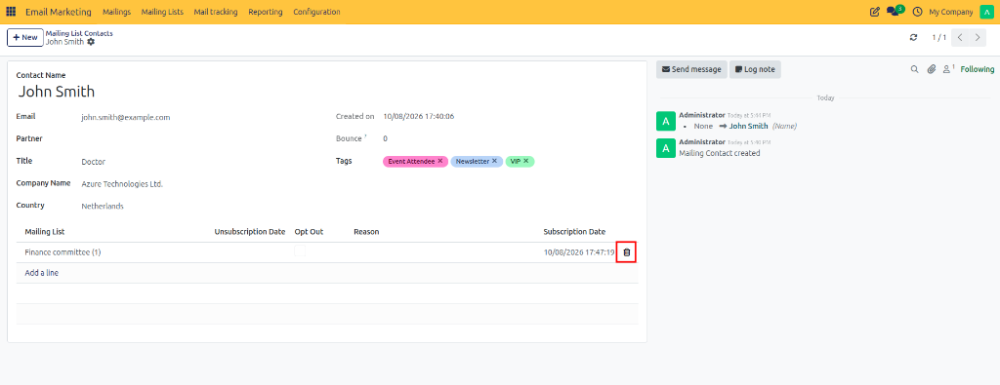

# Creating Mailing List Contacts

Create, configure, and assign individual contact records to target subscriber mailing lists for Email Marketing in CURQ 18.

---

## 1. Opening Mailing List Contacts

To view and manage mailing list contacts:

1. Open the **Email Marketing** application.
2. In the top navigation bar, click **Mailing Lists**.
3. Select **Mailing List Contacts** from the dropdown menu.

The page opens the **Mailing List Contacts** list view, displaying all contact records currently configured for marketing campaigns.

---

## 2. Creating a New Mailing List Contact

To add a new subscriber to your marketing database:

1. In the **Mailing List Contacts** view, click **New** at the top left of the screen.

2. A blank contact form view opens.

---

## 3. Entering Contact Details

Complete the contact profile fields on the form view:

### Field Definitions:

| Field | Description |
| :--- | :--- |
| **Contact Name** | Full name of the subscriber. |
| **Email** | Primary email address for marketing broadcasts. |
| **Partner** | Associated partner record in the Contacts app. |
| **Title** | Professional title or designation. |
| **Company Name** | Associated company or organizational entity. |
| **Country** | Geolocation or country of residence. |
| **Tags** | Categorization tags for subscriber grouping. |

---

## 4. Assigning Mailing Lists

To assign the contact to specific subscriber lists:

1. Under the **Mailing List** tab on the contact form, click **Add a line**.
2. Click the **Mailing List** dropdown field that appears.
3. Select one or more target mailing lists *(such as `Newsletter`, `Marketing Team`, or `Finance committee`)* from the list choices.

4. Repeat steps 1–3 to add the contact to multiple mailing lists if needed.

---

## 5. Subscription Tracking and Removing List Assignments

### Tracking Subscription Details
When a mailing list line is added and saved:
* **Subscription Date**: CURQ automatically records the exact date and timestamp when the contact joined the list.
* **Unsubscription Date**: Automatically populated if the contact unsubscribes from marketing emails.
* **Opt Out**: Mark this checkbox if the subscriber opts out of receiving mailings from this specific list.

### Removing a Contact from a Mailing List
To remove a contact from a specific mailing list line:
1. Locate the target list row under the **Mailing List** tab.
2. Hover over the right-hand end of the list row.
3. Click the trash icon (**Delete**) to remove the list assignment line.

---

## 6. Saving the Contact Record

Once all profile details, list assignments, and subscription tracking fields are verified:

1. Review the entered contact details.
2. Click **Save** (or the cloud icon) at the top left of the form.

The contact record is saved and available for targeted email broadcasts and subscriber list management.
