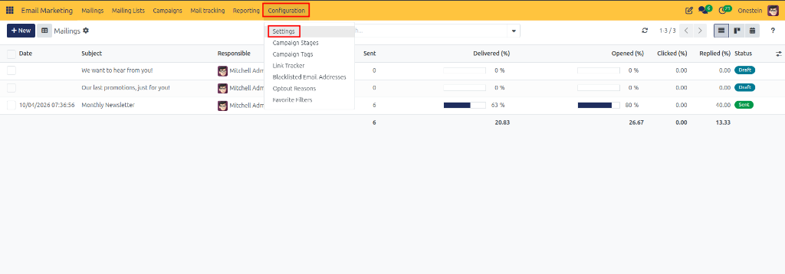
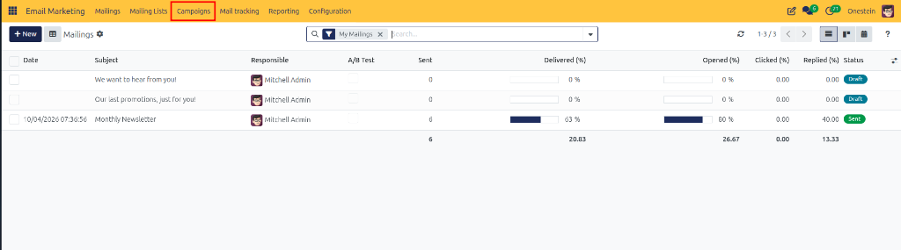
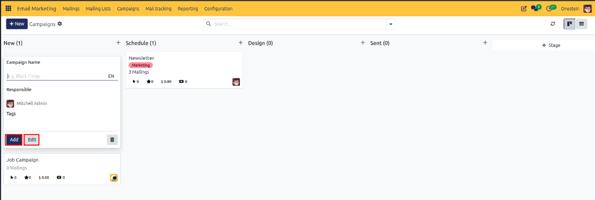
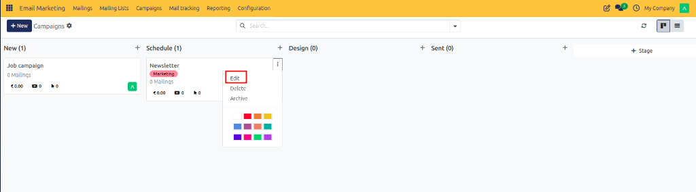
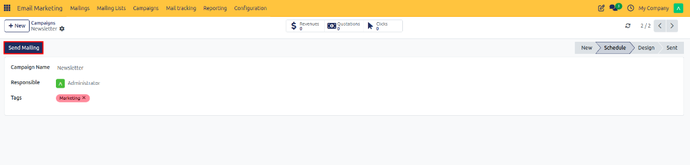
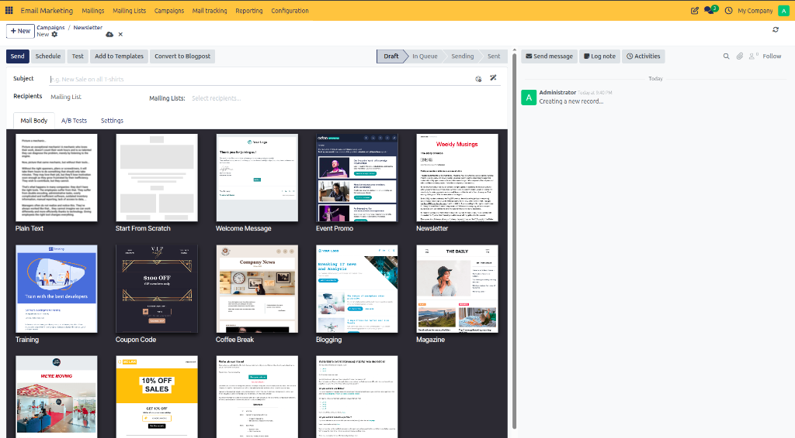
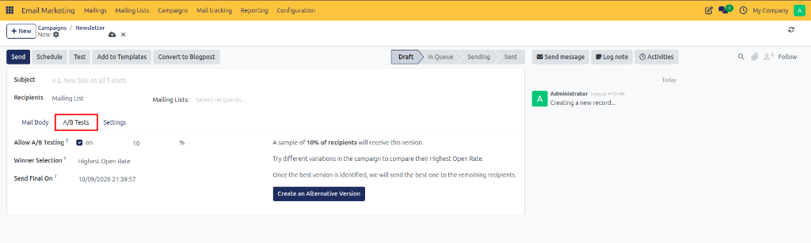
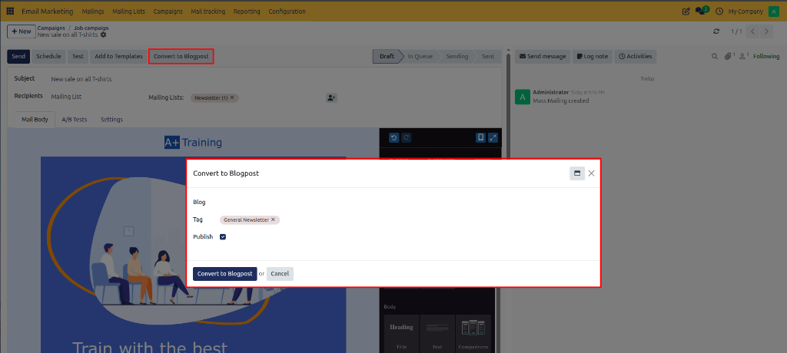
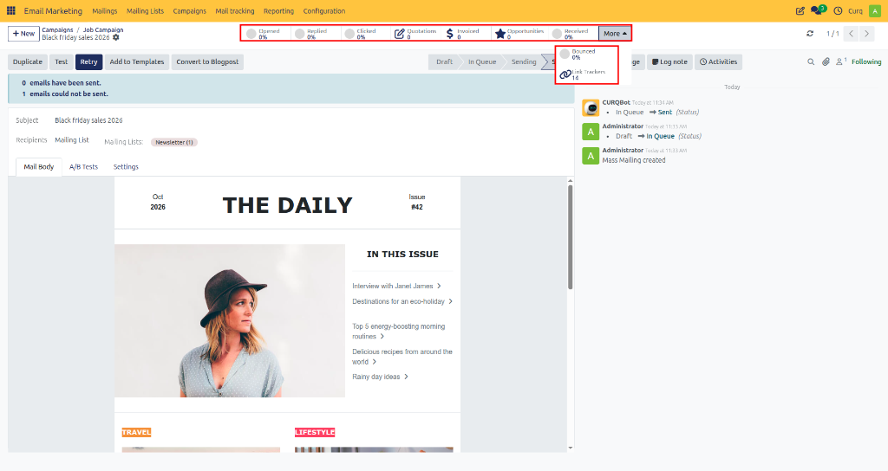

# Creating and Managing Campaigns

Create, organize, and track multi-channel email marketing campaigns in CURQ 18 to measure subscriber engagement, monitor broadcast performance, and evaluate commercial effectiveness.

---

## Overview and Prerequisites

Marketing Campaigns serve as central organizational hubs for grouping related email broadcasts, promotional mailings, and sales initiatives under a unified marketing goal.

### Enabling Marketing Campaigns

Before accessing campaign management features, verify that campaign functionality is enabled in settings:

1. Open the **Email Marketing** application.
2. In the top navigation bar, click **Configuration > Settings**.

3. Under the **Email Marketing** settings pane, enable the **Mailing Campaigns** setting.

4. Click **Save**.

Once enabled, the **Campaigns** menu becomes available in the top navigation bar.

---

## 1. Opening Campaigns

To access campaign management dashboards:

1. Open the **Email Marketing** application.
2. In the top navigation bar, click **Campaigns**.

The page opens the **Campaigns** Kanban dashboard, displaying all existing marketing campaigns organized by campaign stage columns.

---

## 2. Creating a Campaign

You can create a campaign using either Kanban stage views or standard creation forms:

### Method A: Creating from a Campaign Stage (Kanban View)

1. Navigate to **Email Marketing > Campaigns**.
2. Locate the stage column where you want to place the campaign *(such as `New`)*.
3. Click the **+** (plus) icon at the top of the stage column.
4. In the quick-create card form, enter the campaign details:
   * **Campaign Name**: Enter a descriptive campaign title *(e.g., `Black Friday`)*.
   * **Responsible**: Select the team member responsible for managing campaign execution.
   * **Tags**: Assign classification tags.
5. Click **Add** to quickly instantiate the campaign card, or click **Edit** to open the detailed form view.

### Method B: Creating from the Campaign List Form View

1. Navigate to **Email Marketing > Campaigns**.
2. Click **New** at the top left of the screen.

3. In the creation form view, configure the campaign details:
   * **Campaign Name**: Enter a descriptive campaign title.
   * **Responsible**: Select the team member or marketer responsible for managing campaign execution.
   * **Tags**: Assign classification tags to group campaigns.

4. Click **Save** to confirm campaign creation.

---

## 3. Editing a Campaign

To modify campaign properties, update stages, or reassign responsibilities:

* **From the Kanban Dashboard**: Click the three-dot menu (**⋮**) on the top right of any campaign card and select **Edit**.

* **From the Campaign Form View**: Click directly on the campaign card to open its full record view, update the desired fields, and click **Save**.

---

## 4. Creating and Linking Mailings from a Campaign

Once a campaign is established, you can associate and dispatch multiple mass mailings directly from the campaign view:

### Method A: Using the Send Mailing Button

1. Open the target campaign record.
2. Click **Send Mailing** at the top left of the campaign action bar.

A new mailing form view opens pre-configured with the current campaign linked automatically.

### Method B: Using the Mailings Tab

1. Open the target campaign record.
2. Navigate to the **Mailings** tab.
3. Click **Add a Line** to attach an existing mailing or create a new broadcast directly from the list.

### Configuring the Linked Mailing

1. Complete the mailing details across the available configuration tabs:
   * **Subject**: Enter the broadcast subject line.
   * **Recipients**: Select target recipient models and specify destination subscriber lists.
   * **Mail Body**: Select a pre-designed email template layout.

   * **A/B Tests Tab**: The A/B Tests tab allows you to test different versions of a mailing to identify which performs better based on recipient engagement:

     | Field | Description |
     | :--- | :--- |
     | **Allow A/B Testing** | Enable this option to create an alternative version of the mailing and compare its performance with the original. |
     | **Percentage (%)** | Specify the percentage of recipients who will receive the test version *(default `10%`)*. |
     | **Winner Selection** | Select the metric used to determine the winning version, such as Highest Open Rate, click rate, or response rate. |
     | **Send Final On** | Specify the date and time when the winning version is finalized and sent to the remaining recipients. |
     | **Create an Alternative Version** | Click this button to create another version of the mailing with different content for comparison. |

     *How it works*: CURQ sends the test versions to the configured sample of recipients, evaluates the selected performance metric, and uses the winner for the remaining recipients according to the configured schedule.

   * **Settings Tab**: The Settings tab contains email content settings, tracking information, and advanced options:

     #### Email Content
     | Field | Description |
     | :--- | :--- |
     | **Preview Text** | Enter a short text that appears alongside the subject line in supported email clients to summarize the email and encourage recipients to open it. |
     | **Send From** | Specify the sender name and email address displayed to recipients. |
     | **Reply To** | Specify the email address that receives replies from recipients *(can differ from sender address)*. |
     | **Attach a File** | Add files to the mailing as attachments, such as brochures or product information. |

     #### Tracking
     | Field | Description |
     | :--- | :--- |
     | **Campaign** | Link the mailing to an existing marketing campaign to organize related mailings and analyze performance. |
     | **Medium** | Specify the communication channel used for the mailing *(such as `Email`)*. |
     | **Source** | Identify the source associated with the mailing for tracking and analysis purposes. |
     | **Responsible** | Select the user responsible for managing the mailing. |
     | **Blog Post** | Link the mailing to a relevant blog post to associate the email with published content. |

     #### Advanced
     | Field | Description |
     | :--- | :--- |
     | **Name** | Specify the internal name used to identify the mailing record. |
     | **Keep Archives** | Enable this option to retain the mailing's archived content or records according to system archive behavior. |

### Dispatching and Managing Linked Mailings

Once the mailing subject, recipients, and content are configured, use the top action bar buttons:

* **Send**: Broadcasts the mailing immediately to all selected recipients.
* **Schedule**: Specifies a future date and time for automated campaign dispatch.
* **Test**: Opens a dialog to send a sample broadcast to specified internal preview recipients before live dispatch.

* **Add to Templates**: Saves the current email layout to the custom template gallery for reuse in future broadcasts.
* **Convert to Blogpost**: Converts the email content directly into a website blog post record with tags and publishing controls.

The mailing is linked to the campaign and displayed under the campaign's **Mailings** tab.

---

## 5. Reviewing Campaign Performance and Smart Button Metrics

CURQ 18 aggregates real-time performance indicators directly on the form header via interactive smart stat buttons:

### Smart Button Metric Definitions:

* **Opened (%)**: Percentage of delivered emails opened by recipients.
* **Replied (%)**: Percentage of recipients who sent a direct email response.
* **Clicked (%)**: Percentage of recipients who clicked link buttons or hyperlinks within the broadcast.
* **Quotations**: Count of sales quotations generated for contacts interacting with the campaign.
* **Invoiced**: Total monetary revenue invoiced and collected from converted campaign orders.
* **Opportunities**: Count of qualified sales opportunities linked to campaign recipients in CURQ CRM.
* **Received (%)**: Delivery rate percentage of sent messages successfully received by destination inboxes.
* **More (Dropdown Menu)**:
  * **Bounced (%)**: Percentage of undelivered or rejected email broadcasts.
  * **Link Trackers**: Total count of short tracking URLs configured across campaign mailings.

These metrics enable marketing and sales teams to analyze complete ROI, from initial email dispatch to final revenue generation.
