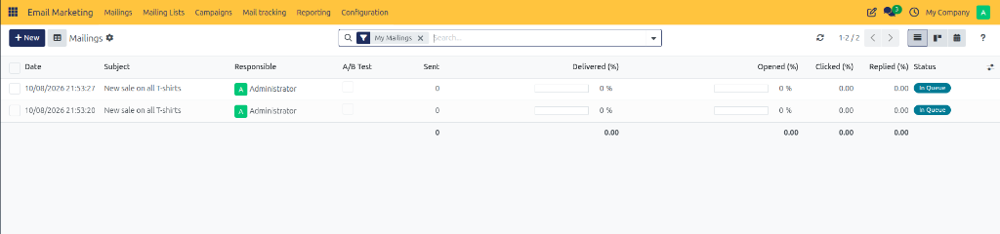
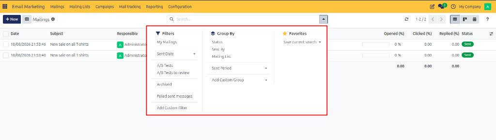
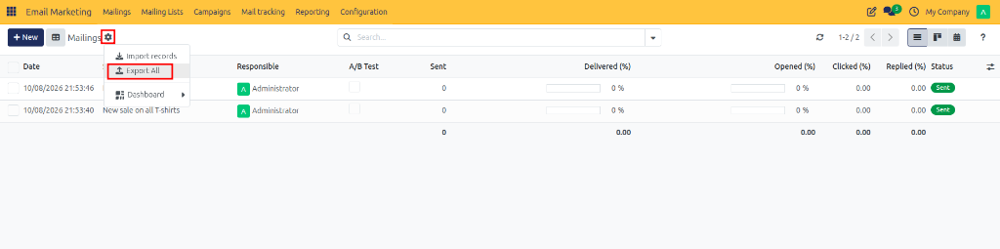
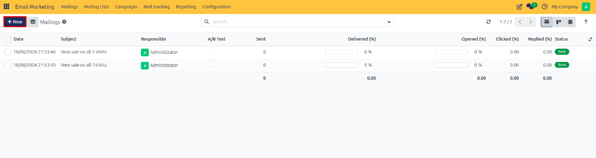
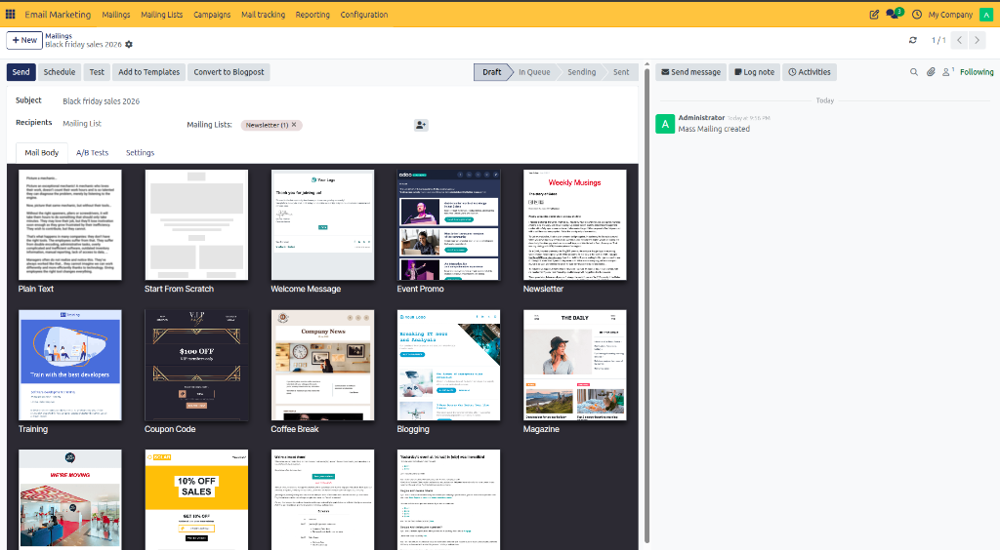

# Creating and Managing Mailings

Create, design, schedule, and send mass email marketing broadcasts in CURQ 18 to engage contacts, evaluate delivery metrics, and track recipient interaction rates.

---

## Overview

The **Mailings** feature serves as the core broadcast dispatch tool in CURQ Email Marketing. Mailings can be created from scratch or templates, sent immediately, scheduled for future delivery, or tested prior to dispatch.

Key capabilities of Mailings:

* **Broadcast Scheduling**: Send emails immediately or set automated future dispatch dates.
* **Multi-Model Audience Selection**: Target Mailing Lists, Contacts, Leads/Opportunities, or custom models.
* **A/B Testing & Templates**: Test subject lines and design templates across sample recipient audiences.
* **Real-time Performance Metrics**: Monitor delivery percentages, open rates, link clickthroughs, and replies.

---

## 1. Opening Mailings

To view existing email broadcasts:

1. Open the **Email Marketing** application.
2. In the top navigation bar, click **Mailings**.

The page opens the **Mailings** overview, displaying all draft, scheduled, in-queue, sending, and completed email broadcasts.

---

## 2. Reviewing Existing Mailings and Performance Metrics

The Mailings overview list view provides key performance metrics for each broadcast:

* **Date**: Creation or scheduled dispatch timestamp.
* **Subject**: Headline subject line of the email broadcast.
* **Responsible**: Marketer or team member managing the mailing.
* **A/B Test**: Indicates whether A/B testing is enabled for the mailing.
* **Sent**: Total count of emails dispatched.
* **Delivered (%)**: Percentage of successfully delivered emails.
* **Opened (%)**: Percentage of recipients who opened the email.
* **Clicked (%)**: Percentage of recipients who clicked links within the email.
* **Replied (%)**: Percentage of recipients who responded to the broadcast.
* **Status**: Current lifecycle status of the mailing (`Draft`, `In Queue`, `Sending`, `Sent`).

### Available Display Views

You can switch between different display formats at the top right of the screen:

* **Kanban View**: Visual board organizing mailings by status stages.
* **List View**: Tabular overview with detailed metric columns.
* **Calendar View**: Chronological schedule view of planned and sent mailings.
* **Graph View**: Analytical charts measuring open, click, and delivery trends over time.

### Filtering and Exporting Mailings

* **Filtering & Grouping**: Use the search bar dropdown panel to filter by *Status*, *Sent Date*, *A/B Tests*, or group by *Status*, *Sent By*, or *Mailing List*.

* **Exporting from List View (Gear Menu)**: Click the gear icon (**⚙**) next to the page title and select **Export All** to download mailing data.

* **Exporting via Actions**: Select one or more mailing checkboxes, click **Action**, and select **Export**.

---

## 3. Creating a New Mailing

To set up a new email broadcast:

1. Navigate to **Email Marketing > Mailings**.
2. Click **New** at the top left of the screen.

3. A blank mailing form view opens.

---

## 4. Entering Basic Information and Selecting Recipients

Complete the essential mailing fields:

1. **Subject**: Enter a catchy subject line for the email broadcast *(emojis can be inserted using the emoji picker button)*.
2. **Recipients**: Select the target audience model from the dropdown:
   * **Mailing List**: Target specific subscriber lists managed under [Mailing Lists](./01-create-mailing-lists.md).
   * **Contact**: Target CRM contact records.
   * **Lead / Opportunity**: Target CRM sales leads.
   * **Other Models**: Target custom recipient models configured in the system.
3. **Campaign**: Optionally associate the mailing with a parent marketing campaign.

---

## 5. Designing Email Content

In the **Mail Body** tab of the mailing form:

* **Template Selection**: Choose from pre-designed layout templates *(such as Newsletter, Event Promo, Welcome Message, or Coupon Code)*.
* **Start From Scratch**: Build a custom email structure using drag-and-drop building blocks.
* **Customization**: Use the design side-pane to adjust colors, fonts, headers, body text, buttons, and social media links.

---

## 6. Configuring A/B Tests

The **A/B Tests** tab allows you to test different versions of a mailing to identify which performs better based on recipient engagement:

| Field | Description |
| :--- | :--- |
| **Allow A/B Testing** | Enable this option to create an alternative version of the mailing and compare its performance with the original. |
| **Percentage (%)** | Specify the percentage of recipients who will receive the test version *(default `10%`)*. |
| **Winner Selection** | Select the metric used to determine the winning version, such as Highest Open Rate, click rate, or response rate. |
| **Send Final On** | Specify the date and time when the winning version is finalized and sent to the remaining recipients. |
| **Create an Alternative Version** | Click this button to create another version of the mailing with different content for comparison. |

> [!NOTE]
> **How it works**: CURQ sends the test versions to the configured sample of recipients, evaluates the selected performance metric, and uses the winner for the remaining recipients according to the configured schedule.

---

## 7. Configuring Settings Tab

The **Settings** tab contains email content settings, tracking information, and advanced options:

### Email Content
| Field | Description |
| :--- | :--- |
| **Preview Text** | Enter a short text that appears alongside the subject line in supported email clients to summarize the email and encourage recipients to open it. |
| **Send From** | Specify the sender name and email address displayed to recipients. |
| **Reply To** | Specify the email address that receives replies from recipients *(can differ from sender address)*. |
| **Attach a File** | Add files to the mailing as attachments, such as brochures or product information. |

### Tracking
| Field | Description |
| :--- | :--- |
| **Campaign** | Link the mailing to an existing marketing campaign to organize related mailings and analyze performance. |
| **Medium** | Specify the communication channel used for the mailing *(such as `Email`)*. |
| **Source** | Identify the source associated with the mailing for tracking and analysis purposes. |
| **Responsible** | Select the user responsible for managing the mailing. |
| **Blog Post** | Link the mailing to a relevant blog post to associate the email with published content. |

### Advanced
| Field | Description |
| :--- | :--- |
| **Name** | Specify the internal name used to identify the mailing record. |
| **Keep Archives** | Enable this option to retain the mailing's archived content or records according to system archive behavior. |

---

## 8. Saving and Understanding Mailing Lifecycles

Click **Save** (or the cloud icon) at the top left of the form. The mailing is created and saved in **Draft** status.

### Mailing Status Stages

| Status | Description |
| :--- | :--- |
| **Draft** | Mailing is being drafted, configured, or edited by marketing staff. |
| **In Queue** | Mailing has been scheduled or triggered and is waiting for background server dispatch. |
| **Sending** | Outgoing mail servers are currently delivering messages to recipient inboxes. |
| **Sent** | All broadcast messages have been fully processed and delivered. |

---

## Next Steps

Once a mailing is saved in **Draft** status, you can test it by sending preview copies, schedule it for automated future delivery, or click **Send** to broadcast it immediately.
