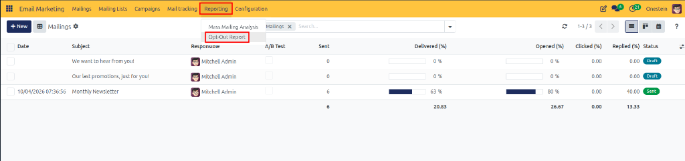
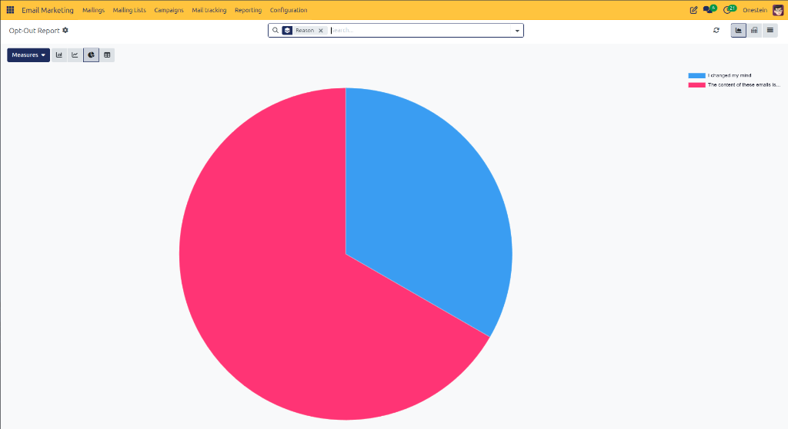
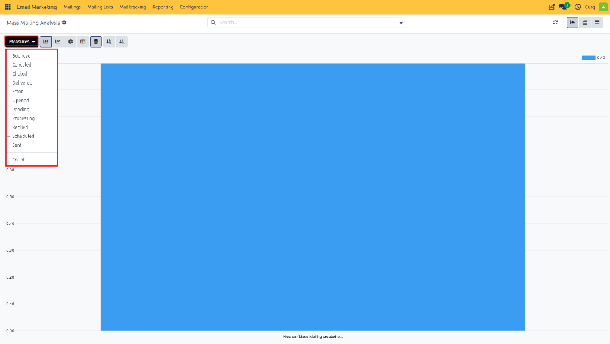
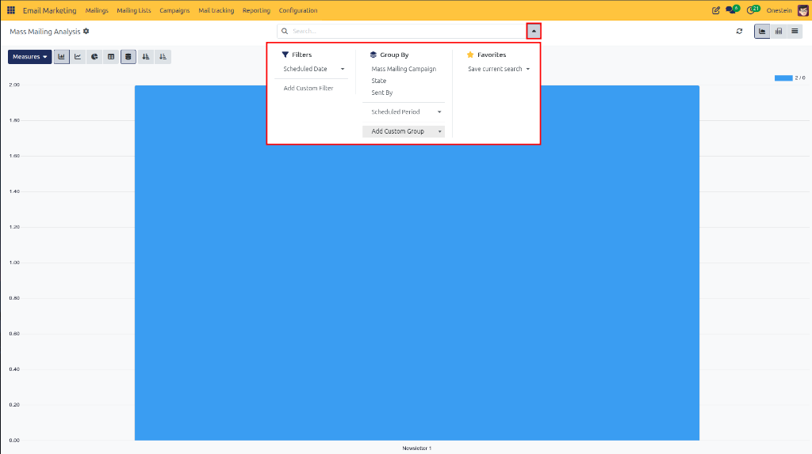

# Analyzing Email Marketing Reports

Review, visualize, and analyze campaign performance metrics in CURQ 18 to measure subscriber engagement, evaluate delivery success rates, and optimize marketing strategies.

---

## Overview

The **Reporting** feature provides detailed graphical analytics and performance data for all email marketing broadcasts dispatched in CURQ 18. Using interactive reports, marketing managers can evaluate delivery statistics, monitor open and clickthrough rates, track bounce figures, and identify high-performing campaign strategies.

Key analytics capabilities:

* **Multi-Format Chart Visualizations**: Switch between Bar, Line, Pie, and Stacked chart formats.
* **Custom Measures**: Analyze key metrics including Sent, Delivered, Opened, Clicked, Replied, and Bounced counts.
* **Granular Filtering & Grouping**: Slice report data by Campaign, Responsible User, Status, or Date range.
* **Opt-Out Reason Analytics**: Analyze pie-chart distributions of subscriber unsubscribe reasons.
* **Saved Favorite Views**: Save customized report configurations for rapid future access.

---

## 1. Opening Email Marketing Reports

To access the email marketing analytics dashboard:

1. Open the **Email Marketing** application.
2. In the top navigation bar, click **Reporting**.
3. Select either **Mass Mailing Analysis** or **Opt-Out Report** from the dropdown menu.

### Mass Mailing Analysis

Selecting **Mass Mailing Analysis** opens the main broadcast performance dashboard, rendering delivery, open, clickthrough, and bounce metrics for all marketing campaigns.

### Opt-Out Report

Selecting **Opt-Out Report** opens the unsubscribe feedback breakdown dashboard, displaying percentage distribution charts of recipient opt-out reasons *(such as `I changed my mind` or `The content of these emails is not relevant`)*.

---

## 2. Selecting a Report Chart View

The reporting dashboard supports multiple graphical visualization formats to suit different analytical needs.

Use the chart mode icons at the top left of the report workspace to switch between views:

* **Bar Chart**: Compare discrete performance metrics across different campaigns, mailings, or responsible users.
* **Line Chart**: Analyze engagement and delivery trends over time *(daily, weekly, or monthly)*.
* **Pie Chart**: View percentage-based distributions *(such as open vs. unopened rates, or bounce ratios)*.
* **Stacked Chart**: Compare multiple metrics combined within single stacked columns for comparative analysis.

---

## 3. Selecting Report Measures and Metrics

Click the **Measures** dropdown button at the top left of the reporting workspace to choose which quantitative metrics to plot:

* **Sent**: Total count of emails dispatched across campaigns.
* **Delivered**: Total count of successfully delivered email messages.
* **Opened**: Total count of emails opened by recipients.
* **Clicked**: Total count of recipient link clickthrough events recorded.
* **Replied**: Total count of direct replies received from contacts.
* **Bounced**: Total count of undeliverable or bounced email messages.
* **Cancelled**: Total count of mailings cancelled prior to server dispatch.

---

## 4. Filtering and Grouping Report Data

Refine reporting data using the search bar dropdown pane:

### Filtering Data (Filters)

Apply specific criteria to isolate target campaign segments:

* **Campaign Status**: Filter by `Draft`, `In Queue`, `Sending`, or `Sent`.
* **Mailing Type**: Isolate mass mailings, newsletters, or transactional mailers.
* **Responsible User**: View analytics for campaigns managed by a specific marketer.
* **Sending Date**: Isolate performance within specific date ranges.

### Grouping Data (Group By)

Organize reporting metrics into category breakdowns:

* **Campaign**: Group results by parent marketing campaign.
* **Status**: Group metrics by current delivery status.
* **Responsible User**: Compare performance across team members.
* **Mailing**: Breakdown metrics by individual email broadcast.
* **Creation / Sent Date**: Group by year, quarter, month, or day.

---

## 5. Saving Favorite Report Views

To save a frequently used report layout, filter, and grouping setup:

1. Apply the desired chart view, measures, filters, and grouping criteria.
2. In the search bar dropdown, click **Favorites**.
3. Select **Save Current Search**.
4. Enter a descriptive title for the report view.
5. Optionally check **Use by default** or **Share with all users**.
6. Click **Save**.

The saved report configuration appears under **Favorites** for instant one-click access in future reporting sessions.
