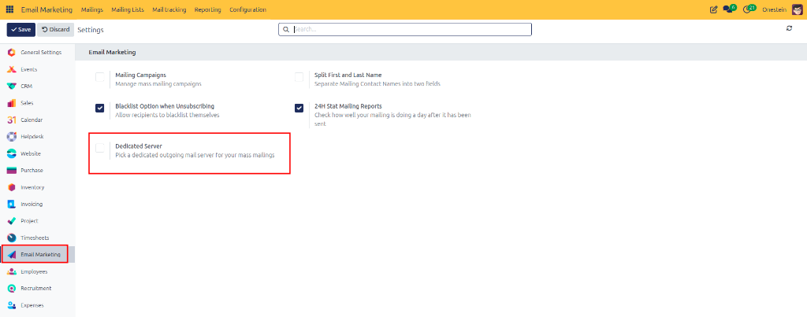
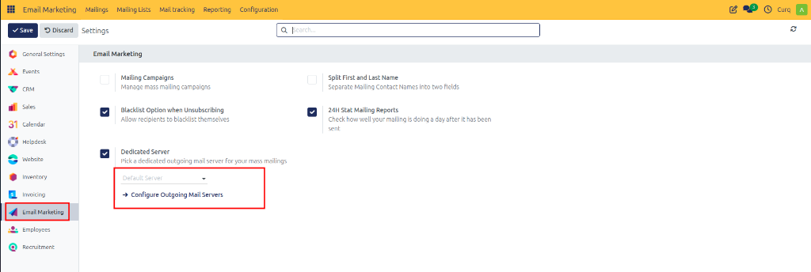

# Configuring a Dedicated Mail Server

Enable and configure a dedicated mail server for Email Marketing in CURQ 18 to isolate mass mailing campaigns, improve email deliverability, and safeguard domain sender reputation.

---

## 1. Overview and Benefits

Email marketing campaigns involve sending mass communications such as newsletters, promotional offers, and product announcements. Using a dedicated mail server ensures marketing emails are sent through an isolated outgoing server rather than sharing your primary domain's transactional mail server.

### Key Benefits:
* **Improved Deliverability**: Keeps high-volume marketing broadcasts separate from critical business emails.
* **Reputation Protection**: Protects primary email domains from potential spam complaints or ISP rate limiting.
* **Flexible Routing**: Allows selection of specialized SMTP delivery services tailored for email marketing.

---

## 2. Navigating to Email Marketing Settings

To enable the dedicated server feature:

1. Open the **Email Marketing** application.
2. In the top navigation bar, click **Configuration**.
3. Select **Settings** from the dropdown menu.

---

## 3. Enabling the Dedicated Server Setting

Inside the Email Marketing Settings panel:

1. Locate the **Dedicated Server** configuration section.
2. Mark the **Dedicated Server** checkbox.

3. Click **Save** at the top left of the screen to apply the setting.

---

## 4. Selecting a Dedicated Server

Once the Dedicated Server option is enabled:

1. A **Server** dropdown field appears beneath the Dedicated Server setting.
2. Click the dropdown menu to select an existing configured outgoing mail server.

3. If no server is configured yet, or if you need to set up a new SMTP server:
   * Click the **Configure Outgoing Mail Servers** link directly below the dropdown.
   * Follow the complete setup instructions in [Configuring Outgoing Mail Servers](./02-configure-outgoing-mail-server.md).