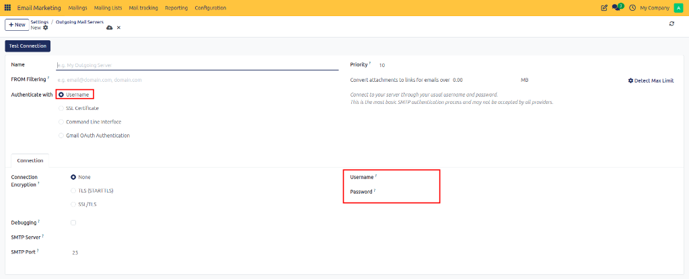
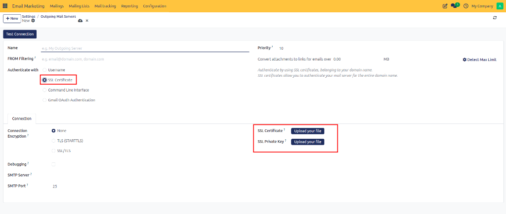
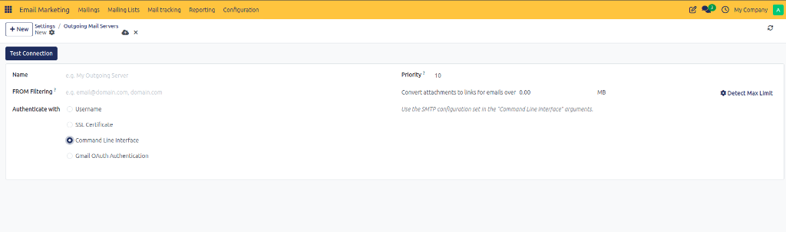
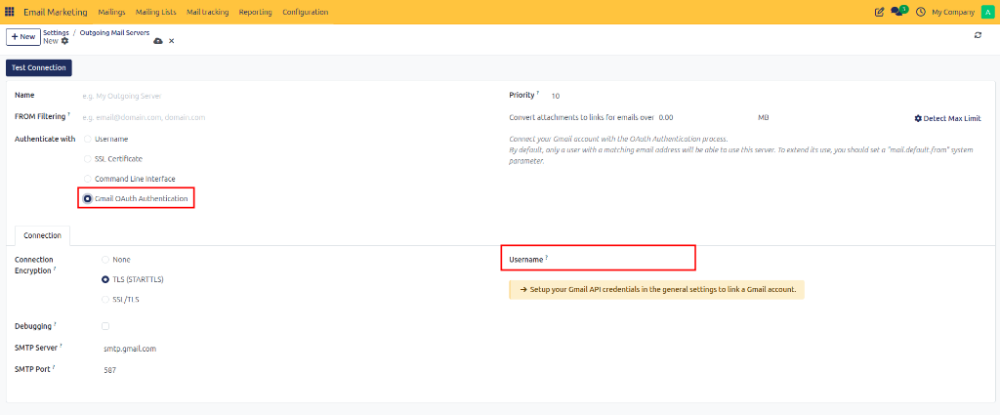

# Configuring Outgoing Mail Servers

Set up and configure dedicated SMTP outgoing mail servers in CURQ 18 to handle outbound mass mailings and marketing email delivery.

---

## 1. Overview of Outgoing Mail Servers

Outgoing mail servers (SMTP servers) process and transmit outgoing email messages from CURQ to external recipient email servers. Setting up dedicated SMTP servers for Email Marketing ensures high delivery throughput, proper authentication (SPF, DKIM, DMARC), and detailed tracking of sent broadcasts.

---

## 2. Accessing Outgoing Mail Server Configuration

To access the Outgoing Mail Servers management view:

1. Open **Email Marketing**.
2. Navigate to **Configuration > Settings**.
3. Under the **Dedicated Server** section, click **Configure Outgoing Mail Servers**.

*(Alternatively, navigate to **Settings > General Settings > Technical > Outgoing Mail Servers**).*

---

## 3. Configuring Server General Fields and Connection Details

When creating a new server record by clicking **New**:

1. Configure the general header fields:
   * **Description / Name**: Enter a clear, descriptive name for the mail server *(such as `SendLayer Marketing SMTP` or `Brevo Dedicated Mailer`)*.
   * **FROM Filtering**: Specify allowed email sender domains or addresses *(such as `email@domain.com` or `domain.com`)* to restrict which senders can use this server.
   * **Priority**: Set an integer priority value *(default `10`)*. Lower numbers indicate higher sending priority when multiple servers are configured.

2. Under the **Connection** tab, configure network settings:
   * **SMTP Server**: Enter the hostname of your SMTP provider *(such as `smtp.sendlayer.net` or `smtp.gmail.com`)*.
   * **SMTP Port**: Enter the port number required by your provider *(typically `587` for STARTTLS, `465` for SSL/TLS, or `25` for unencrypted/CLI)*.
   * **Connection Encryption**:
     * **None**: Unencrypted connection.
     * **TLS (STARTTLS)**: Upgrades connection to TLS during handshake.
     * **SSL/TLS**: Encrypts connection immediately upon connecting.

---

## 4. Selecting an Authentication Method

CURQ 18 supports four distinct authentication methods under the **Authenticate with** setting:

### Option A: Username Authentication (Standard SMTP)

Uses standard SMTP username and password credentials.

1. Under **Authenticate with**, select **Username**.
2. Enter your credentials under the **Connection** tab:
   * **Username**: Enter your SMTP account username or API login key.
   * **Password**: Enter your SMTP password or secret API token.

### Option B: SSL Certificate Authentication

Authenticates connections using domain SSL certificates and private keys.

1. Under **Authenticate with**, select **SSL Certificate**.
2. Upload certificate files under the **Connection** tab:
   * **SSL Certificate**: Click **Upload your file** to select your public certificate (`.crt` or `.pem`).
   * **SSL Private Key**: Click **Upload your file** to select your private key file (`.key`).

### Option C: Command Line Interface (CLI)

Uses system-level SMTP configuration parameters provided via server startup arguments.

1. Under **Authenticate with**, select **Command Line Interface**.
2. Connection credentials are automatically managed by your server's CLI parameters.

### Option D: Gmail OAuth Authentication

Links directly to a Google Workspace or Gmail account using OAuth 2.0 API credentials.

1. Under **Authenticate with**, select **Gmail OAuth Authentication**.
2. Enter the target Gmail address in the **Username** field.
3. If API credentials are not yet configured, click **Setup your Gmail API credentials in the general settings to link a Gmail account**.

---

## 5. Testing the Connection and Saving

Before utilizing the mail server for live marketing broadcasts:

1. Click **Test Connection** in the top action bar.
2. CURQ attempts to connect and authenticate with the configured SMTP host.
3. Upon success, a confirmation message confirms proper authorization.
4. Click **Save** (or cloud icon) to finalize the server record.

---

## 6. Recommended SMTP Providers

Select an SMTP relay provider tailored to your sending volumes:

| Provider | Description & Key Features | Best Applied For |
| :--- | :--- | :--- |
| **SendLayer** | High deliverability SMTP relay service with simplified DNS setup and delivery analytics. | Small to medium marketing campaigns and automated email sequences. |
| **Brevo** | Reliable email marketing platform offering dedicated IP options and transactional relays. | Promotional broadcasts, customer newsletters, and multi-channel campaigns. |
| **SendGrid** | Enterprise cloud email delivery platform with scalable infrastructure. | Large-scale bulk marketing broadcasts and enterprise email delivery. |