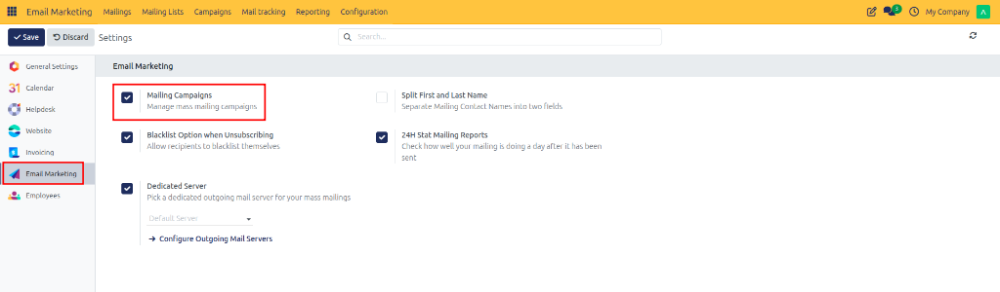
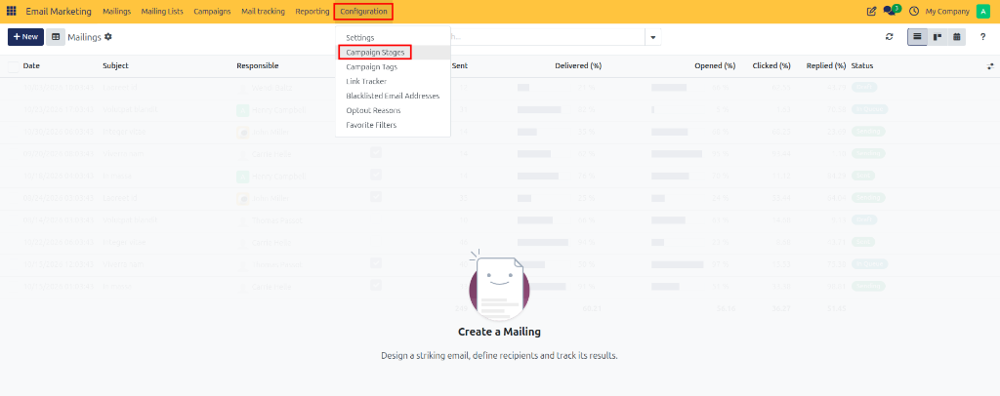
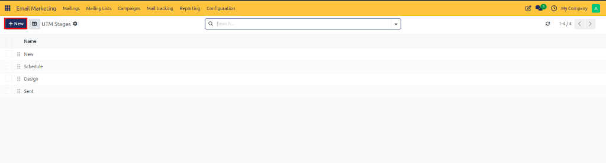

# Configuring Campaign Stages

Configure custom campaign stages in CURQ 18 to organize marketing campaigns, track milestone progression, and manage multi-channel promotional workflows.

---

## 1. Prerequisites: Enabling Mailing Campaigns

Before campaign stages can be created or accessed, the Mailing Campaigns feature must be enabled in Email Marketing settings:

1. Open the **Email Marketing** application.
2. In the top navigation bar, click **Configuration**.
3. Select **Settings** from the dropdown menu.
4. Under the **Email Marketing** settings pane, mark the **Mailing Campaigns** checkbox.

5. Click **Save** at the top left of the settings view.

Enabling this feature unlocks the **Campaigns** top navigation item and the **Campaign Stages** option under **Configuration**.

---

## 2. Navigating to Campaign Stages

Once the Mailing Campaigns setting is saved:

1. Open **Email Marketing**.
2. In the top navigation bar, click **Configuration**.
3. Select **Campaign Stages** from the dropdown menu.

The page opens the **UTM Stages** / **Campaign Stages** list view, displaying all active campaign progression milestones in your system.

---

## 3. Creating a New Campaign Stage

To define a new milestone in your marketing campaign workflow:

1. In the **Campaign Stages** list view, click **New** at the top left.

2. An inline entry row or stage form view opens.
3. Configure the stage fields:
   * **Stage Name**: Enter a clear label for the campaign milestone *(such as `Draft`, `Schedule`, `Design`, `Sent`, `Planned`, `Running`, or `Completed`)*.
   * **Sequence**: Adjust stage ordering by dragging row handles.

---

## 4. Saving and Verifying Campaign Stages

Once the stage details are entered:

1. Review the stage name and sequence settings.
2. Click **Save** (or press Enter) to confirm the stage record.

The new stage becomes immediately available when organizing marketing campaigns, enabling team members to move campaigns through structured stages on the campaign Kanban board.
