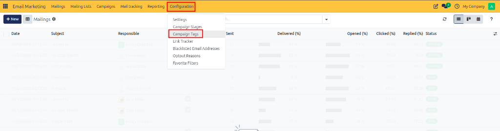
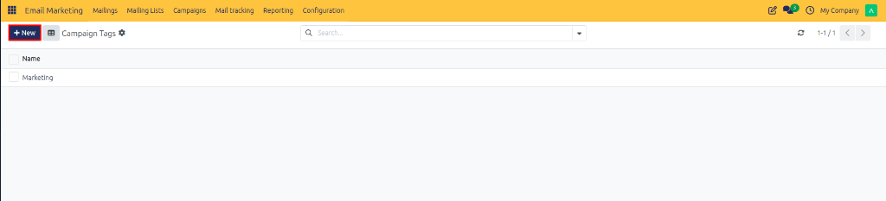

# Configuring Campaign Tags

Create and configure campaign tags in CURQ 18 to categorize marketing campaigns, filter analytics reports, and organize multi-channel promotional broadcasts.

---

## 1. Navigating to Campaign Tags

To manage campaign tags:

1. Open the **Email Marketing** application.
2. In the top navigation bar, click **Configuration**.
3. Select **Campaign Tags** from the dropdown menu.

*(Note: If **Campaign Tags** is not visible, ensure **Mailing Campaigns** is enabled under **Configuration > Settings**).*

The page opens the **UTM Tags** / **Campaign Tags** list view, displaying all active campaign categorization labels.

---

## 2. Creating a New Campaign Tag

To define a new tag for campaign classification:

1. In the **Campaign Tags** list view, click **New** at the top left of the screen.

2. An inline entry row or tag creation form view opens.
3. Configure the tag properties:
   * **Tag Name**: Enter a concise, recognizable label *(such as `Marketing`, `Newsletter`, `Promotion`, or `Event`)*.
   * **Color Index**: Select a visual color code to easily distinguish the tag on campaign Kanban cards and list views.

---

## 3. Saving and Applying Campaign Tags

Once the tag details are configured:

1. Verify the tag name and color selection.
2. Click **Save** (or press Enter) to confirm the tag record.

The newly created tag becomes immediately available under the **Tags** field on campaign creation forms, allowing you to filter campaigns by tag across list views, Kanban boards, and reporting views.
