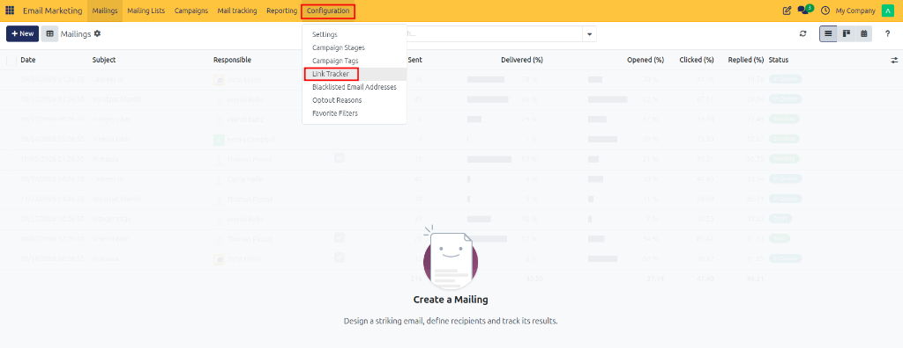
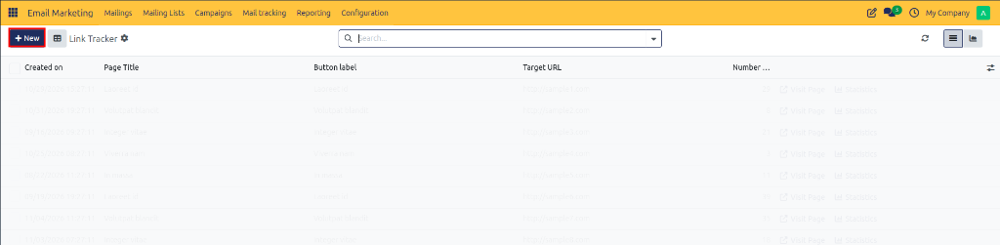
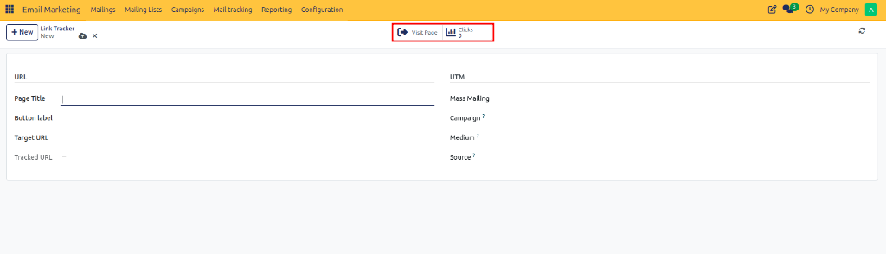

# Configuring Link Trackers

Configure link trackers in CURQ 18 to generate short tracking URLs, monitor recipient clickthrough rates, and evaluate call-to-action performance across email marketing campaigns.

---

## What is a Link Tracker?

A **Link Tracker** in CURQ 18 is a tracking utility that converts target web URLs into unique, traceable short links. When embedded in email marketing broadcasts:

* **Click Tracking**: Every time a recipient clicks the link in an email, CURQ logs the click event, timestamp, and recipient details.
* **Redirection**: The system seamlessly redirects the recipient to the target web page without delay.
* **Performance Measurement**: Allows marketing teams to analyze Call-to-Action (CTA) effectiveness, measure Click-Through Rates (CTR), and evaluate overall campaign engagement.

---

## 1. Opening Link Tracker Configuration

To view existing tracking links and access link configuration:

1. Open the **Email Marketing** application.
2. In the top navigation bar, click **Configuration**.
3. Select **Link Tracker** from the dropdown menu.

The page opens the **Link Tracker** list view, displaying all tracked links currently registered in the system.

---

## 2. Reviewing Link Statistics and Metrics

The Link Tracker list view provides key engagement metrics for every tracked URL:

| Column / Stat | Description |
| :--- | :--- |
| **Created On** | Creation date and timestamp. |
| **Page Title** | Title of the destination web page. |
| **Button Label** | Anchor text or button label text. |
| **Target URL** | Destination web address. |
| **Number of Clicks** | Total recorded clickthrough count. |

---

## 3. Creating a New Link Tracker

To generate a new tracked link for an upcoming campaign:

1. In the **Link Tracker** list view, click **New** at the top left of the screen.
2. A blank link tracker form view opens.

3. Configure the **URL** fields on the left pane:
   * **Page Title**: Enter a clear descriptive title for internal tracking *(such as `Seasonal Discount Landing Page`)*.
   * **Button Label**: Enter the call-to-action text displayed on the email button or hyperlink *(such as `Claim Your Discount`)*.
   * **Target URL**: Enter the full destination web address *(such as `https://example.com/promo-sale`)*.
   * **Tracked URL**: Automatically generated short tracking link after saving.

4. Optionally configure the **UTM** analytics fields on the right pane:
   * **Mass Mailing**: Link the tracker to a specific email mailing.
   * **Campaign**: Associate the link with a parent marketing campaign.
   * **Medium**: Specify the marketing medium *(default `Email`)*.
   * **Source**: Specify the traffic source *(such as `Newsletter`)*.

---

## 4. Saving and Using Tracked Links in Campaigns

Once link details are entered:

1. Verify the Target URL, Page Title, and Button Label.
2. Click **Save** (or the cloud icon) at the top left of the form view.
3. Use the top action buttons to monitor or test the link:
   * **Visit Page**: Opens the target URL in a new browser tab to test destination link validity.
   * **Clicks**: Displays the live stat button tracking total recipient clicks.

The link tracker is saved and ready for insertion into email campaign templates. Click activity will be automatically recorded in real-time under Link Tracker statistics.
