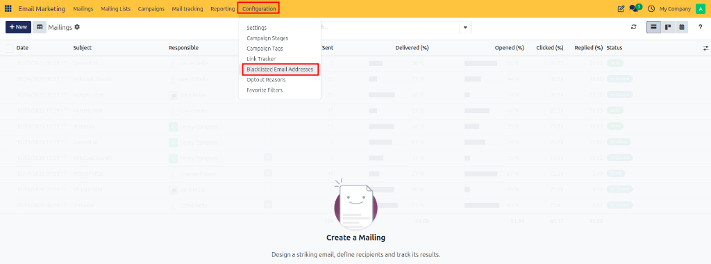
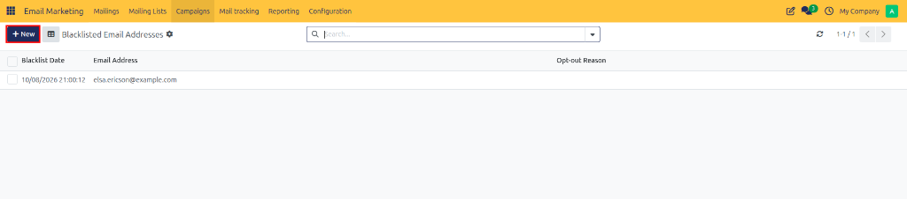
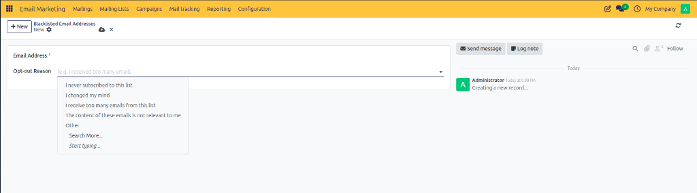
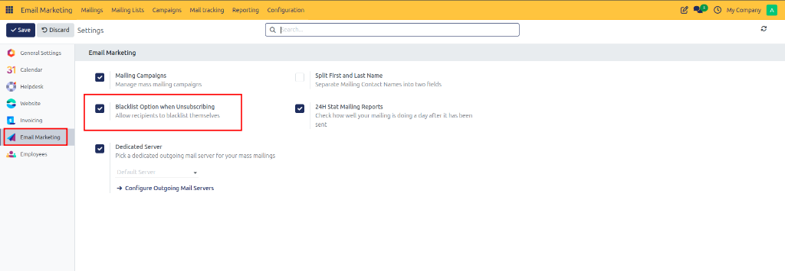

# Managing Blacklisted Email Addresses

Configure and manage blacklisted email addresses in CURQ 18 to prevent sending marketing communications to opted-out recipients, protect sender domain reputation, and comply with global anti-spam regulations.

---

## Overview and Compliance

Blacklisted email addresses are blocked from receiving any mass marketing mailings sent from CURQ 18. Maintaining an up-to-date email blacklist ensures:

* **Regulatory Compliance**: Respects recipient unsubscribe requests in accordance with privacy and anti-spam laws *(such as GDPR and CAN-SPAM)*.
* **Domain Protection**: Prevents repeated broadcasts to invalid, unsubscribed, or complaining email addresses, reducing bounce rates and spam reports.
* **Automatic Safeguards**: CURQ automatically screens recipient lists against the blacklist prior to dispatching any email campaign.

---

## 1. Opening Blacklisted Email Addresses

To view and manage blacklisted email addresses:

1. Open the **Email Marketing** application.
2. In the top navigation bar, click **Configuration**.
3. Select **Blacklisted Email Addresses** from the dropdown menu.

The page opens the **Blacklisted Email Addresses** list view, displaying all blocked email addresses currently registered in the system along with their active status and creation timestamps.

---

## 2. Adding a Blacklisted Email Address

To manually block an email address from receiving future marketing communications:

1. Navigate to **Email Marketing > Configuration > Blacklisted Email Addresses**.
2. Click **New** at the top left of the screen.
3. In the creation form view, configure the blacklist fields:
   * **Email Address**: Enter the full email address to be blocked *(such as `client@example.com`)*.
   * **Opt-Out Reason**: Select or specify the reason for blacklisting the email address.

---

## 3. Automatic Blacklisting on Unsubscribe

In addition to manual entries, CURQ 18 supports automatic blacklisting when recipients click unsubscribe links in marketing emails:

1. Navigate to **Email Marketing > Configuration > Settings**.
2. Under the **Email Marketing** settings pane, enable the **Blacklist Option when Unsubscribing** setting.

3. Click **Save**.

When enabled, recipients who click the unsubscribe link on any marketing email broadcast are automatically added to the **Blacklisted Email Addresses** directory, preventing future mailings without requiring manual administrative intervention.

---

## 4. Saving and Verifying Blacklist Records

Once the email address details are entered:

1. Review the email address format and opt-out reason.
2. Click **Save** (or the cloud icon) at the top left of the form view.

The email address is added to the system blacklist and will be automatically excluded from all present and future email marketing campaign broadcasts.
