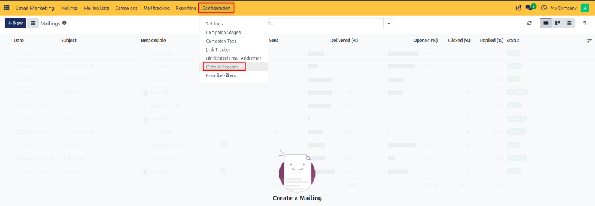
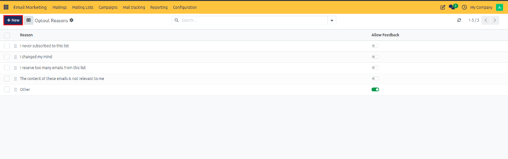

# Managing Opt-Out Reasons

Configure and manage unsubscribe reasons in CURQ 18 to gather valuable feedback when recipients opt out of marketing communications, analyze subscriber disengagement, and optimize email marketing campaigns.

---

## Overview

Opt-Out Reasons allow recipients to specify why they no longer wish to receive marketing emails. When a recipient clicks the unsubscribe link in a mass mailing, CURQ presents a list of predefined reasons that help your organization understand subscriber feedback.

Collecting unsubscribe feedback helps:

* **Identify Content Issues**: Determine if subscribers feel emails are irrelevant, too frequent, or unsolicited.
* **Improve Targeting**: Adjust mailing frequency and segmentation strategies based on opt-out feedback patterns.
* **Enhance Deliverability**: Address root causes of subscriber dissatisfaction before they mark emails as spam.

---

## 1. Opening Opt-Out Reasons

To view and manage available opt-out reasons:

1. Open the **Email Marketing** application.
2. In the top navigation bar, click **Configuration**.
3. Select **Opt-Out Reasons** from the dropdown menu.

The page opens the **Opt-Out Reasons** list view, displaying all active unsubscribe reasons available to recipients along with their **Allow Feedback** toggle state.

---

## 2. Creating a New Opt-Out Reason

To add a custom unsubscribe reason for recipients:

1. Navigate to **Email Marketing > Configuration > Opt-Out Reasons**.
2. Click **New** at the top left of the screen.
3. In the creation form view, enter the reason parameters:
   * **Name**: Enter the text displayed to recipients on the unsubscribe page *(such as `Email format is unreadable`)*.
   * **Allow Feedback**: Enable this checkbox to allow recipients to type a custom text response when selecting this reason.

---

## 3. Enabling Recipient Feedback (Allow Feedback)

The **Allow Feedback** option determines whether recipients can provide additional text comments when choosing a specific opt-out reason.

When **Allow Feedback** is enabled:

* **Custom Comments**: Recipients get a text input box on the unsubscribe page to enter specific comments.
* **Granular Insight**: Additional context is captured alongside the selected reason for deeper analysis.
* **Recommended Usage**: Ideal for broad or generic reasons such as *Other*, where predefined options may not fully describe the recipient's decision.

---

## 4. Saving Changes

Once the reason name and feedback options are configured:

1. Review the reason text and settings.
2. Click **Save** (or the cloud icon) at the top left of the form view.

Any changes or newly created opt-out reasons are automatically updated and immediately available on live unsubscribe landing pages for future campaign broadcasts.
