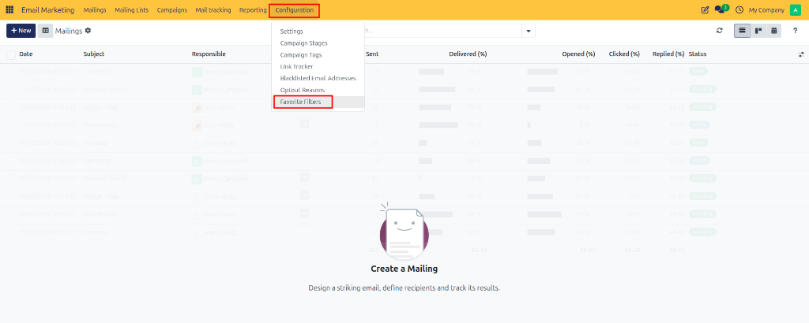
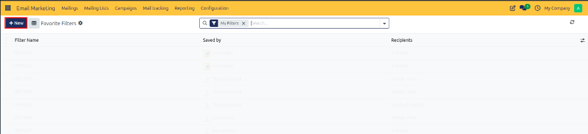
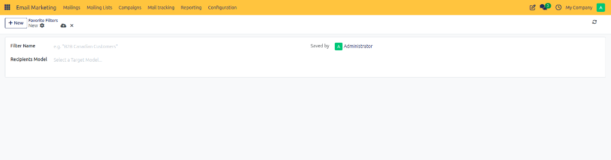

# Configuring Favorite Filters

Configure and save favorite domain filters in CURQ 18 to quickly target specific recipient audiences, streamline campaign segmentation, and reuse search criteria across mass mailings.

---

## Overview

Favorite Filters allow marketing administrators to save custom domain filtering rules for specific target models *(such as Mailing Contacts, Lead/Opportunity, or Contact)*. Saved favorite filters appear as pre-configured target audience options when composing new email broadcasts, eliminating the need to manually construct complex domain queries each time a campaign is sent.

Key benefits of favorite filters:

* **Consistent Audience Targeting**: Standardize recipient selection criteria across marketing teams.
* **Efficient Campaign Setup**: Quickly select pre-defined subscriber segments without re-building search domains.
* **Model Flexibility**: Scope filters to specific target recipient models used in mass mailings.

---

## 1. Opening Favorite Filters

To view and manage saved favorite filters:

1. Open the **Email Marketing** application.
2. In the top navigation bar, click **Configuration**.
3. Select **Favorite Filters** from the dropdown menu.

The page opens the **Favorite Filters** list view, displaying all pre-saved domain filters along with their associated recipient models.

---

## 2. Creating a Favorite Filter

To create a new saved filter for campaign audience selection:

1. Navigate to **Email Marketing > Configuration > Favorite Filters**.
2. Click **New** at the top left of the screen.
3. In the creation form view, enter the filter parameters:
   * **Filter Name**: Enter a clear, descriptive name for the filter *(such as `B2B Canadian Customers` or `Active Newsletter Subscribers`)*.
   * **Recipients Model**: Select the audience record model that this filter applies to *(such as `Mailing List Contact` or `Contact`)*.
   * **Saved by**: Displays the user responsible for creating and maintaining the saved filter.

The selected recipient model determines which target audience record types can utilize this saved filter during campaign creation.

---

## 3. Saving and Applying Filters

Once the filter details are entered:

1. Review the filter name and recipient model selection.
2. Click **Save** (or the cloud icon) at the top left of the form view.

The filter is saved and immediately available for selection in the target recipient dropdown menu when setting up new email marketing broadcasts.
