# Creating and Designing Webpages

Build, customize, and publish responsive web pages using the drag-and-drop website editor in CURQ 18.

---

### 1. Opening the Website Editor

To access the website frontend and editing tools:

1. Open the CURQ 18 main dashboard and click the **Website** app icon.
2. CURQ opens your public website in live preview mode with the website administrative control bar fixed at the top of your screen:
   * **Edit** *(Blue button)*: Opens the visual block editor sidebar and unlocks inline canvas editing.
   * **+ New**: Quick-creation menu to add new pages, blog posts, events, products, or job openings.
   * **Website Switcher Dropdown**: If your database manages multiple websites, a website selector dropdown appears in the top control bar *(press hotkey `Alt + w`)* displaying the active website name. Click it to switch frontend context between your different brand websites before creating or editing pages.
   * **Mobile / Desktop Switcher**: Toggle icon to preview how pages adapt across desktop screens and mobile devices.
   * **Page Status Toggle**: Switch between **Unpublished** *(red)* and **Published** *(green)*.
   * **Site Menu**: Direct navigation to explore pages, configure SEO metadata, and access backend website settings.

   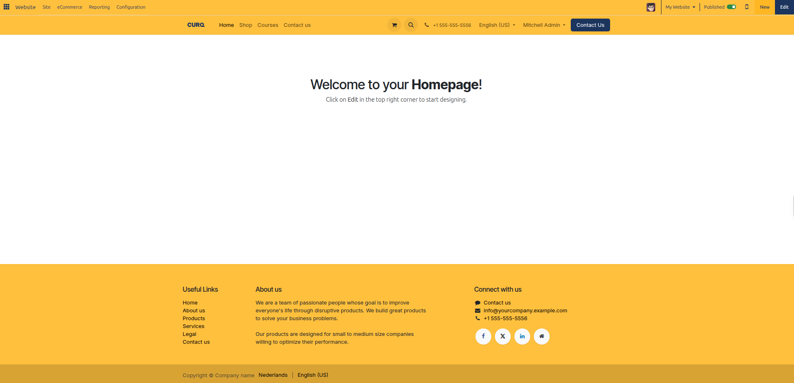

---

### 2. Creating a New Webpage

To start a new webpage:

1. In the top website control bar, click **+ New** *(if multiple websites are configured, ensure you have the intended website selected in the top website switcher dropdown first)*.

   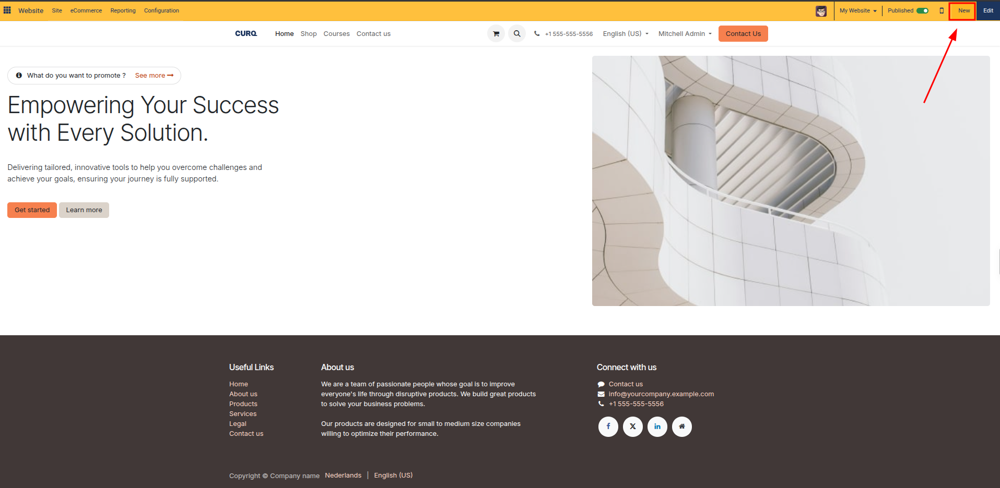

2. In the quick-creation overlay dialog, click **Page**:
   * CURQ provides direct creation shortcuts for multiple content types, including **Page**, **Product**, **Course**, **Livechat Widget**, **Blog Post**, **Event**, **Forum**, and **Job Position**.

   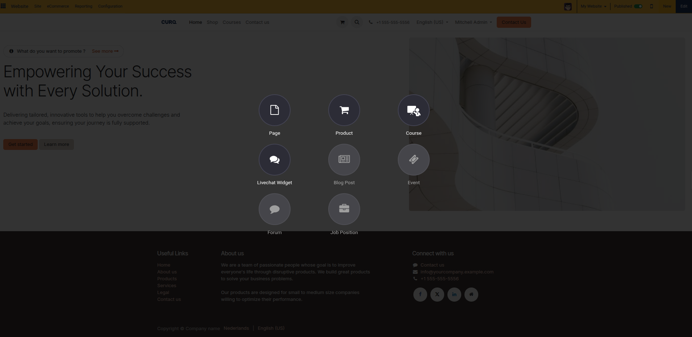

3. In the **New Page** template selector dialog:
   * Select a layout category from the left sidebar *(such as **Basic**, **About**, **Landing Pages**, **Gallery**, **Services**, **Pricing Plans**, **Team**, or **Custom**)*.
   * Choose a pre-designed page structure from the library, or select **Blank Page** to build from scratch.

   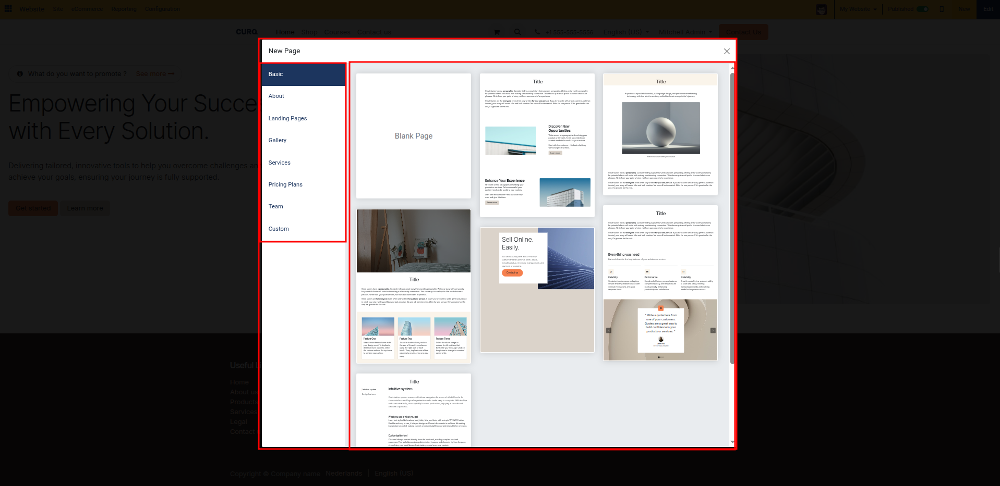

4. In the title prompt modal:
   * **Page Title**: Enter a clear name for your new webpage *(such as `Info`, `Services`, or `About Us`)*.
   * **Add to menu**: Keep this checked to automatically insert a navigation link for this page into your primary header navbar. Uncheck this if you are creating a standalone landing page.
   * Click **Create**.

   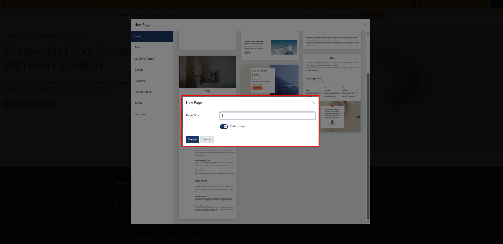

5. CURQ generates the new page, inserts the new menu link in the website navbar, and immediately opens the visual drag-and-drop editor.

   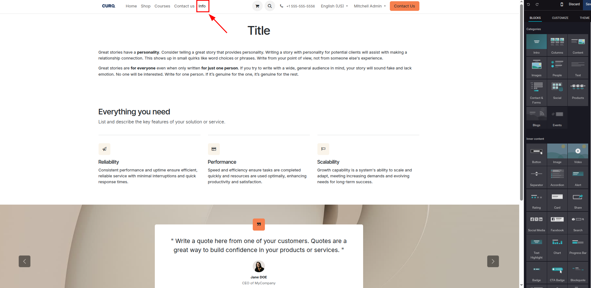

---

### 3. Adding Content Using Building Blocks

The drag-and-drop editor provides a library of pre-designed responsive blocks in the right-hand **Blocks** sidebar:

1. In the right sidebar, ensure the **Blocks** tab is selected.
2. Browse through the available block categories:
   * **Structure**: Fundamental layout containers including **Banner**, **Cover**, **Text - Image**, **Columns**, **Masonry**, and **Image Gallery**.
   * **Features**: Engagement components including **Features**, **Comparison Table**, **Process Steps**, **Team Profiles**, **Client Testimonials**, and **FAQ Accordions**.
   * **Dynamic Content**: Connected data widgets that pull live CURQ records into your webpage, such as **Contact Form**, **Blog Posts**, **Products**, and **Call to Action**.
   * **Inner Content**: Smaller building blocks to nest inside columns, such as **Headings**, **Paragraphs**, **Icons**, **Buttons**, **Dividers**, and **Rating Stars**.

   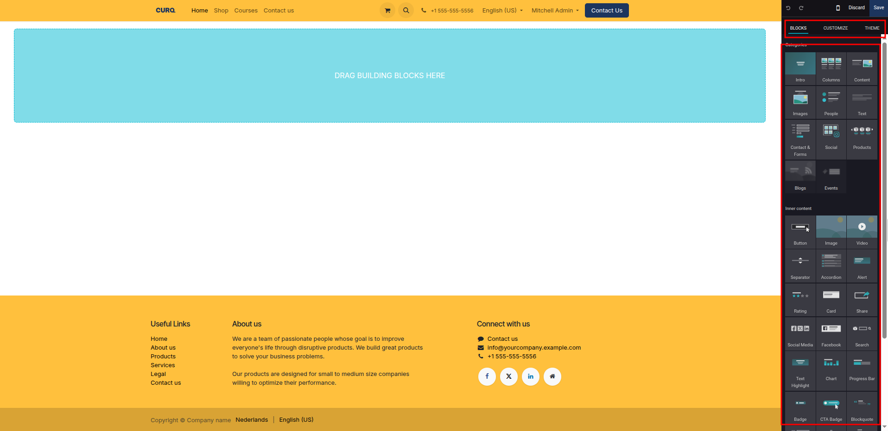

3. Click and hold any block card in the sidebar *(such as **Intro**)*.
4. Drag the block over to the main page canvas.
5. As you move the block, CURQ displays a blue horizontal insertion line indicating where the component will drop.
6. Release the mouse button to drop the block into your page.

   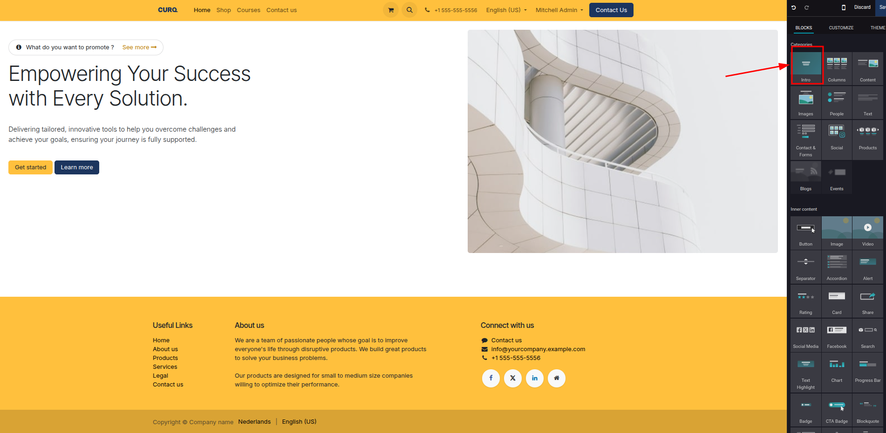

---

### 4. Editing Text and Button Links Inline

Every element on the canvas can be edited directly without opening separate dialog forms:

1. Click directly on any headline, subtitle, or paragraph on the page canvas to select and activate the text block.
2. Type or paste your replacement text directly on the canvas.

   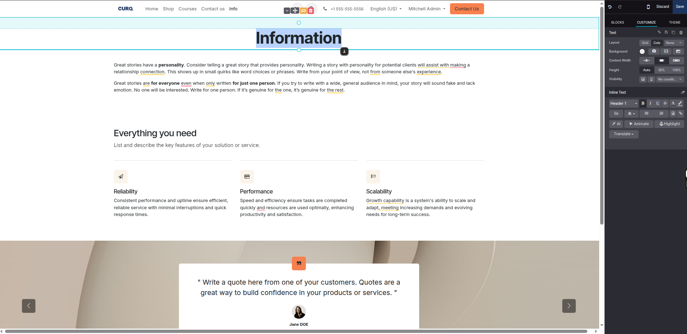

3. When a text block is selected, the right **Customize** sidebar displays the **Inline Text** panel (which remains hidden for non-text components like images or layout containers):
   * **Text Format**: Select heading levels *(Header 1 to Header 6, Display 1 to 4)*, paragraph body text *(Normal, Light, Small)*, code blocks, or blockquotes.
   * **Typography Styles**: Apply **Bold**, *Italic*, Underline, or Strikethrough formatting, or click the eraser icon to remove formatting.
   * **Font Size & Color**: Adjust pixel font size, apply text font colors from the palette, and apply background highlighter colors.
   * **Lists & Alignment**: Set text alignment *(Left, Center, Right, Justify)*, and create unordered bullet lists, numbered ordered lists, or interactive checklists.
   * **AI Text Assistant & Copywriter**: While AI in CURQ is strictly limited to text (it does not generate layouts or images), it is not just a raw prompt generator. It operates in three distinct modes:
     * **Prompt Generation**: When no specific text is selected (cursor simply placed in a text block), clicking the AI wand opens the **Generate Text with AI** modal to draft new copy from a conversational prompt.
     * **AI Copywriter**: When specific text is selected on the canvas, clicking the AI wand opens the **AI Copywriter** dialog to generate 3 alternative variations with one-click tone and length filters *(Correct, Shorten, Lengthen, Friendly, Professional, or Persuasive)*.
     * **AI Translation**: When text is selected, the **Translate** dropdown appears in the sidebar to translate the selected text into other configured website languages.
   * **Animations & Highlights**: Click **Animate** to configure text entrance animations, or click **Highlight** to apply stylistic animated marker strokes.

   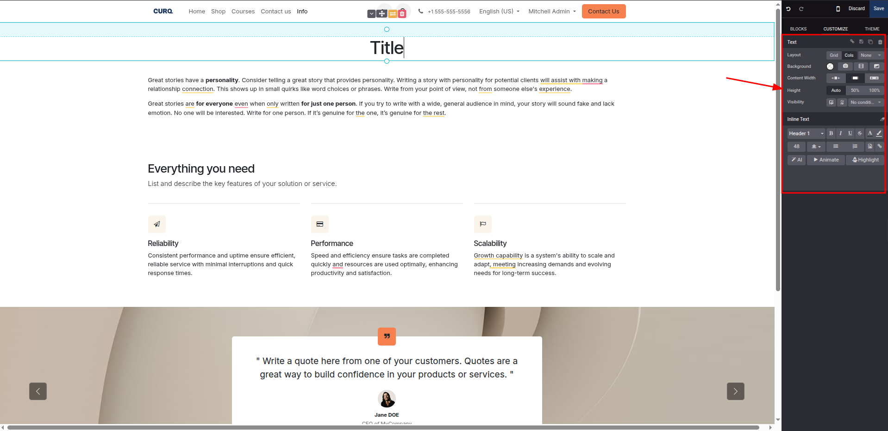

   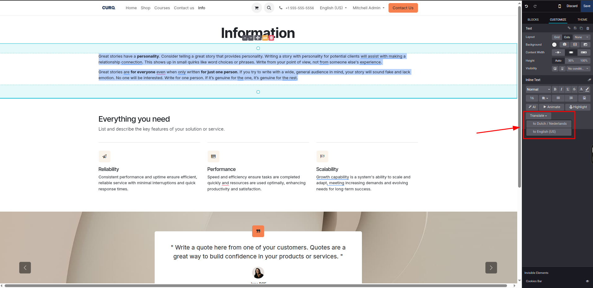

   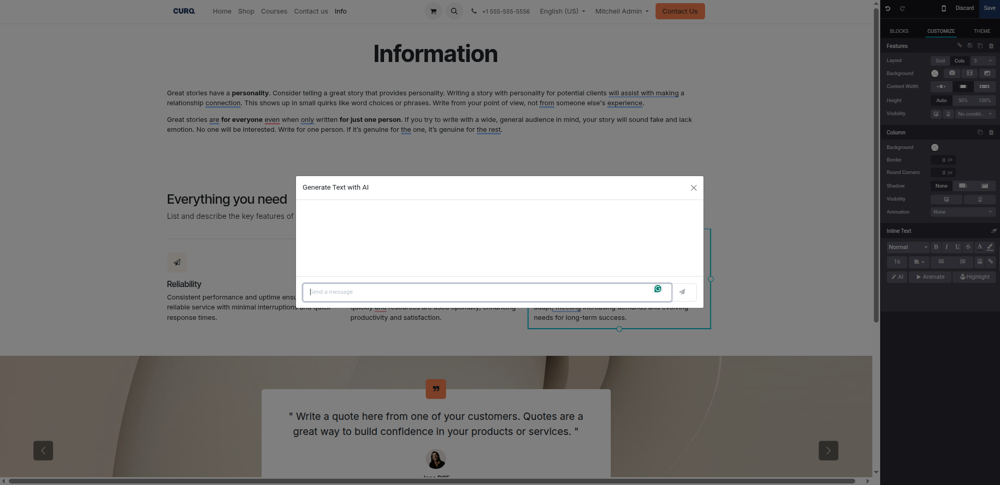

   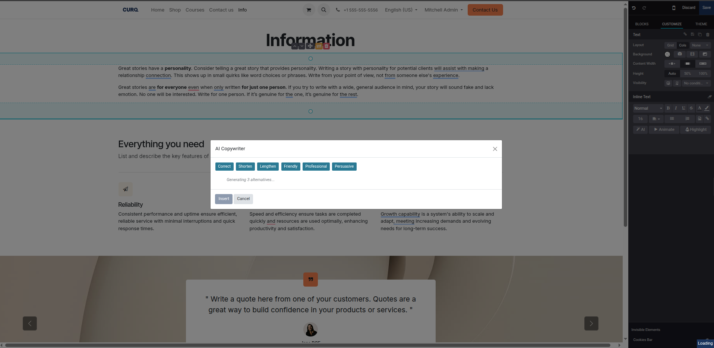

4. Click on any button component on the canvas to configure button actions:
   * **Link (URL)**: Enter an external URL, search for an internal site page by typing `/`, or link to a section anchor by typing `#`. Toggle **Open in New Window** to control tab behavior.
   * **Label**: Edit button display text directly in the sidebar or inline on the canvas.
   * **Style**: Switch button appearance between **Button Primary**, **Button Secondary**, **Light**, **Dark**, or **Outline** styles.
   * **Size**: Choose button size between **Small**, **Medium**, or **Large**.

   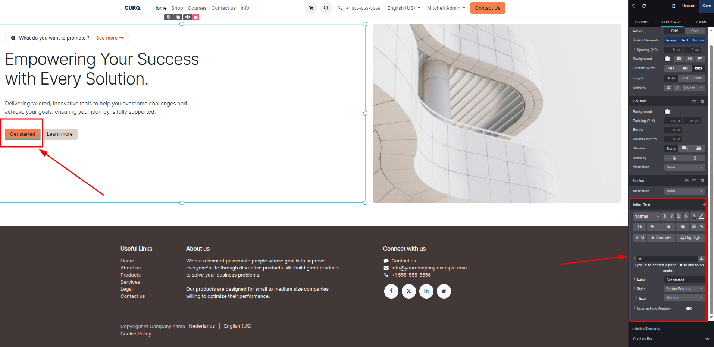

---

### 5. Replacing and Formatting Media

To replace stock placeholder pictures with company media:

1. Click directly on any image on the canvas.
2. In the right **Customize** sidebar under the **Image** section, click the green **Replace** button to open the media library:

   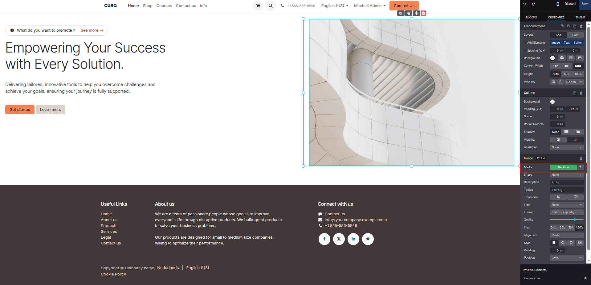

   * **Images**: Search copyright-free illustrations and photos *(such as built-in Undraw vector illustrations)*, add an image by URL, or click **Upload an image** from your computer.
   * **Documents**: Select downloadable files or PDF documents uploaded to your database.
   * **Icons**: Choose from hundreds of vector line icons for feature lists and service cards.
   * **Videos**: Embed video URLs or upload short video clips.

   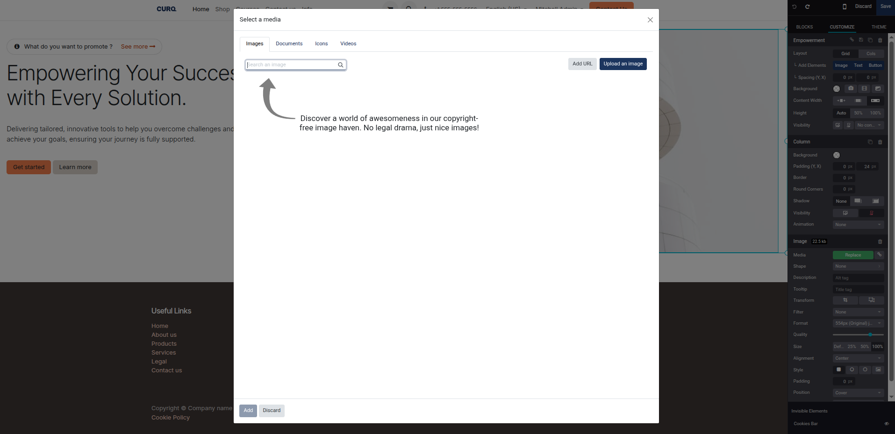

   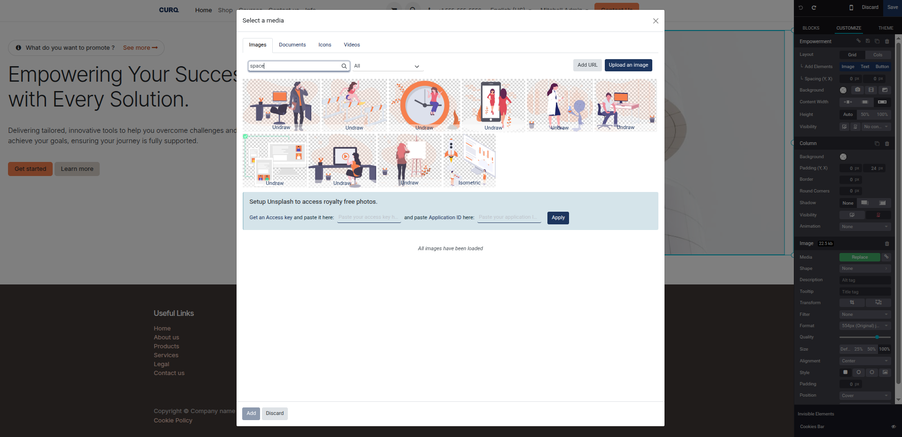

3. Select your chosen image or illustration and click **Add**.
4. In the right-hand **Customize** sidebar under the **Image** section, configure presentation settings:
   * **Media Action**: Click **Replace** to swap the asset, or click the link chain icon to make the image clickable.
   * **Description & Tooltip (SEO)**: Enter an **Alt tag** in the Description field for accessibility/SEO, and set a hover **Title tag** in the Tooltip field.
   * **Transform & Crop**: Use crop and transform icons to adjust framing directly inside the editor.
   * **Filter & Style**: Apply visual filters *(such as Warm, Cold, B&W)* and choose border shapes *(Default, Rounded Circle, Shadow, or Thumbnail)*.
   * **Quality & Sizing**: Choose width scaling *(25%, 50%, 100%, or Default)* and adjust the image quality compression slider.

   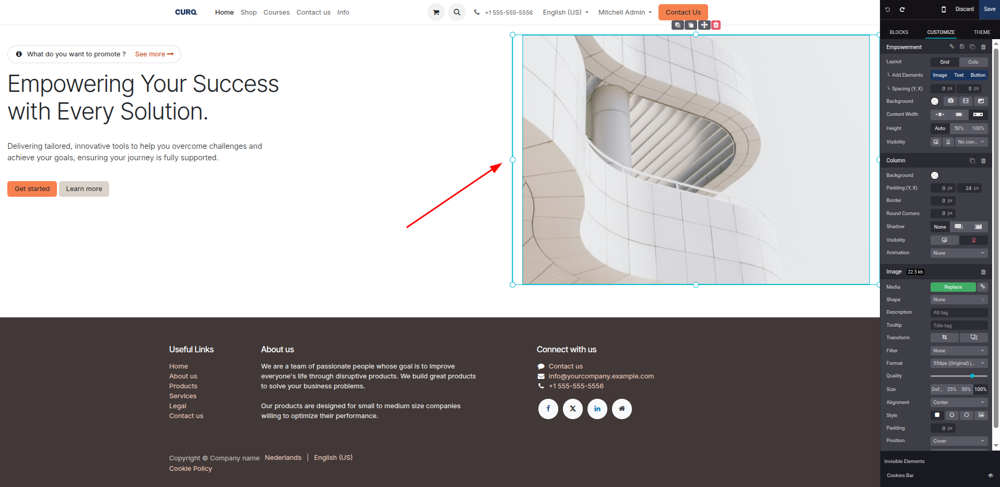

---

### 6. Customizing Section Layout and Styling

When an entire block section is selected, the right sidebar switches to the **Customize** panel to control section geometry:

1. Click on the outer border of any block section on the canvas.
2. In the right **Customize** sidebar, configure layout options:
   * **Width**: Set container width to **Full Width** *(stretching across the entire browser window)* or **Boxed** *(centered with standard container gutters)*.
   * **Height**: Set section height to **Full Screen** *(100vh)*, **Auto**, or custom minimum pixel heights.
   * **Padding & Margins**: Use top and bottom spacing sliders to control white space between sections.
   * **Background**: Select a section background:
     * **Color**: Pick a solid background shade or gradient.
     * **Image**: Upload a full-width background photo with customizable opacity overlay and parallax scrolling effects.
     * **Video**: Embed an MP4 or streaming video loop as a dynamic background.
   * **Shape Dividers**: Add decorative top or bottom vector wave, slant, or arrow dividers to create modern section transitions.
   * **Animation**: Add entrance animations *(such as Fade In, Slide Up, or Zoom In)* that trigger as visitors scroll down the page.

   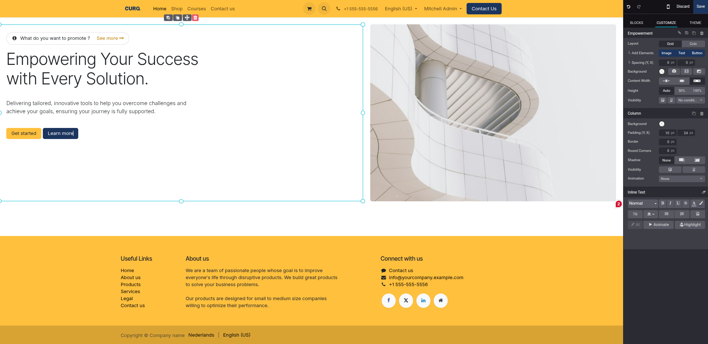

---

### 7. Managing Site-Wide Themes and Brand Styling

To maintain visual consistency across all pages without restyling blocks one by one:

1. In the top right sidebar, click the **Theme** tab.

   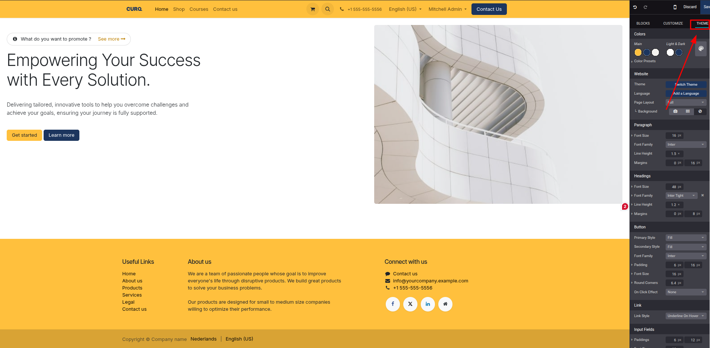

2. Configure site-wide brand styles:
   * **Color Palette**: Choose a curated multi-color palette preset, or click individual color swatches to define your brand primary, secondary, accent, and neutral tones. All blocks immediately update to match your chosen palette.

   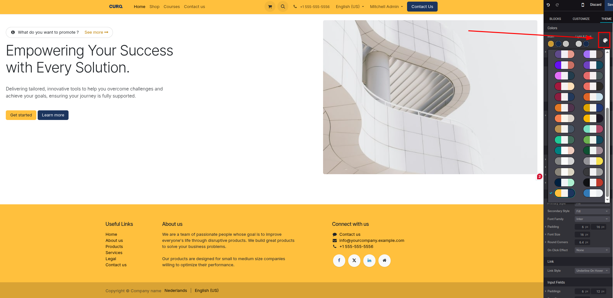

   Selecting a color palette immediately updates button accents, navbar highlights, and footer colors across the entire website:

   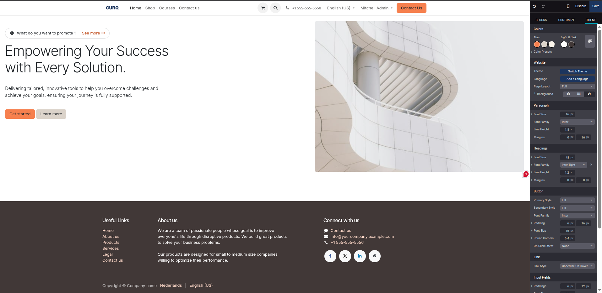

   * **Fonts**: Select primary heading fonts and body text font pairings from integrated Google Fonts libraries.
   * **Buttons**: Set default button corner roundness *(Sharp, Rounded, or Pill)*, drop shadow depth, and border weight.
   * **Layout**: Choose default container widths, card styling, and input field aesthetics.

---

### 8. Previewing Responsive Layouts

To verify how the page renders on smaller screens before going live:

1. In the top website editor bar, click the **Mobile Preview** button *(smartphone icon, press hotkey `Alt + v`)*.

   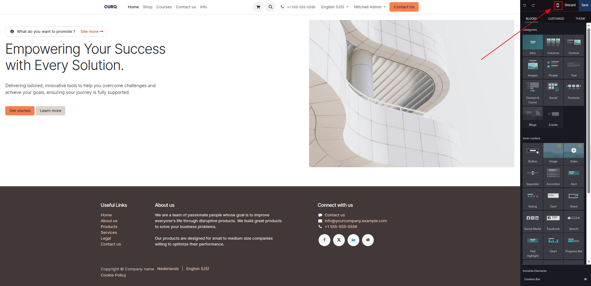

2. CURQ resizes the editor canvas into an interactive vertical smartphone device frame:

   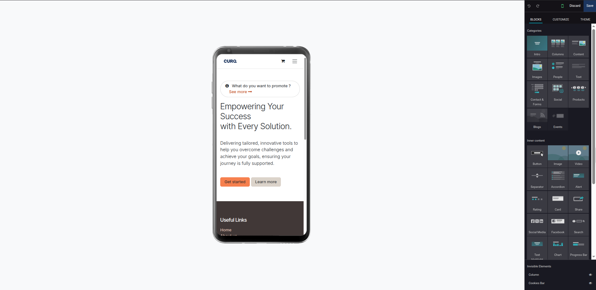

3. Review text scaling, responsive column stacking, and mobile hamburger navigation.
4. Click the smartphone icon again to return to full desktop editing view.

---

### 9. Saving and Publishing the Page

Once your design and copy are finalized:

1. Click the **Save** button in the top right corner of the website control bar to preserve all canvas edits.

   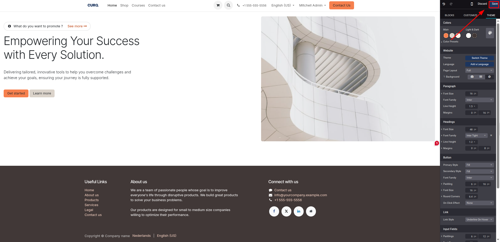

2. By default, newly created pages remain in **Unpublished** state, making them invisible to regular website visitors while visible to logged-in administrators.
3. To make the page live on the internet, click the red **Unpublished** toggle switch in the top bar.
4. The switch turns green and displays **Published**. Visitors can now access the page through your navigation menu or direct URL.
