# Menu & Navigation

Organize website structure, build hierarchical dropdowns, design responsive mega menus, and customize header and footer navigation layouts in CURQ 18.

---

### 1. Accessing the Menu Editor

CURQ 18 provides visual menu management directly from the frontend website builder as well as through contextual inline editing popovers:

1. Open the CURQ 18 main dashboard and click the **Website** app icon.
2. Ensure you are working on the intended website:
   * If your database manages multiple websites, check the website selector dropdown in the top administrative bar *(press hotkey `Alt + w`)*.
   * Menu trees are strictly isolated per website. Switching the active website updates the live preview and loads that website's distinct navigation structure.
3. Access the Menu Editor using one of the following methods:
   * **Method A (Top Administrative Bar)**: Click the **Site** menu in the top bar, then select **Menu Editor**.

   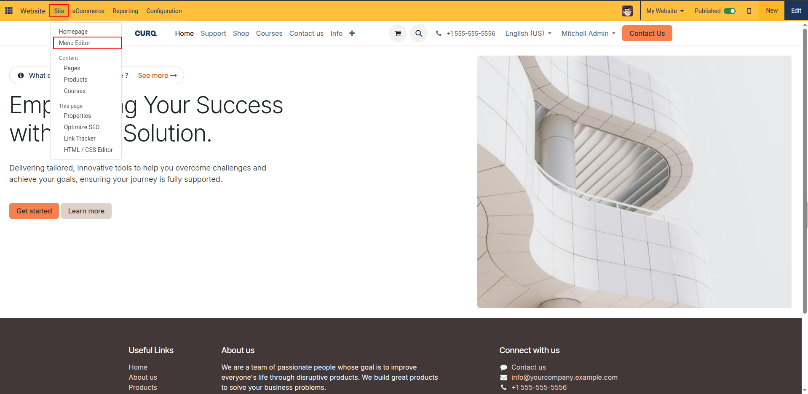

   * **Method B (Inline Navbar Popover)**: In edit mode *(click the blue **Edit** button in the top bar)*, click directly on any navigation link in the header navbar. A floating popover appears showing the link destination with action buttons: click the **Edit Menu** icon *(sitemap hierarchy icon)* to launch the menu tree editor.

   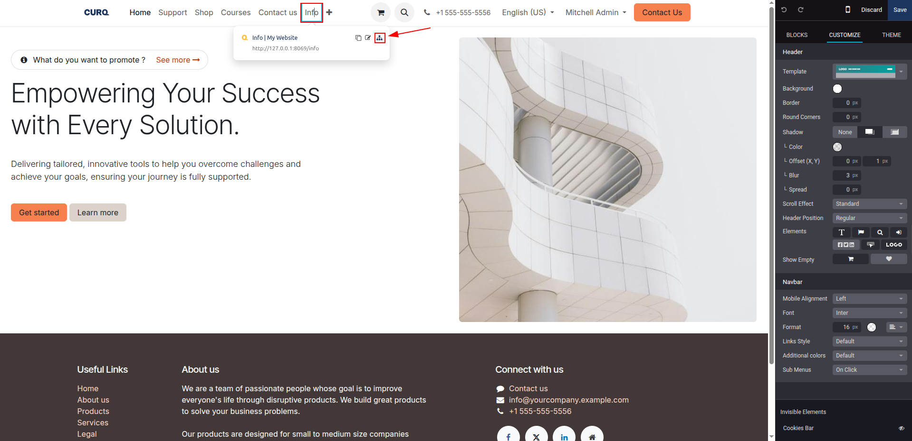

4. The **Edit Menu** modal opens, displaying your website's active navigation tree in an interactive sortable list.

   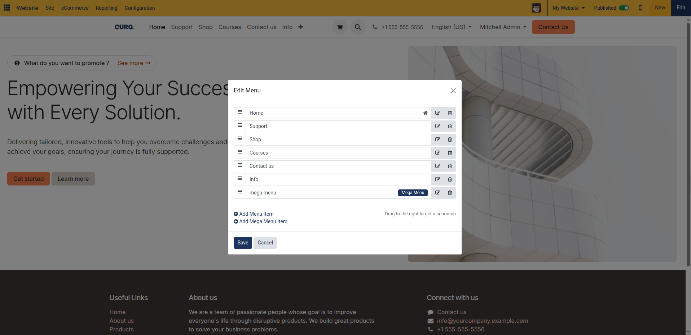

---

### 2. Adding and Editing Menu Items

Standard menu items link visitors directly to internal pages, page sections (anchors), external web addresses, or email mailto links:

1. In the **Edit Menu** modal, locate the action buttons at the bottom: click **+ Add Menu Item** to create a standard navigation link *(or click **+ Add Mega Menu Item** for rich multi-column panels)*.

   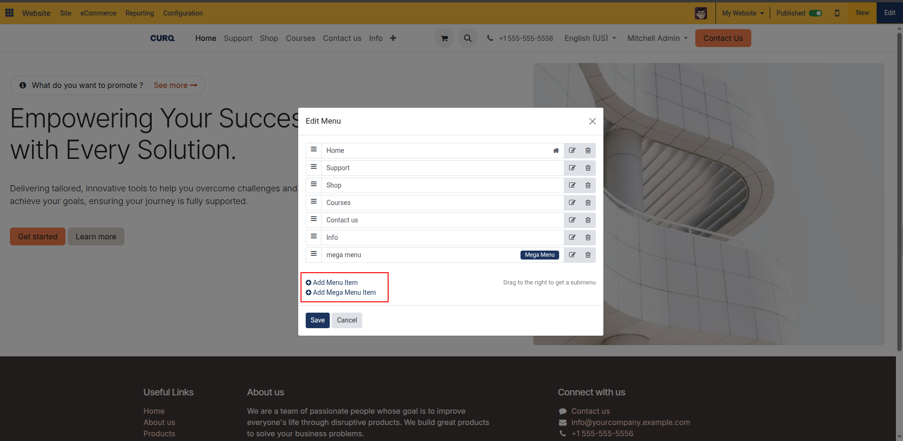

2. The **Add a menu item** dialog opens with two configuration fields:
   * **Name**: Enter the text label displayed in the website navigation bar *(such as `T&C`, `Services`, or `Contact Us`)*.
   * **Url or Email**: Specify the target link destination. CURQ includes built-in autocomplete and validation:
     * **Internal Pages**: Type `/` *(such as `/t`)* to open an autocomplete dropdown list of existing published pages on your website. Select the target page *(such as `/terms`)* from the suggestions.
     * **Section Anchors**: Type `#` followed by a block anchor ID *(such as `#contact-section` or `#pricing`)* to smoothly scroll to a specific section on the current page, or use global anchors `#top` and `#bottom`.
     * **External URLs**: Type the full external web address including the protocol *(such as `https://example.com`)*. Note that URLs cannot contain spaces.
     * **Email Links**: Type an email address *(such as `info@company.com`)*. CURQ automatically prefixes the destination with `mailto:` upon saving.
3. Click **OK** to confirm the menu item.

   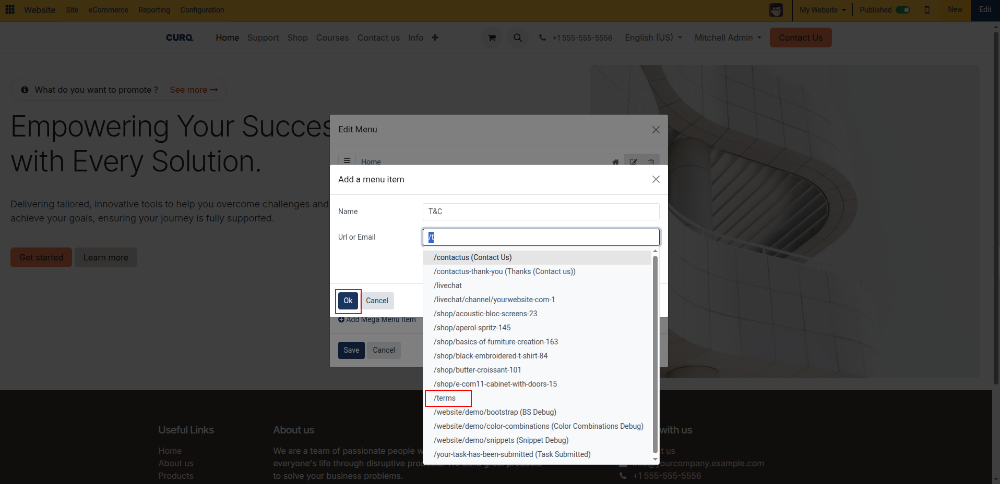

4. The newly created menu item appears immediately at the bottom of the navigation tree in the **Edit Menu** list.

   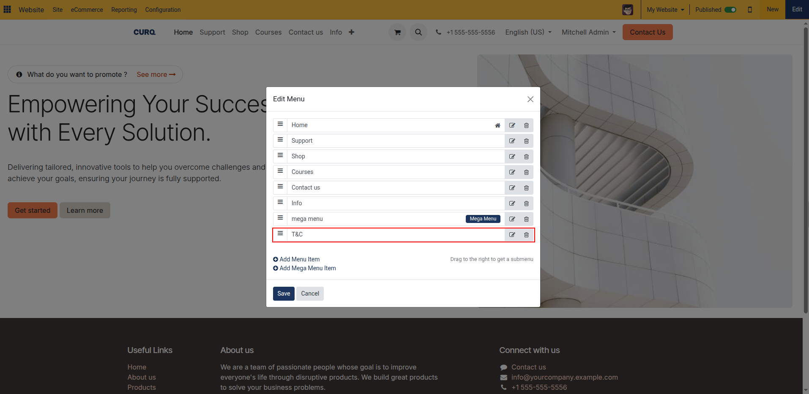

5. To edit an existing menu item at any time:
   * Click the pencil icon *(**Edit Menu Item**)* next to the item in the list.
   * Update the label name or destination URL in the dialog, then click **OK**.
6. Click **Save** in the bottom-left corner of the **Edit Menu** dialog to apply your changes to the live website. The new navigation item appears immediately in your website's header navbar.

   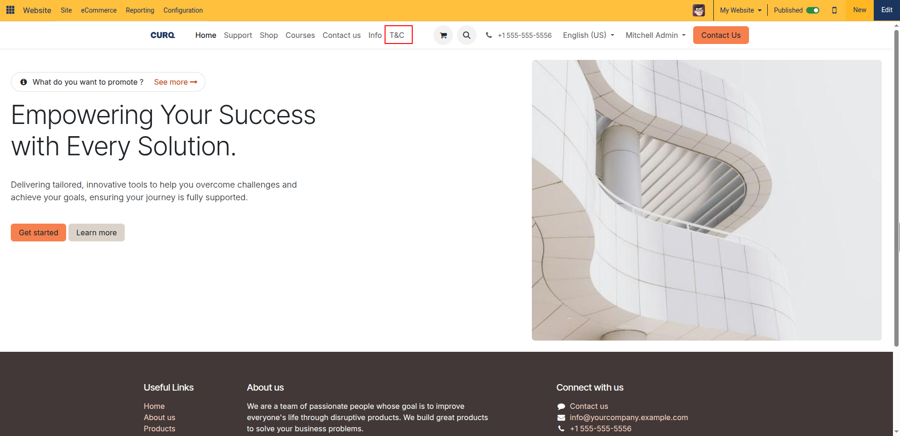

---

### 3. Organizing Hierarchy and Dropdown Submenus

Group related navigation items into clean dropdown submenus using intuitive drag-and-drop hierarchy controls:

1. In the **Edit Menu** dialog, locate the items you want to nest inside a parent dropdown.
2. Review the drag handles:
   * Each menu item features a drag handle *(three horizontal bars icon)* along the left column.
   * Click and hold the drag handle on the left side of the child menu item.

   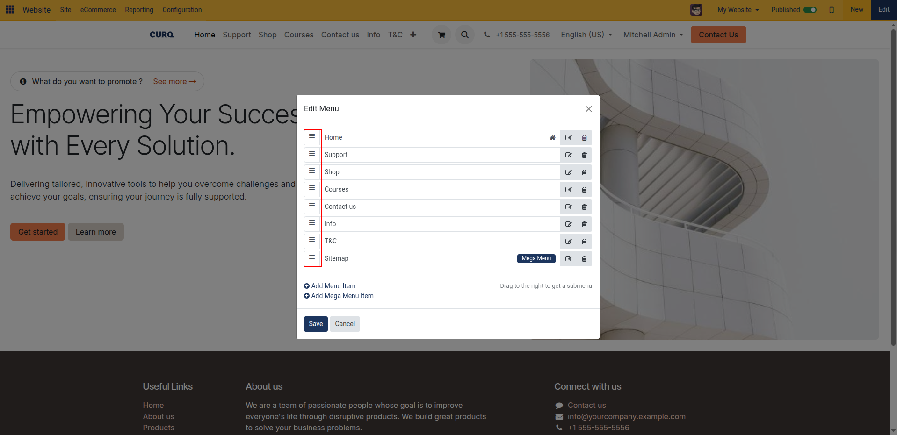

3. Drag the item vertically below the target parent menu item, then shift the cursor slightly to the **right**.
4. A visual indentation indicator and width shift appear:
   * Releasing the mouse button indents the item under the parent menu item *(such as nesting `Contact us`, `Info`, and `T&C` under `Support`)*.
   * The indented items now function as submenu entries inside that parent's dropdown menu on the website navbar.

   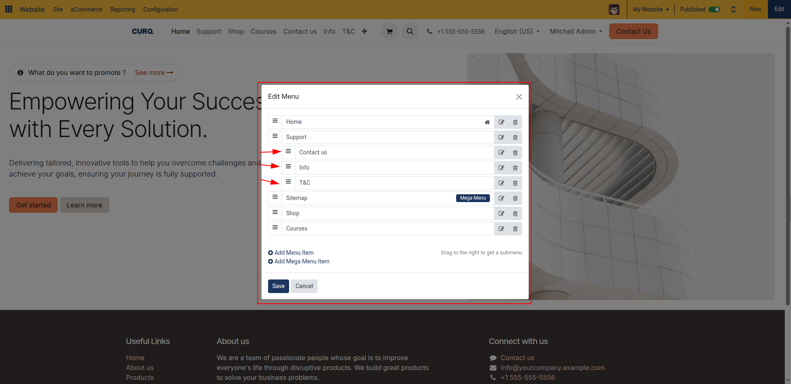

5. Review hierarchy constraints and indicator badges:
   * **Two-Level Maximum Depth**: CURQ navigation menus support up to two hierarchy levels. You can nest submenu items under a primary root menu item, but you cannot nest a third level inside a submenu.
   * **Homepage Indicator**: The menu item linked to your website's home URL displays a house icon *(Home indicator)* on the right side of the row.
   * **Sequence Reordering**: To reorder items within the same level, drag the handle vertically up or down without horizontal indentation.
6. Deleting menu items:
   * Click the trash can icon *(**Delete Menu Item**)* next to any item to remove it from the navigation tree.
   * *Important*: Deleting a parent menu item automatically removes all nested child submenu items beneath it.
7. Click **Save** to write the updated navigation hierarchy to the database.

   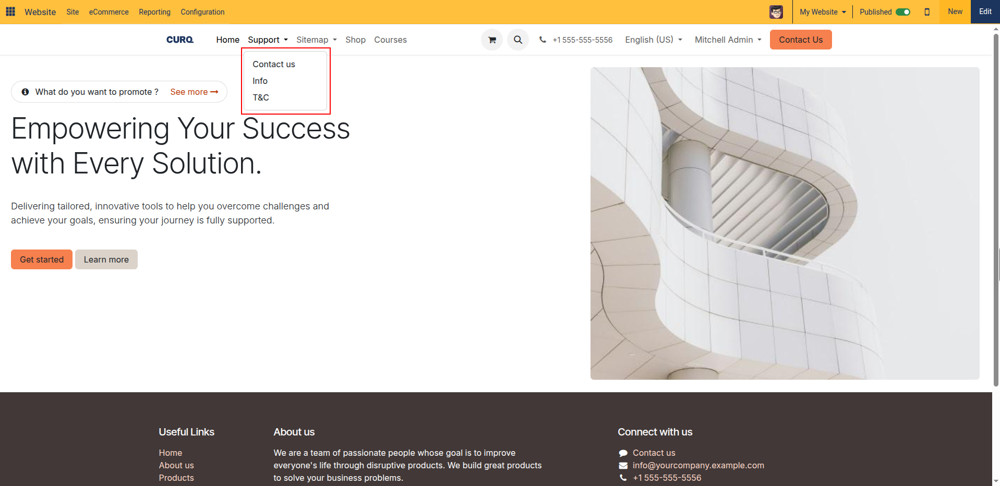

---

### 4. Creating and Styling Mega Menus

Mega menus replace narrow vertical dropdowns with expansive, multi-column navigation panels. They allow you to showcase categorized links, promotional banners, service thumbnails, and icons across the full viewport width:

1. In the **Edit Menu** modal, click the **+ Add Mega Menu Item** link at the bottom.

   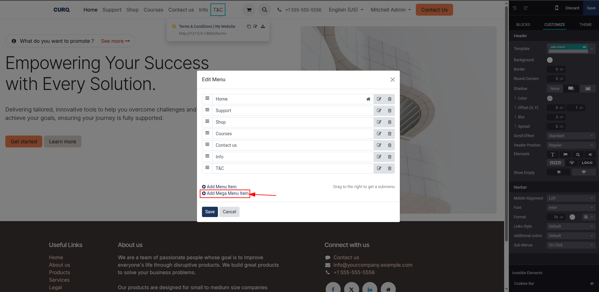

2. In the dialog prompt:
   * Enter the **Name** for the mega menu category *(such as `Sitemap`, `Products`, or `Solutions`)*.
   * Notice that the URL field is automatically hidden and disabled because clicking a mega menu item toggles the interactive dropdown canvas panel rather than opening a single link.
3. Click **OK**.

   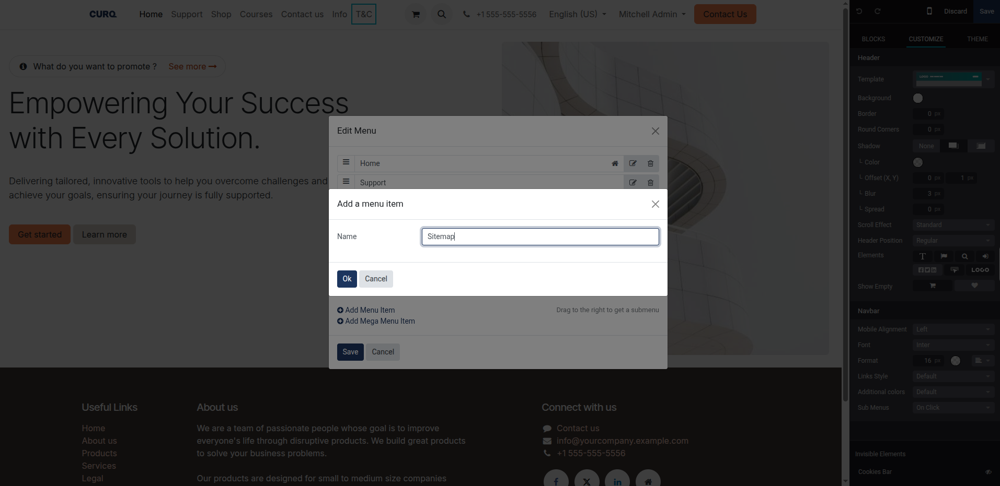

4. In the menu list, the new item appears with a blue **Mega Menu** badge pill:
   * *Hierarchy Rule*: Mega menus must always reside at the root navigation level. They cannot be nested as submenus inside another dropdown, nor can standard menu items in the dialog be dragged inside a mega menu item. Mega menu content is designed visually on the canvas.
5. Click **Save** in the **Edit Menu** dialog.

   

6. Switch to **Edit** mode by clicking the blue **Edit** button in the top bar.
7. In your website navbar, click the newly created mega menu link *(such as `Sitemap`)* to expand the mega menu canvas panel.

   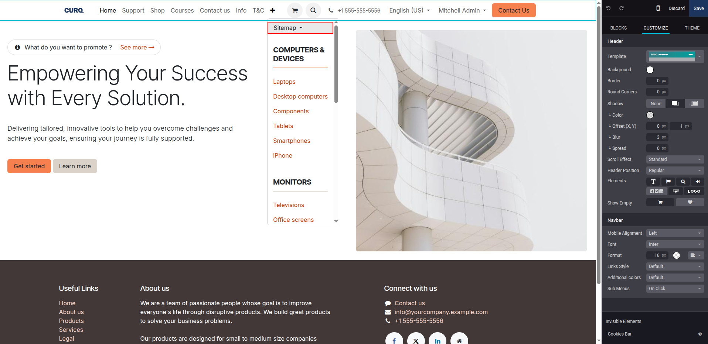

8. Click anywhere inside the mega menu container to activate its customization controls in the right sidebar:
   * **Template**: CURQ provides 9 pre-designed layout templates. Select a template from the dropdown to instantly reformat the panel:
     * **Multi Menus**: Categorized link columns with bold headers, ideal for large directories and resource hubs.
     * **Image Menu**: Structured navigation columns paired with a prominent featured image block.
     * **CURQ Menu**: Clean standard layout featuring categorized section headings and grouped links.
     * **Little Icons**: Compact link lists with small leading icons next to each navigation target.
     * **Big Icons Subtitles**: High-impact cards with large illustrated icons, prominent titles, and explanatory subtitles.
     * **Images Subtitles**: Rich visual cards combining thumbnail photography, titles, and brief summaries.
     * **Logos**: Brand and partner layout displaying client logos and associated navigation paths.
     * **Thumbnails**: Media-rich catalog view featuring rectangular category preview images.
     * **Cards**: Contained cards with distinct borders, background styling, and callout buttons.
   * **Size**: Choose between **Full-Width** (spans across the entire browser viewport) and **Narrow** (contained within the standard page grid margins).
   * **Background & Colors**: Apply solid colors, gradients, or background images to the mega menu panel using the color picker.
9. Customize inner content and links inline:
   * Click directly on any category headline, subtitle, link, or image inside the mega menu on the canvas to edit text.
   * When an individual menu link *(such as `Laptops`)* is selected on the canvas, the right **Customize** sidebar displays the link configuration card:
     * **URL**: Set internal or anchor destinations (`#` or `/...`).
     * **Label**: Adjust the link text label.
     * **Style**: Choose between `Link`, `Button`, or outline styling.
     * **Open in New Window**: Toggle whether clicking this mega menu link opens in a new browser tab.
   * Drag additional building blocks *(such as **Buttons**, **Icons**, or **Columns**)* directly from the **Blocks** sidebar into the mega menu panel.

   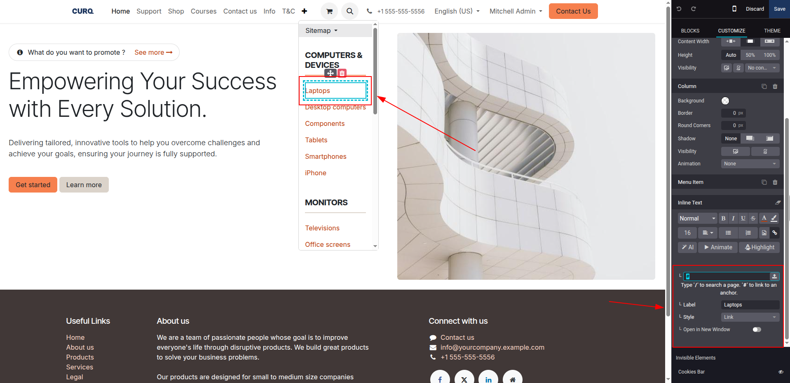

10. Configure conditional visibility per mega menu column or section:
    * Select a section within the mega menu panel.
    * Under **Conditional Visibility** in the sidebar, set device filters:
      * **Visible on all devices**
      * **Desktop only** *(No Mobile)*
      * **Mobile only** *(No Desktop)*
    * Set audience visibility filters:
      * **Visible for Everyone**
      * **Visible for Logged In** users only *(customer portal / internal users)*
      * **Visible for Logged Out** visitors only *(guest prospects)*
11. Click **Save** in the top bar to publish your mega menu.

---

### 5. Customizing Header Layout and Navbar Options

The website header houses your main brand identity, navigation links, and primary call-to-action buttons. Customize its design system-wide:

1. Click the blue **Edit** button in the top bar to enter edit mode.
2. Click directly on the Navbar area at the top of your webpage.
3. In the right **Customize** sidebar, configure the header layout and navigation behavior:
   * **Template**: Select from 11 responsive header layouts:
     * **Default**: Standard horizontal navbar with brand logo on the left and menu links on the right.
     * **Hamburger menu**: Sleek, minimalist header where navigation links collapse into a hamburger drawer on all screen sizes.
     * **Rounded box menu**: Floating pill-shaped header container with rounded corners and elevated shadow styling.
     * **Stretch menu**: Edge-to-edge navbar with full-width link distribution.
     * **Vertical**: Stacked brand header with company branding on top and navigation links centered below.
     * **Menu with Search bar**: Prominent integrated search input placed directly alongside navigation items.
     * **Menu - Sales 1 to 4**: Commercial eCommerce headers featuring shopping cart shortcuts, product search bars, and direct contact buttons.
     * **Sidebar**: Fixed vertical navigation sidebar anchored to the side of the viewport with adjustable width.
   * **Scroll Effect**: Controls how the header behaves as visitors scroll down the page:
     * **Standard**: Header scrolls away naturally with the page content.
     * **Scroll**: Sticky header remains pinned to the top of the viewport.
     * **Fixed**: Permanently fixed at the top of the screen at all times.
     * **Disappears**: Automatically hides as the user scrolls down, and slides back into view when scrolling up.
     * **Fade Out**: Smoothly fades away as the user scrolls down the page.
   * **Header Position**:
     * **Regular**: Header sits squarely above the main webpage body content.
     * **Over The Content**: Creates a transparent header that floats over the top hero banner or cover block.
     * **Hidden**: Completely hides the header for distraction-free landing pages or special campaign pages.

   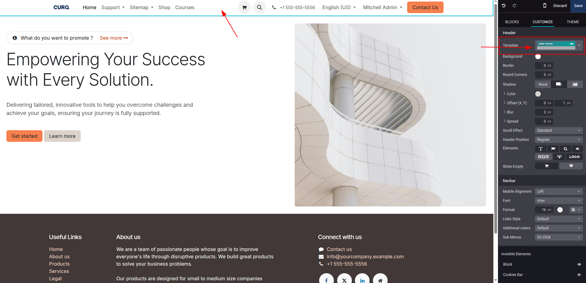

   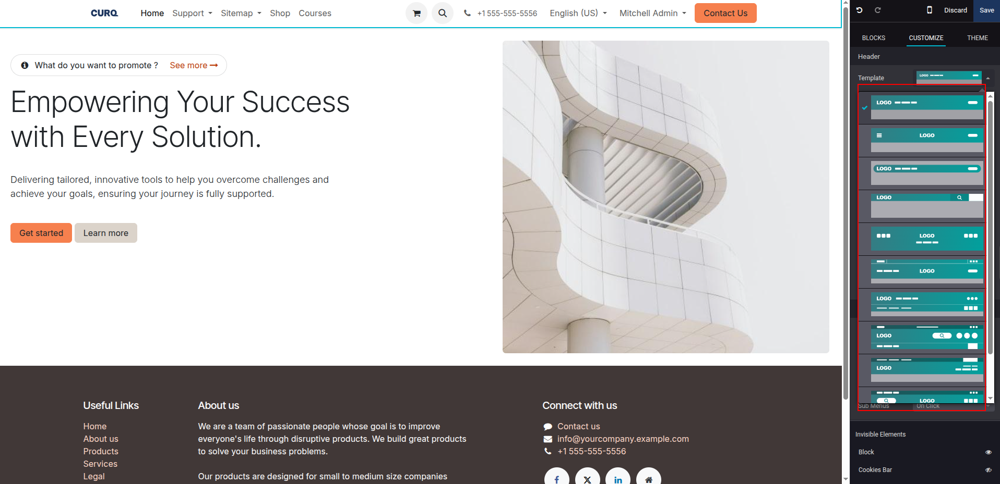

4. Configure visible header elements:
   * Under the **Elements** panel in the sidebar, toggle one-click header components:
     * **Text element**: Announcement banner or customer service phone number bar.
     * **Language selector**: Multi-language dropdown selector for international websites.
     * **Search bar**: Instant search widget.
     * **Sign in button**: Direct login and portal link for registered customers.
     * **Social links**: Social media profile icons.
     * **Call to action**: Prominent button *(such as `Contact Us` or `Get a Quote`)*.
     * **Brand Logo / Name**: Toggle display of the company logo image, text brand name, or both.
5. Configure Navbar typography and mobile alignment:
   * Under **Header > Navbar**, adjust font family and pixel font size.
   * Under **Mobile Alignment**, choose how the hamburger toggle aligns on mobile devices: **Left**, **Center**, or **Right**.

   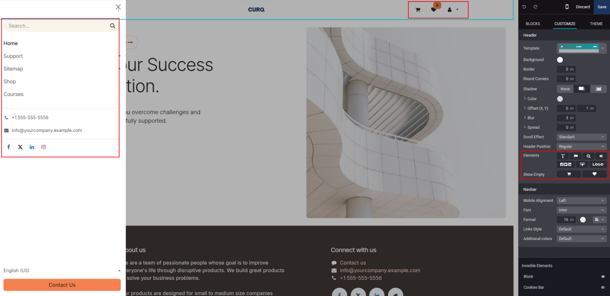

---

### 6. Customizing Footer Layout and Navigation Links

The footer provides persistent legal information, secondary navigation links, contact details, and copyright notices across all pages:

1. In visual edit mode, scroll to the bottom of the page and click directly on the footer container.
2. In the right **Customize** sidebar, configure footer layout options:
   * **Template**: Select from 8 pre-designed footer structures:
     * **Default**: Multi-column layout with company summary, link columns, and social icons.
     * **Descriptive**: Expanded layout with rich company description and categorized link directories.
     * **Centered**: Symmetrical layout with centered brand logo and single-line link bar.
     * **Links**: Clean, link-focused directory grouping site pages by department or category.
     * **Minimalist**: Sleek, compact single-line footer for minimalist websites.
     * **Contact**: Highlights physical address, email, telephone, and interactive contact details.
     * **Call-to-action**: Includes a prominent full-width newsletter subscription or conversion banner.
     * **Headline**: Bold typographic footer with large brand headline.
   * **Slideout Effect**:
     * **Regular**: Standard static footer.
     * **Slide Hover**: Footer stays pinned behind the page content and reveals smoothly on hover.
     * **Shadow**: Applies an elevated elevation shadow above the footer boundary.
   * **Copyright Notice**: Checkbox to enable or disable the bottom copyright statement bar.
   * **Scroll Top Button**: Check the box to activate a floating back-to-top button, with position options for **Left**, **Center**, or **Right**.
   * **Page Visibility**: Toggle **Page Visibility** checkbox to hide the footer on specific conversion or checkout pages while keeping it visible on the rest of the website.
3. Edit links and footer text inline directly on the canvas, then click **Save** in the top bar.

   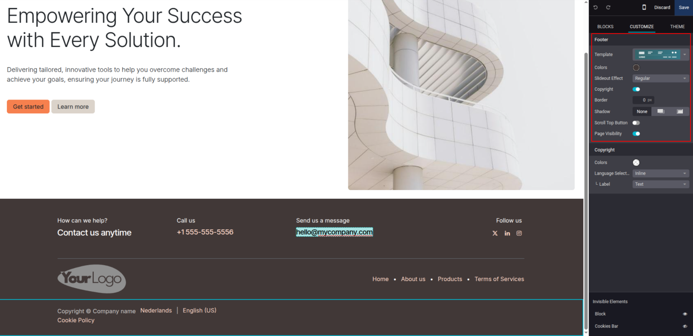

---

### 7. Multi-Website Navigation Isolation

When operating multiple brand websites within a single CURQ database:

1. **Independent Menu Trees**: Each website has its own independent root navigation menu. Adding, reordering, or deleting a menu item on Website A does not impact Website B.
2. **Contextual Menu Switching**:
   * When using the frontend **Menu Editor** *(Site > Menu Editor)*, CURQ always edits the navigation tree for the currently active website.
   * To switch websites, use the top switcher dropdown in the administrative bar *(press hotkey `Alt + w`)* before launching the Menu Editor.
3. **Dedicated Brand Navigation**:
   * Each website maintains its own header and footer styling, brand logo, and navigation links.
   * Changes made within the Menu Editor are saved strictly under the active website context.
