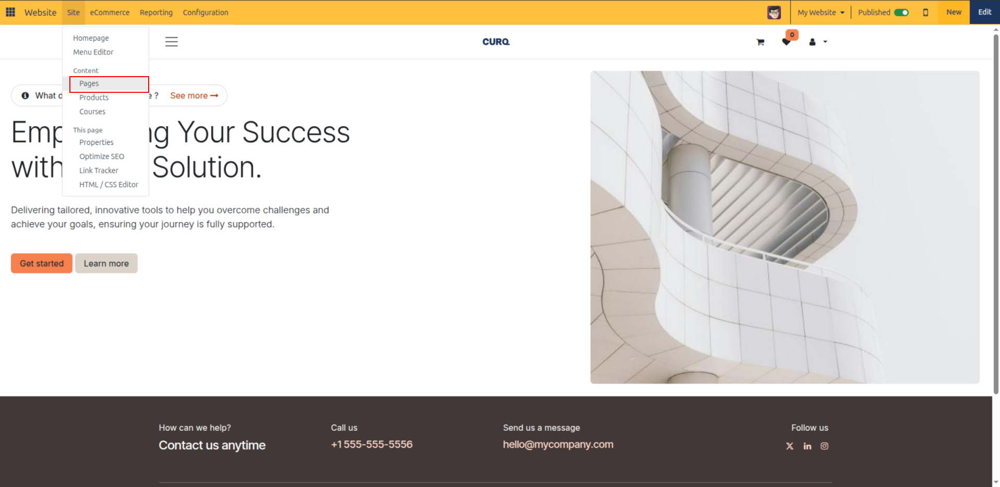
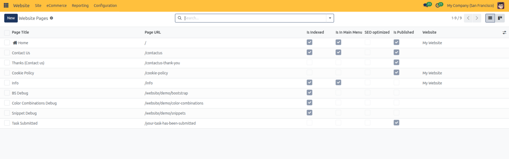
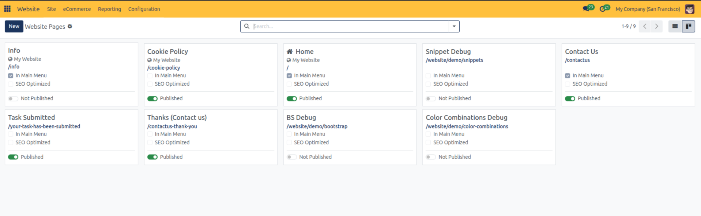
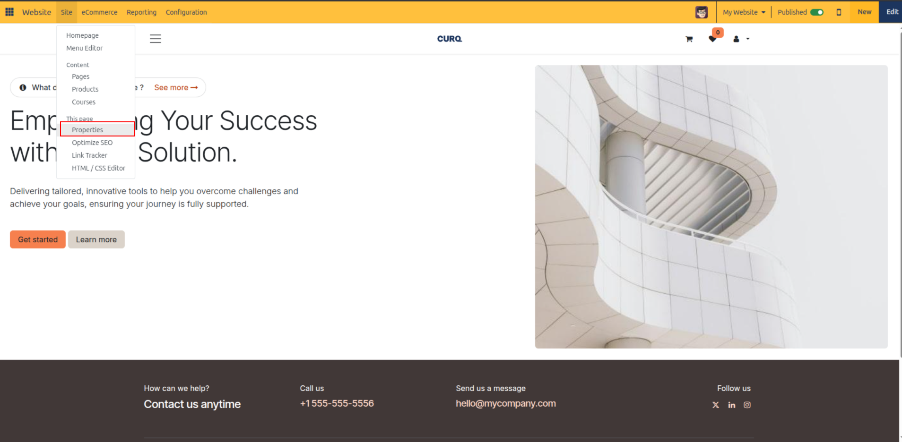
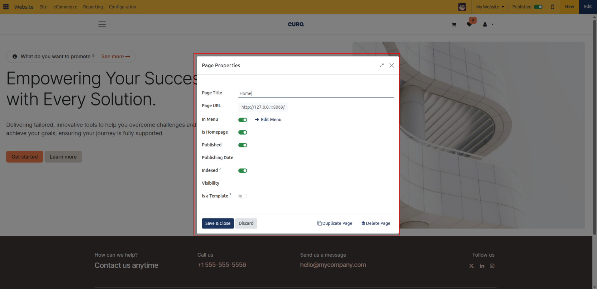

# Page Management

Organize, configure, secure, and maintain web pages across your CURQ 18 websites using the centralized Page Manager and Page Properties dialog.

---

### 1. Accessing the Page Manager

The **Page Manager** provides a comprehensive control center where administrators can monitor publication status, SEO indexing, menu visibility, and website assignments across all pages.

To open the Page Manager:

1. Open your CURQ 18 website in frontend preview mode.
2. In the top administrative control bar, click **Site** > **Pages**.

   

CURQ opens the **Website Pages** manager interface with view-switching controls and filter tools:

* **List View** *(Default)*: Tabular grid displaying all page attributes, ideal for comparing settings, sorting, and executing batch operations.

  

* **Kanban View**: Visual card layout highlighting page titles, homepage badges, URLs, and status indicators.

  

* **Search & Filters**: Quick-filter options to isolate published, unpublished, or tracked pages.

---

### 2. Page Manager Columns & Indicators

In List view, the Page Manager organizes your website hierarchy with the following columns:

| Column | Description |
| --- | --- |
| **Page Title** | The public or internal display name of the webpage. Clicking a page opens it in live frontend preview. |
| **Page URL** | The relative URL path route *(e.g., `/contactus`, `/about-us`, `/services`)*. |
| **Indexed** | Toggle indicating whether search engines are allowed to index and surface this page in public search results. |
| **Is In Main Menu** | Checkbox indicating whether an active link pointing to this page exists in the main header navigation menu. |
| **SEO Optimized** | Indicator showing whether custom SEO metadata *(Meta Title, Meta Description, keywords)* has been configured. |
| **Is Published** | Active status switch. Green indicates live and visible to visitors; grey/red indicates unpublished and restricted to administrators. |
| **Website** | In multi-website environments, displays the specific website instance associated with the page *(empty if accessible across all websites)*. |

---

### 3. Searching, Filtering, and Grouping Pages

When managing extensive websites with dozens or hundreds of pages, use the search and filter bar to locate specific content quickly:

1. In the search box at the top of the Page Manager, type keywords to match against **Page URL** or **Page Title**.
2. Click the search dropdown menu to apply pre-configured filters:
   * **Published**: Displays only live, publicly accessible pages.
   * **Not published**: Isolates drafts, internal staging pages, and unreleased content.
   * **Tracked**: Filters pages where website visitor analytics tracking is explicitly enabled.
   * **Not tracked**: Displays untracked pages.
3. In multi-website setups, use the **Website** filter to restrict the view to pages belonging to a specific company or brand site.

---

### 4. Performing Batch Actions on Pages

The Page Manager allows administrators to perform bulk maintenance operations across multiple selected pages simultaneously:

1. In the Page Manager list view, select the checkboxes next to the target pages *(or check the top checkbox in the table header to select all pages)*.
2. Click the **Action** cog menu at the top of the control panel:
   * **Publish**: Bulk-publishes all selected pages, making them live immediately.
   * **Unpublish**: Bulk-unpublishes all selected pages, instantly removing them from public access.
   * **Duplicate**: Clones the selected pages into new drafts with custom name prefixes.
   * **Delete**: Removes selected pages after evaluating URL dependencies across the system.

> [!WARNING]
> When deleting pages, CURQ analyzes URL dependencies *(such as links in menu items, internal buttons, or custom views)*. A confirmation dialog will list detected references and require checking **"I am sure about this"** before confirming deletion.

---

### 5. Configuring Page Properties

The **Page Properties** dialog allows granular control over page URLs, redirects, homepage assignment, and search engine visibility.

#### Opening Page Properties

You can access Page Properties through two methods:

* **From the live page**: Navigate to the target page, then click **Site** > **This page** > **Properties** in the top administrative bar.

  

* **From the visual editor sidebar**: Click **Page** in the editor sidebar while editing.

CURQ opens the **Page Properties** modal dialog:

#### Core Page Properties

* **Page Title**: The human-readable name of the webpage, displayed in browser title bars and search results.
* **Page URL**: The route path of the page *(e.g., `/our-mission`)*.
* **Redirect Old URL**: When modifying an existing page URL, toggle this option to automatically create an HTTP redirect from the old URL to the new URL:
  * **301 Moved permanently**: Recommended for permanent URL migrations to preserve search engine rankings and backlinks.
  * **302 Moved temporarily**: Used for temporary rerouting without altering canonical search engine indexes.
  * **Dependencies**: Click the **Dependencies** helper link to inspect any internal blocks, menus, or records referencing the old URL.
* **In Menu**: Toggle whether this page is included in the website header navigation menu. Clicking the **Edit Menu** arrow jumps directly to the Menu Editor modal.
* **Is Homepage**: Toggle switch to designate this page as the root homepage (`/`) for the active website.
* **Published**: Quick toggle to switch between draft and live status.
* **Publishing Date**: Set an optional scheduled date and time when the page should automatically become published.

---

### 6. Page Visibility & Access Security

Control visitor access to individual pages using the **Visibility** setting in Page Properties:

1. Open **Site** > **This page** > **Properties**.
2. Locate the **Visibility** dropdown field and select the desired security rule:
   * **Public**: Default setting. Anyone visiting the website can view the page.
   * **Signed In**: Restricts page access to authenticated portal users and internal employees. Anonymous visitors are prompted to log in.
   * **Restricted Group**: Restricts page access to users belonging to specific security user groups. When selected, an **Authorized Groups** tag field appears to choose authorized user groups *(e.g., Portal, Editor, Sales / User)*.
   * **With Password**: Protects the page behind a direct access code. When selected, enter a **Password** in the displayed field. Visitors must enter this password to view the page contents.
3. Click **Save** to enforce access restrictions immediately.

---

### 7. Creating and Managing Page Templates

Standardize brand layout designs by converting custom pages into reusable templates:

1. Design and build a page layout using the drag-and-drop editor.
2. Open **Site** > **This page** > **Properties**.
3. Toggle the **Is a Template** switch to enabled.
4. Click **Save**.
5. When any team member clicks **+ New** > **Page**, this custom layout will now appear as an available template option under the page selector library, allowing instant replication of standard company page layouts.
