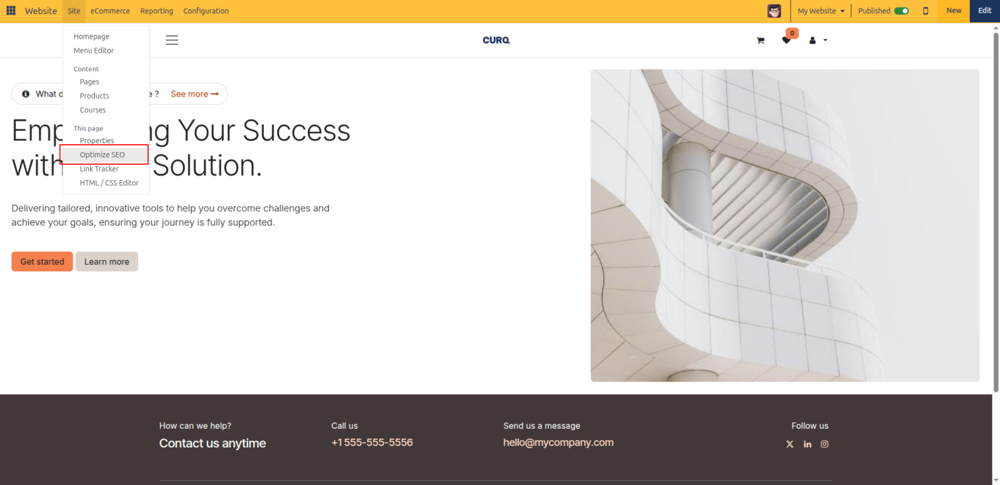
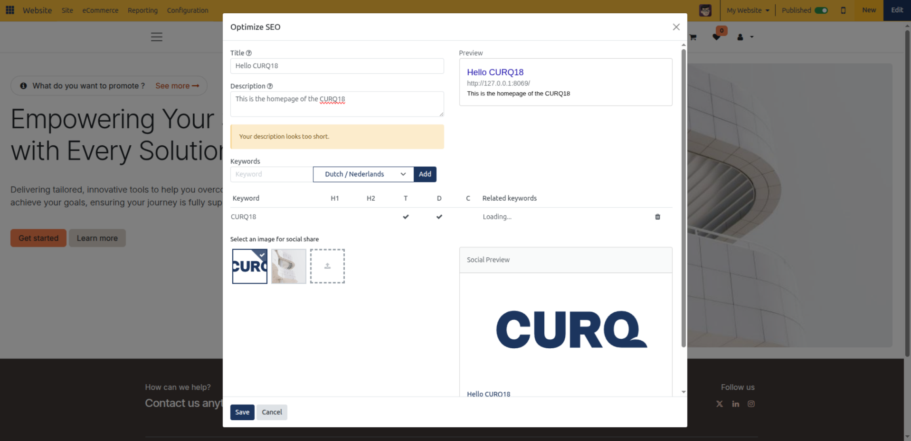

# SEO Optimization

Enhance search engine rankings, customize social media preview cards, and analyze on-page keyword density in CURQ 18 using the integrated SEO Optimizer tool.

---

### 1. Accessing the SEO Optimizer Tool

CURQ includes an on-page SEO dialog that evaluates live page content, renders real-time search engine result previews, and provides keyword placement feedback.

To open the SEO Optimizer:

1. Navigate to the webpage, product, or blog post you want to optimize.
2. In the top administrative control bar, click **Site** > **This page** > **Optimize SEO**.

   

CURQ opens the **Optimize SEO** modal dialog, presenting metadata inputs, search engine snippet simulations, keyword density analysis, and social media card previews:

---

### 2. Search Engine Title, Description & Snippet Preview

The top section of the dialog configures the metadata search engines read when crawling and indexing your page:

* **Title**:
  * Enter a descriptive page title.
  * Search engines display this as the primary clickable headline in search results.
  * If left empty, CURQ automatically applies the default record or page title combined with your website company name.
* **Description**:
  * Provide a concise meta description summarizing the content of the page.
  * Search engines display this summary snippet beneath the title.
  * If left blank, search engines dynamically extract text excerpts from the page content.
* **Search Engine Preview**:
  * A live simulation on the right displays exactly how the page will appear in Google search results *(Title headline, green/grey URL breadcrumb, and snippet description)*.
  * If the page has indexing disabled in Page Properties, the preview alerts you with: *"You have hidden this page from search results. It won't be indexed by search engines."*

---

### 3. Keyword Optimization & Content Placement Scoring

The **Keywords** tool audits your target terms against live page content, identifying whether keywords are placed strategically across HTML heading and content tags:

1. In the **Keyword** input field, type a target keyword or keyphrase.
2. Select the target **Language** from the adjacent dropdown *(keywords are evaluated per language)*.
3. Click **Add** *(or press `Enter`)*.
4. CURQ immediately scans the current page DOM structure and displays a real-time placement scorecard:

| Placement Indicator | Meaning | Best Practice |
| --- | --- | --- |
| **H1** | First-level page heading | Every page should include the primary keyword in its main `<h1>` banner headline. |
| **H2** | Second-level page heading | Secondary section titles should feature primary or supporting keywords. |
| **T** | Page Title | Ensure target keywords appear within the meta `<title>`. |
| **D** | Meta Description | Verifies inclusion within the meta description snippet. |
| **C** | Body Content | Confirms the keyword appears naturally within paragraph text and body copy. |

#### Related Keyword Suggestions

Beneath the score columns, CURQ generates **Related keywords** badges based on common search queries:

* Click any suggested keyword badge to automatically append it to your tracking list and audit its presence across your page.
* To remove a keyword, click the trash can icon at the end of the keyword row.

---

### 4. Customizing Social Media Sharing Cards (Open Graph)

When links to your website are shared across social platforms *(such as LinkedIn, Facebook, Twitter/X, WhatsApp, or Slack)*, social crawlers fetch Open Graph tags to generate visual link preview cards.

The **Social Share** section allows you to customize this card:

1. **Select an image for social share**:
   * CURQ automatically displays thumbnails of all images detected on the current webpage.
   * Click any existing image thumbnail to set it as the active.
   * Click the **Upload** icon to upload a high-resolution branded banner specifically formatted for social link previews *(recommended aspect ratio 1.91:1, e.g., 1200x630 px)*.
2. **Social Preview**:
   * A live card preview reflects how social platforms will render the link, displaying the selected hero image, the Open Graph title, website URL, and snippet text.
3. Click **Save** in the modal footer to update meta tags immediately.

---

### 5. Customizing SEO-Friendly URL Slugs

For dynamic website records *(such as Blog Posts, Events, eCommerce Products, and Forum topics)*, CURQ creates structured URLs with customizable slugs:

1. When opening **Optimize SEO** on a dynamic record page, a **Custom Url** field appears beneath the Description.
2. Edit the slug text to incorporate targeted keywords while maintaining clean, readable formatting *(CURQ automatically sanitizes spaces and special characters into hyphens)*.
3. The unalterable database record ID is retained at the end of the path to ensure URL integrity.
4. Click **Save** to update the canonical URL. CURQ automatically manages 301 redirects from the prior slug.
