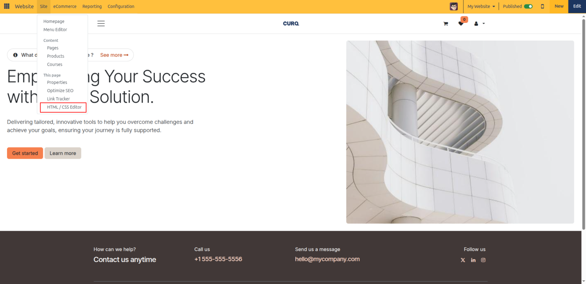
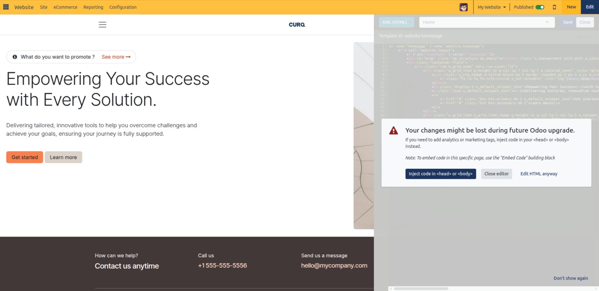
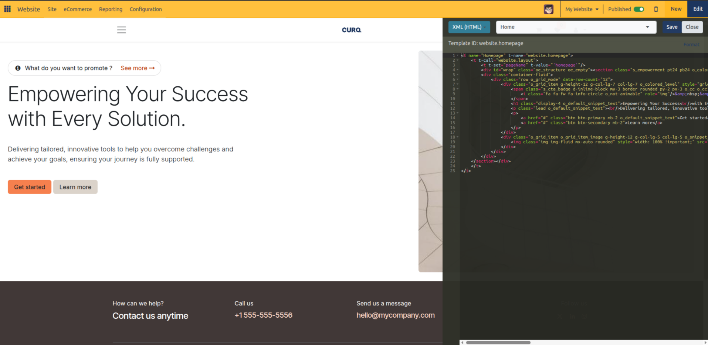
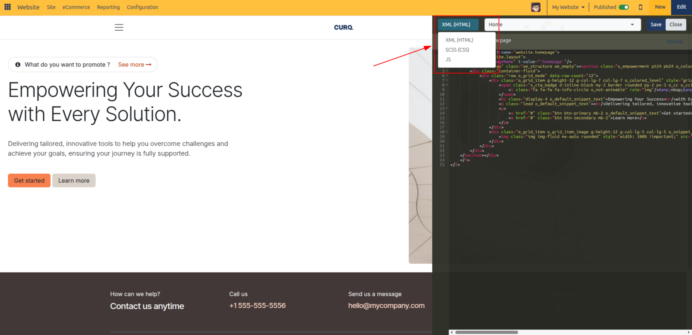
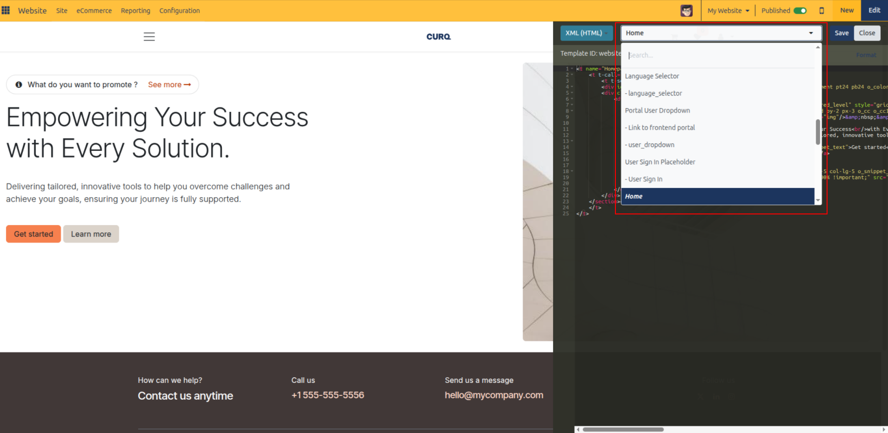

# HTML / CSS Editor

Edit underlying QWeb templates, customize styling rules with SCSS/CSS, and inspect website code in CURQ 18 using the built-in HTML / CSS Editor.

---

### 1. Opening the HTML / CSS Editor

The **HTML / CSS Editor** (Resource Editor) provides a code editing sidebar directly in the live website environment:

1. Navigate to the webpage you want to inspect or modify.
2. In the top administrative control bar, click **Site** > **This page** > **HTML / CSS Editor**.

   

3. When launching the editor, CURQ displays a technical overlay warning advising caution when editing core templates directly:

   

> [!WARNING]
> Direct template modifications may conflict with future system upgrades:
> * For tracking tags and analytics, use **Inject code in `<head>` or `<body>`** in website settings instead.
> * For isolated script snippets on a single page, use the **Embed Code** building block.
> * Click **Edit HTML anyway** to proceed into the code editor.

4. CURQ opens a resizable code editor pane on the right-hand side of your browser screen alongside the live webpage canvas:

   

---

### 2. File Types & Resource Switcher

The top bar of the editor contains a resource type switcher allowing you to toggle between different web asset formats:

* **XML (HTML)**: Edit the QWeb template arch powering the current webpage or its inherited layout views *(e.g., page container, custom headers, footers, building block templates)*.
* **SCSS (CSS)**: Edit custom styling sheets and stylesheets tied to the website theme or page layout.
* **JS**: Inspect and modify custom JavaScript files associated with frontend interactions.

---

### 3. Selecting and Navigating Views & Assets

Adjacent to the file type dropdown is the **Resource Selector**:

1. Click the resource selector dropdown to search and choose from views and stylesheets active on the current page:

   

2. Status indicators next to resource names indicate their state:
   * **Floppy disk icon with orange/warning color**: Unsaved, pending editor changes.

3. If inspecting an XML view, clicking **Format** automatically indents and formats the XML markup cleanly.

---

### 4. Editing Code & Live Preview

The editor features full syntax highlighting directly synchronized with the live canvas:

* **Real-time Synchronization**: When editing template text or markup, notice the orange floppy disk icon appears next to the template name, and corresponding elements on the canvas outline the modified area.
* **Real-time Error Detection**: Checks syntax in real time for XML and SCSS syntax violations, highlighting erroneous lines with error markers.
* **Resetting Customizations**: For modified SCSS stylesheets, a red **Reset** button appears, allowing you to discard custom CSS overrides and restore default styling.
* **Saving Changes**: Click **Save** in the top bar to apply changes directly to the database. The webpage automatically re-renders with your new code.
* **Closing the Editor**: Click **Close** to dismiss the code panel and return to standard frontend preview.
