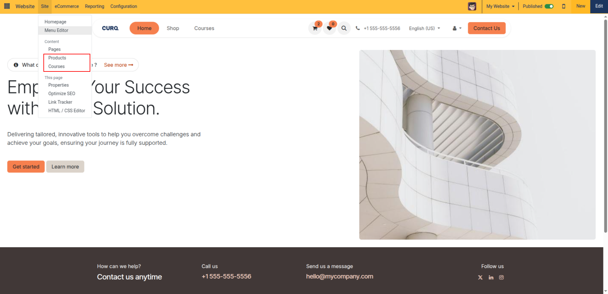
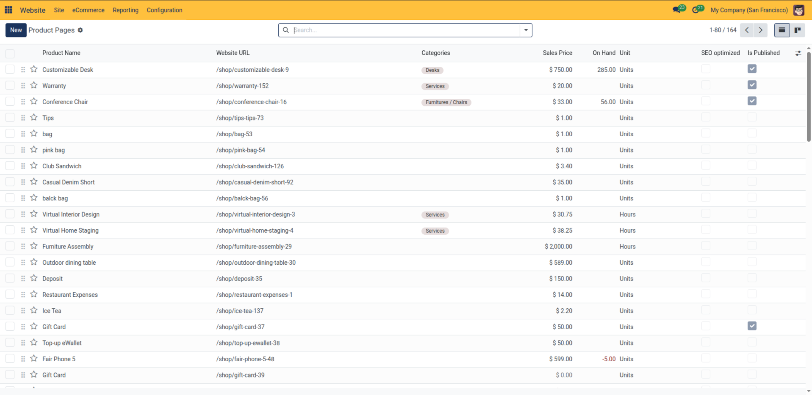
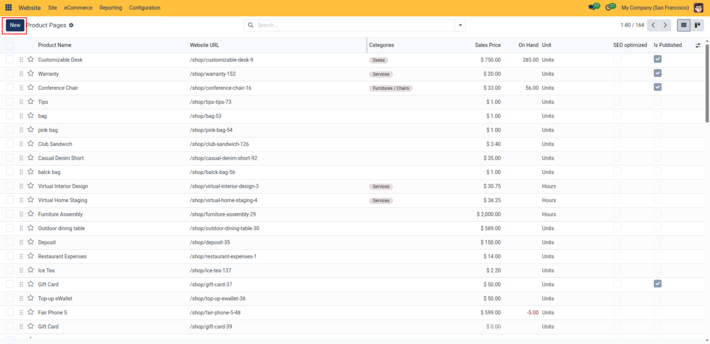
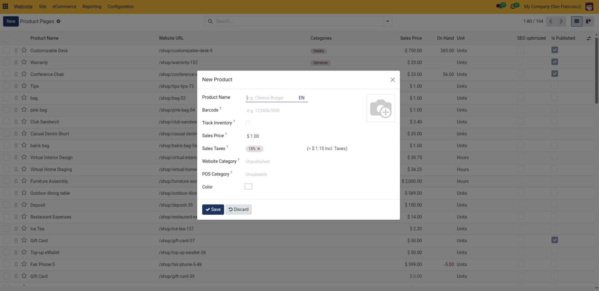
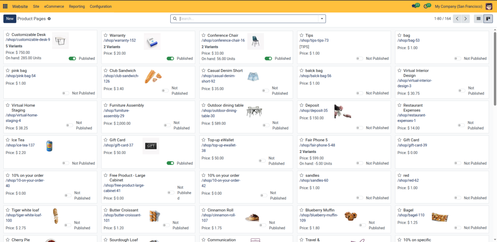
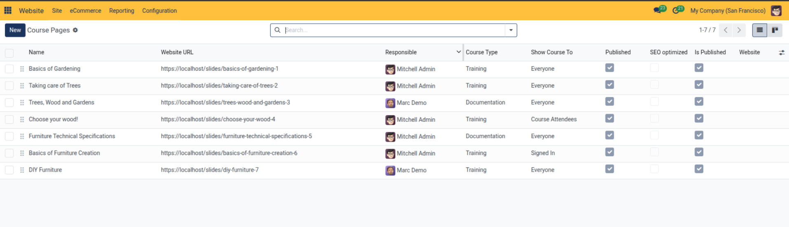
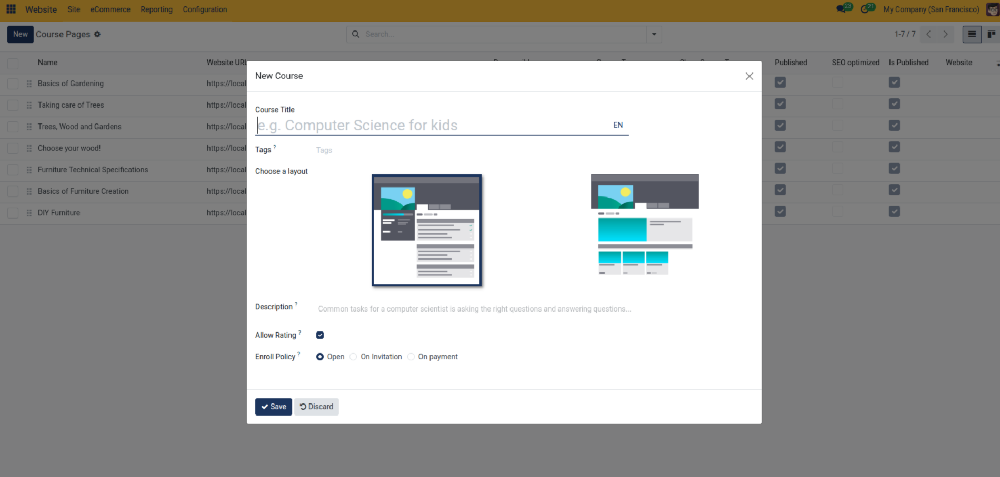
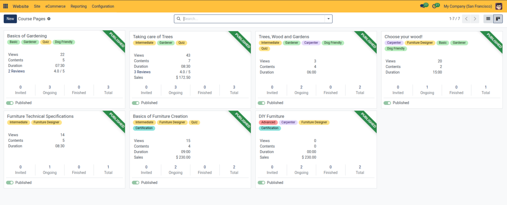

# Products & Courses Management

Monitor, publish, and manage eCommerce products and eLearning course pages in CURQ 18 using the frontend Page Manager.

---

> [!NOTE]
> The **Products** option requires the **eCommerce** app to be installed, while the **Courses** option requires the **eLearning** app. If either app is not installed in your database, its corresponding option will not appear in the **Site** menu.

---

### 1. Accessing Product & Course Pages

Administrators can inspect all published and unpublished catalog items directly from the frontend top bar without opening backend settings:

* **Product Pages**: In the top administrative bar, click **Site** > **Products**.
* **Course Pages**: In the top administrative bar, click **Site** > **Courses**.

Both menus open a unified manager interface providing synchronized List and Kanban views tailored to your products and courses.

---

### 2. Managing Product Pages

The **Product Pages** manager displays your store catalog with website-specific indicators across List and Kanban views:

#### List View

| Column | Description |
| --- | --- |
| **Product Name** | Product display title. Clicking a row opens the live frontend product page. |
| **Website URL** | Direct public route to the product page *(e.g., `/shop/customizable-desk-9`)*. |
| **Categories** | Assigned eCommerce category tags. |
| **Sales Price** | Retail price configured for the storefront. |
| **On Hand** | Current inventory quantity available in warehouse. |
| **SEO Optimized** | Indicator confirming whether meta title, description, and keywords have been set via Optimize SEO. |
| **Is Published** | Toggle switch indicating storefront availability. If disabled, the product is hidden from visitors. |

#### Creating a New Product from Product Pages

You can add a new product directly from the Product Pages manager without navigating away to backend sales forms:

1. In the top-left corner of the Product Pages manager, click the blue **New** button:

   

2. In the **New Product** dialog, enter initial catalog details:
   * **Product Name**: Enter the title of the item.
   * **Photo**: Upload a thumbnail image for the store.
   * **Barcode**: Optional product barcode number.
   * **Track Inventory**: Check to enable inventory tracking.
   * **Sales Price** & **Sales Taxes**: Set retail pricing and tax rule.
   * **Website Category**: Assign storefront product category.
   * Click **Save**.

   

#### Kanban View

#### Product Batch Actions

From the list view:
1. Select target products using the checkboxes on the left.
2. Open the **Action** menu:
   * **Publish / Unpublish**: Batch-toggle storefront visibility across catalog selections.
   * **Duplicate**: Clone products into new draft items.
   * **Delete**: Remove selected product pages.

---

### 3. Managing Course Pages

The **Course Pages** manager organizes online learning programs with progress, audience access, and visibility tracking:

#### List View

| Column | Description |
| --- | --- |
| **Name** | Course title. Clicking a row opens the course landing page. |
| **Website URL** | Frontend route to the course *(e.g., `/slides/basics-of-gardening-1`)*. |
| **Responsible** | Team member or instructor managing the course. |
| **Course Type** | Type classification *(e.g., Training, Documentation)*. |
| **Show Course To** | Access audience rules *(e.g., Everyone, Signed In, Course Attendees)*. |
| **SEO Optimized** | Verification of configured search engine snippets. |
| **Is Published** | Active publication toggle. |

#### Creating a New Course from Course Pages

You can create an online course directly from the Course Pages manager:

1. Click the blue **New** button in the top-left corner of the Course Pages manager.
2. In the **New Course** dialog, configure the following options:
   * **Course Title**: Enter the public name of the course.
   * **Tags**: Assign relevant subject tags to facilitate storefront filtering and search.
   * **Choose a layout**: Select your preferred content layout format (sidebar syllabus structure or card grid view).
   * **Description**: Enter an overview summary explaining the course objectives to prospective students.
   * **Allow Rating**: Enable this checkbox to permit student star ratings and reviews.
   * **Enroll Policy**: Select how learners join the course:
     * **Open**: Anyone can enroll freely.
     * **On Invitation**: Enrollment is restricted to invited users.
     * **On payment**: Enrollment requires purchasing the associated course product through the storefront.
3. Click **Save** to create the course and open its landing page in edit mode.

#### Kanban View

#### Course Batch Actions

From the list view:
1. Select target courses using the row checkboxes.
2. Open the **Action** menu to perform bulk operations:
   * **Publish / Unpublish**: Batch-update public course availability.
   * **Duplicate**: Duplicate course structures.
   * **Delete**: Remove selected course pages.
